# Arco Unleashed — every install path as a flowchart

The same procedure as [QUICKSTART](QUICKSTART.md) (checklist), [MANUAL](MANUAL.md) (pictures) and
[README](README.md) (reference) — drawn. Nothing here is new information: every box maps to a step in
those documents or to a script in this kit, named at the top of each section.

Diagrams render on GitHub, in VS Code and in any Markdown viewer with Mermaid.

**Reading the diagrams**

| Shape | Meaning |
|---|---|
| Rounded box | start / end state |
| Rectangle | you do something, or a script does |
| Diamond | a decision — every outgoing edge is a real option |
| Red box | **irreversible** — no undo past this point |
| Green box | a checkpoint: the "done when" of that step |

---

## 1. Which path is yours?

Four ways in and out. **A** and **B** install Unleashed and meet again at the first boot; **C** builds the
stack yourself from the Klipper-less base image; **D** takes the printer back to stock.

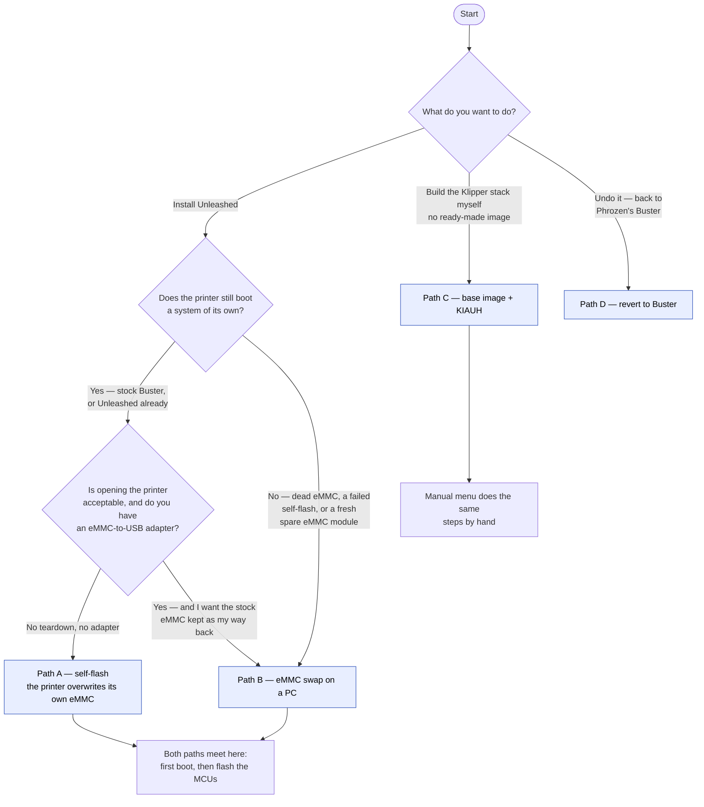

> **A pre-flashed spare eMMC** (someone hands you a module with the image already on it) is path B from
> "put the eMMC back in" onwards — skip the balenaEtcher step.

**Path A vs path B in one line:** A needs no screwdriver but is one shot with no net once the write
begins; B costs a teardown and is also the recovery route for a failed A.

---

## 2. Before anything is flashed — the two things you cannot get back later

`collect_data_arco.sh` · `install-unleashed.sh --backup` — QUICKSTART Step 0 and 0b.

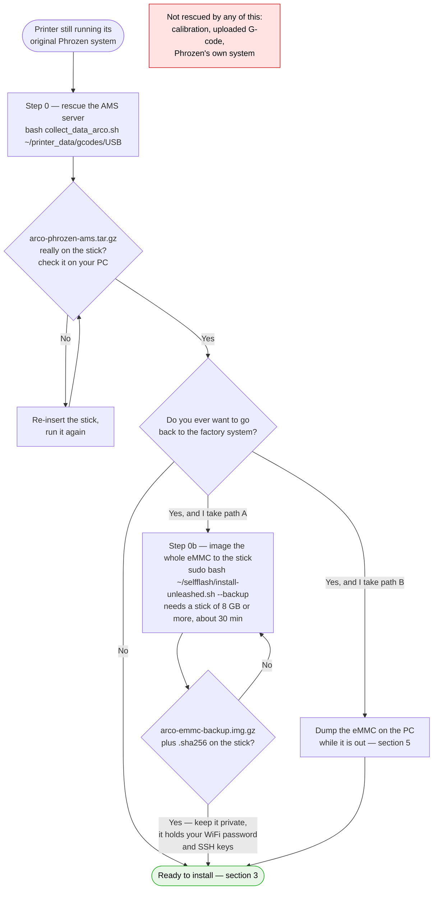

> Phrozen publish **no** stock image. Step 0b is the only way to make one, and only *before* the flash —
> from Unleashed you can only ever image Unleashed.

---

## 3. What goes on the USB stick

One **FAT32** stick, ≥ 4 GB (≥ 8 GB if you also take the Step 0b image), plugged **straight into the
printer** — never through a hub. Start from an **empty** stick: the tools take the *first* pattern match,
so an old image or a `(1)` re-download can win silently.

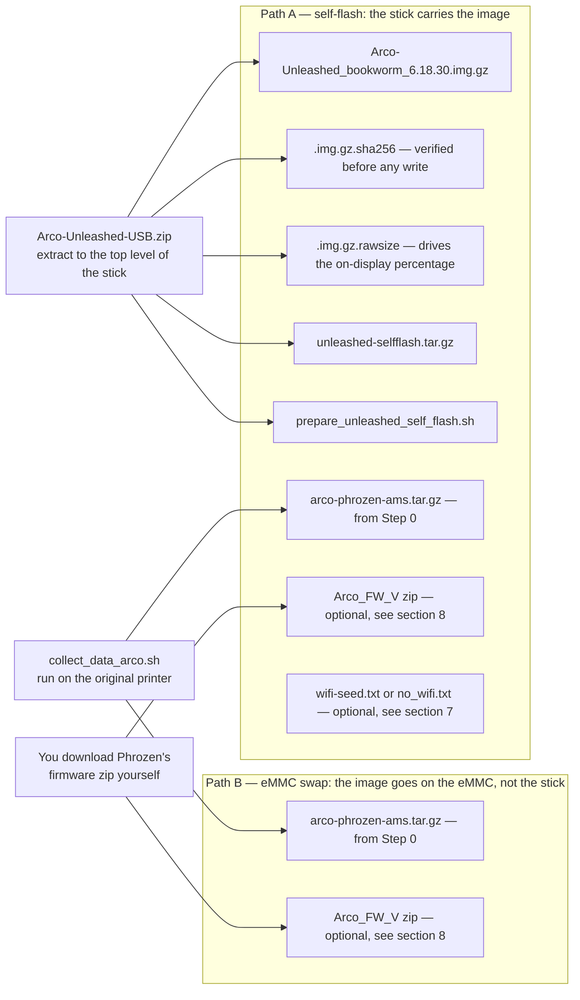

---

## 4. Path A — self-flash from the running printer

`prepare_unleashed_self_flash.sh` · `selfflash/install-unleashed.sh` — MANUAL "Path A",
[`selfflash/README.md`](selfflash/README.md). Works from stock Buster **and** from an Unleashed system
(that is also how you re-install or move to a newer image).

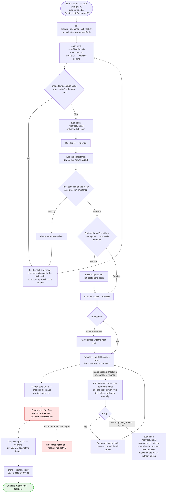

**Extra switches:** `--image PATH` (flash a specific file — this is also how a backup is restored) ·
`--usb DIR` · `--yes` (skips the typed confirmations, discouraged) · `--no-reboot` ·
`--backup` (section 13) · `--disarm` (cancels a pending flash *or* a pending backup).

---

## 5. Path B — eMMC replacement and recovery

MANUAL Steps 1–3. Also the recovery route when a path-A write fails.

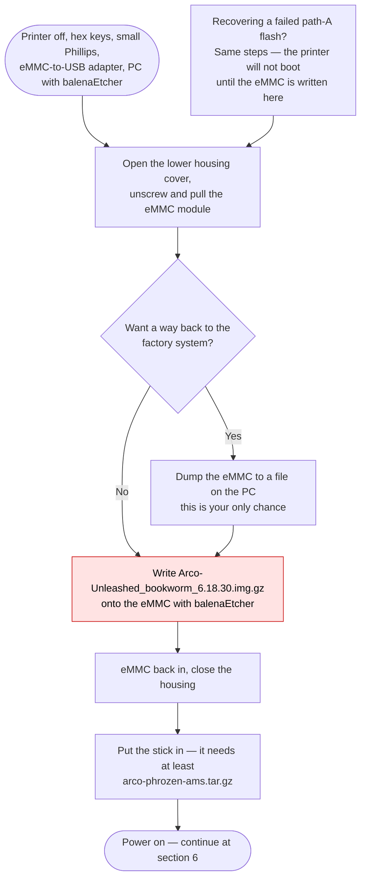

---

## 6. First boot — shared by path A and path B

`scripts/arco-firstrun.sh`, run once by `arco-firstrun.service`. Everything here is automatic; the
diagram exists so you can tell "still working" from "stuck".

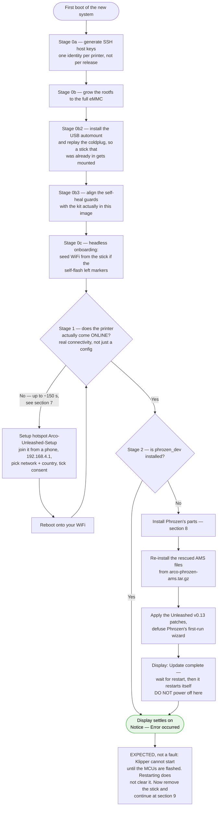

> Allow up to five minutes per stage. The display is drawn once per stage and then stays put — an
> unchanged screen is not a hung printer, and power-cycling restarts the stage rather than speeding it up.

---

## 7. WiFi — every possibility

`scripts/wifi-portal/` · `install-unleashed.sh` (capture) · `arco-firstrun.sh` (`wait_online`).
The printer's radio is **2.4 GHz only**, and `COUNTRY` must be *your* region or it may not join.

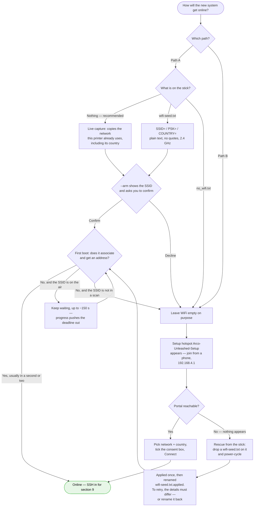

> The stick is re-read on **every** power-cycle until Phrozen's firmware is installed — after that, the
> printer's normal display WiFi screen takes over.

---

## 8. Phrozen's own software — where it comes from

`scripts/fetch-phrozen-fw.sh`. Nothing proprietary is shipped or mirrored by this project; you supply it,
or the printer fetches it from the vendor with your say-so.

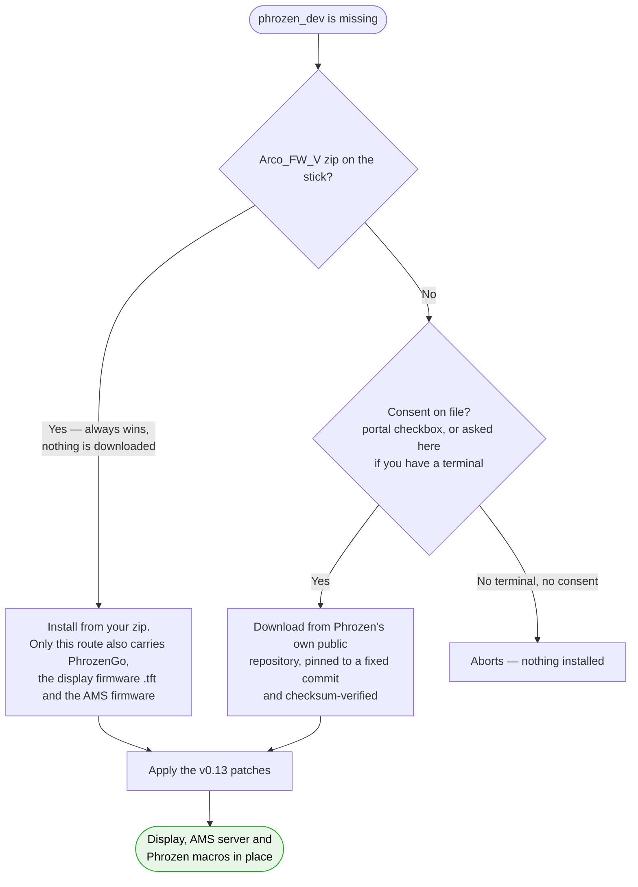

**Put the zip on the stick if** the printer will have no internet during setup, **or** you want
PhrozenGo, a display-firmware (`.tft`) update, or the AMS firmware.

---

## 9. Flash the MCUs — the one step that is not optional

Setup menu item **1** → `scripts/flash_mcus.sh` (also `all` / `f407` / `f103` / `host` on the command
line). The host runs Klipper v0.13; the MCUs still carry factory firmware and cannot talk to it.

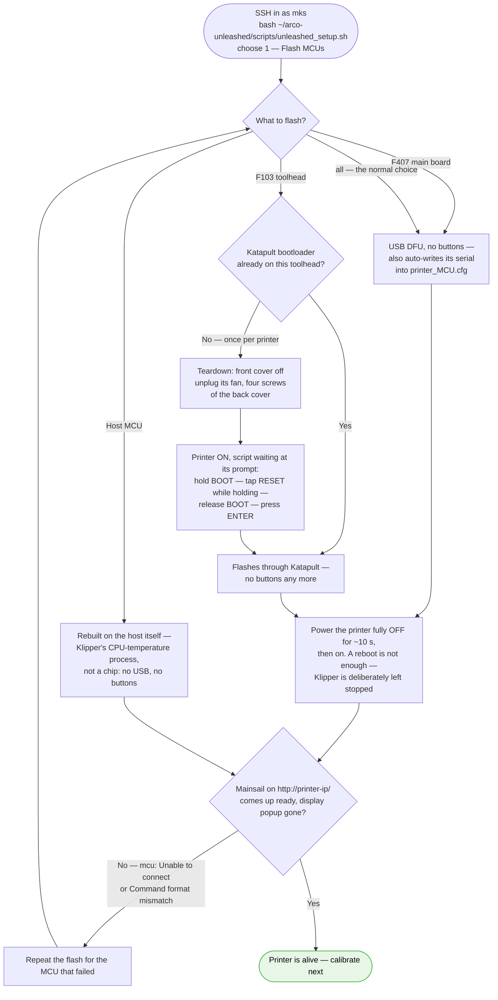

---

## 10. Calibrate, save it, print

QUICKSTART Steps 5–6. The image ships **no** calibration on purpose — another printer's numbers are
worthless. There is **no z-offset step**: the Arco probes with a load cell.

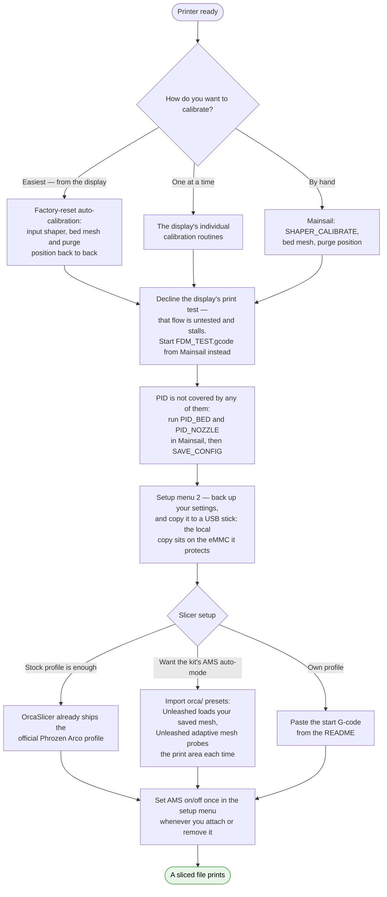

---

## 11. The setup menu — everything it can do

`scripts/unleashed_setup.sh` (image path). Run it any time with
`bash ~/arco-unleashed/scripts/unleashed_setup.sh`.

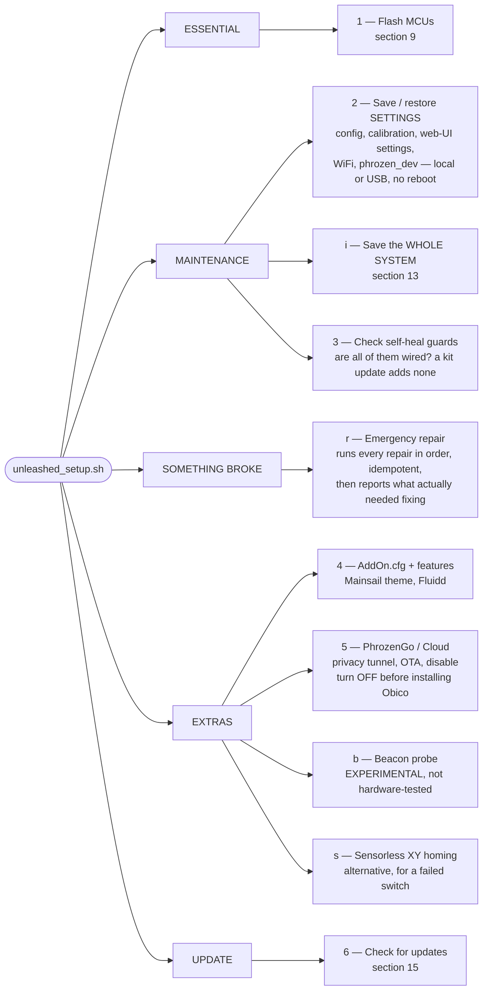

---

## 12. Path C — base image + KIAUH, the manual build

`unleashed` bootstrap → `scripts/unleashed_setup_manual.sh`. The base image is Armbian plus the Arco
hardware enablement — **no Klipper, no phrozen_dev**. Choose this if you want to assemble the stack
yourself.

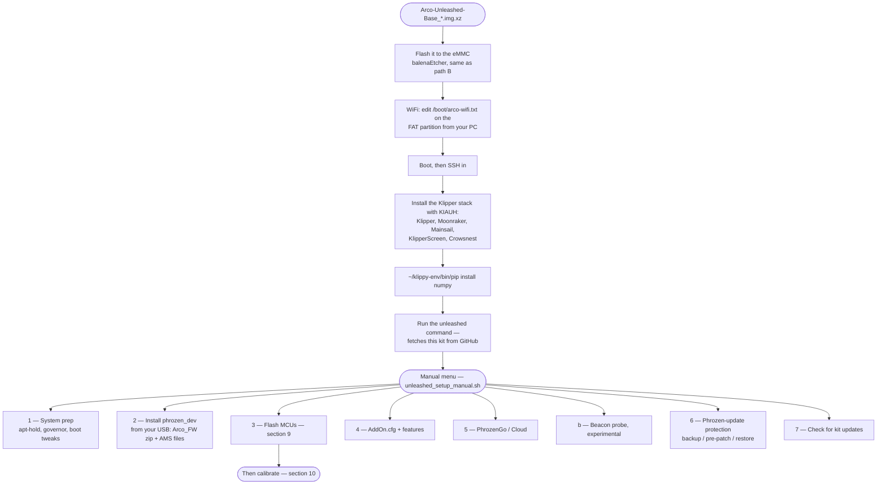

---

## 13. Whole-system backup and restore

Setup menu **i** → `selfflash/install-unleashed.sh --backup` / `--arm --image`. This is the disk-image
kind: every file, the partition table, the bootloader. Menu **2** is the other kind — your settings only,
a few MB, quick, and it cannot revive a printer that no longer boots.

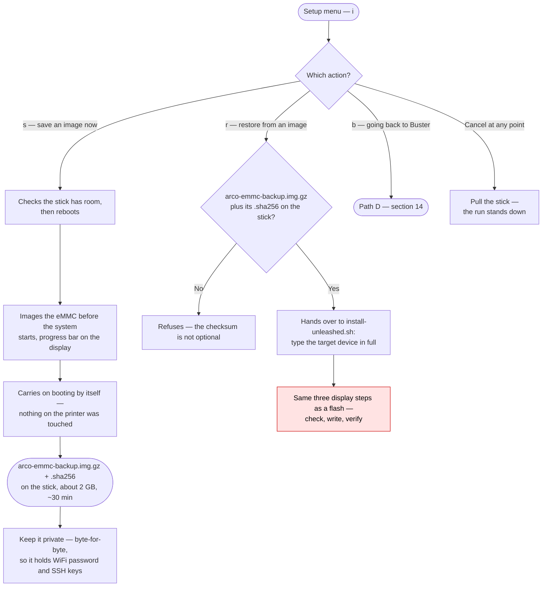

> An image taken from Unleashed **restores Unleashed**. The one that puts the printer back on Phrozen's
> system has to be made *before* the migration (section 2) — afterwards it cannot be produced at all.

---

## 14. Path D — back to Buster

Setup menu **i → b**, or `revert-to-buster/flash-buster-mcus.sh` by hand. **Swapping the eMMC is not
enough:** the MCU firmware sits on the STM32 chips, so a Buster host (v0.11) would boot and then fail to
find its own hardware.

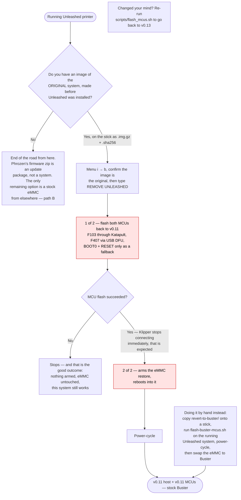

Gone afterwards: the v0.13 stack, the self-heal guards, sensorless homing, the AddOn macros, Fluidd, the
theme, the WiFi portal, and the backup feature itself. Your prints, Orca profiles and the AMS keep working.

---

## 15. Updates and self-healing

`scripts/selfupdate.sh` · `scripts/update-from-usb.sh` · `scripts/check-guards.sh` ·
`scripts/emergency-repair.sh`.

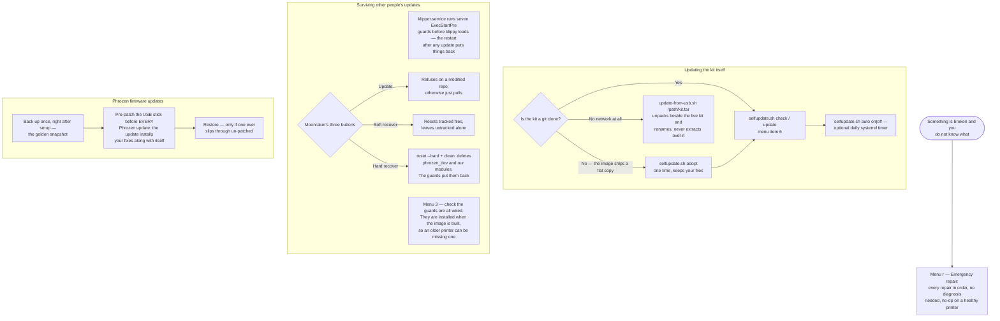

---

## 16. When it goes wrong — where to look

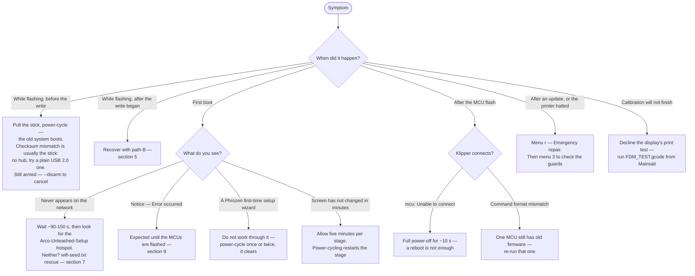

---

## Where each diagram comes from

| Section | Source in this repo |
|---|---|
| 1, 3 | [README](README.md) "Two ways to install", [QUICKSTART](QUICKSTART.md) Step 1 |
| 2 | `collect_data_arco.sh`, [QUICKSTART](QUICKSTART.md) Steps 0 / 0b |
| 4 | [`selfflash/install-unleashed.sh`](selfflash/install-unleashed.sh), [`selfflash/README.md`](selfflash/README.md) |
| 5 | [MANUAL](MANUAL.md) Steps 1–3 |
| 6, 7, 8 | [`scripts/arco-firstrun.sh`](scripts/arco-firstrun.sh), [`scripts/wifi-portal/`](scripts/wifi-portal), [`scripts/fetch-phrozen-fw.sh`](scripts/fetch-phrozen-fw.sh) |
| 9 | [`scripts/flash_mcus.sh`](scripts/flash_mcus.sh), [MANUAL](MANUAL.md) Step 5 |
| 10 | [QUICKSTART](QUICKSTART.md) Steps 5–6, [`orca/`](orca) |
| 11 | [`scripts/unleashed_setup.sh`](scripts/unleashed_setup.sh) |
| 12 | [`scripts/unleashed_setup_manual.sh`](scripts/unleashed_setup_manual.sh) |
| 13, 14 | [`scripts/_arco-lib.sh`](scripts/_arco-lib.sh), [`revert-to-buster/`](revert-to-buster) |
| 15 | [`scripts/selfupdate.sh`](scripts/selfupdate.sh), [`scripts/update-from-usb.sh`](scripts/update-from-usb.sh), [`scripts/check-guards.sh`](scripts/check-guards.sh), [`scripts/emergency-repair.sh`](scripts/emergency-repair.sh) |
| 16 | [MANUAL](MANUAL.md) Troubleshooting |
