<p align="center">
  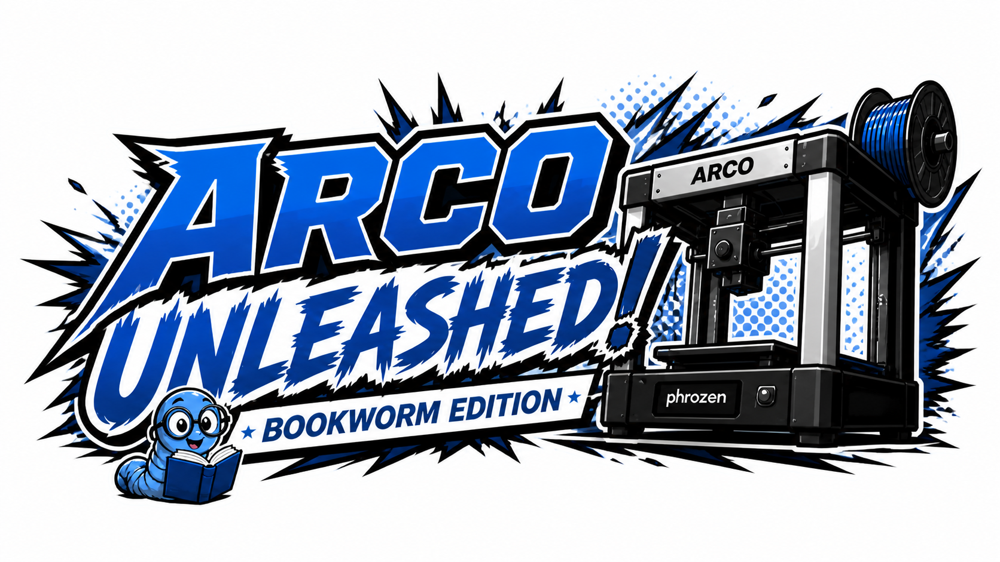
</p>

# Arco Unleashed — Step-by-Step Install Manual

The illustrated long-form of the [README](README.md)'s **🟢 Flash & Run** section. It takes a stock
**Phrozen Arco** and moves it onto **armbian-mkspi (Debian Bookworm, kernel 6.18) · Klipper v0.13** using
the pre-built image. Follow it top to bottom — every screen you'll see is pictured.

> **Two routes onto the printer, and this manual walks both.** Steps 0 and 4–10 are shared; only the
> flashing differs:
> * **[Path A — direct self-flash](#path-a--easy-direct-flash-self-flash--alternative-to-steps-13)**
>   *(no teardown, no PC)* — the running printer overwrites its own eMMC. ✅ Proven on hardware, but
>   **one shot, no net**, and it gives you no chance to save the factory system. It **replaces** steps 1–3.
> * **Path B — eMMC replacement / recovery** *(steps 1–3, below)* — pull the eMMC and flash it on a PC.
>   The proven path, the way to recover a bricked unit, and the only one that lets you keep a way back
>   to stock.
>
> Whichever you take, both meet again at [Step 4](#step-4--connect-via-ssh-putty).

> ⚠️ **Hardware-specific:** Phrozen Arco with MKS board (RK3328, STM32F407 + MKS_THR STM32F103), AP6212
> WiFi. Not a generic Klipper kit. Working inside the printer means mains and electronics — power the
> machine **off and unplug it** before you open the housing. Use at your own risk (see the README
> disclaimer).
>
> ⚠️ **Warranty:** replacing the factory OS/firmware and opening the printer will very likely **void your
> Phrozen warranty**. Keep the original eMMC (or a backup image) so you can restore stock if you ever
> need to — [Step 1](#step-1--remove-the-emmc-module) is the only moment that image can be made. Note
> that the eMMC alone is not the whole way back: Step 5 also reflashes both MCUs, so a full return to
> stock needs their v0.11 firmware too. That is what
> [`revert-to-buster/`](revert-to-buster/PACKAGE-START-HERE.txt) is for.
>
> ℹ️ **This project is not affiliated with Phrozen.** Arco Unleashed is an independent, community-made
> project. It is not endorsed, supported or distributed by Phrozen, and **Phrozen cannot be asked for
> support on a printer running it** — if something is wrong, ask here, not them. *Phrozen* and *Arco*
> are the manufacturer's trademarks and are used only to say which machine this fits.

At a glance:

| Step | What you do |
|---|---|
| **0** | Rescue the AMS server from the *running* printer (one SSH command) — **not a full backup** |
| **A** | *Path A only* — self-flash from the printer, then jump to 4 (**replaces 1–3**) |
| **1** | *Path B* — remove the eMMC module (**and image it, if you want a way back**) |
| **2** | *Path B* — flash the image to the eMMC (balenaEtcher) |
| **3** | *Path B* — first boot: WiFi portal + USB install (from your phone) |
| **4** | SSH in with PuTTY |
| **5** | **Flash the MCUs** (the one essential manual step) |
| **6** | The rest of the setup menu — backup/restore, guards, repair |
| **7** | Calibrate |
| **8** | Optional — AddOn features, Mainsail theme, verify |
| **9** | First print — OrcaSlicer Machine G-code |
| **10** | Optional — Unleashed × KAOS add-on |

> 🛑 **Do Step 0 first — before you flash anything.** The new system needs data (the AMS server
> **`phrozen_master` + `~/hdlDat`**) that lives **only on your original, still-running printer** and is
> **not** in Phrozen's `Arco_FW_V*.zip`. The flash erases it for good. **Collect it now (Step 0)** while the
> old printer still boots — skip it and AMS detection hangs and the display won't return home after calibration.

---

## What you need

<p align="center">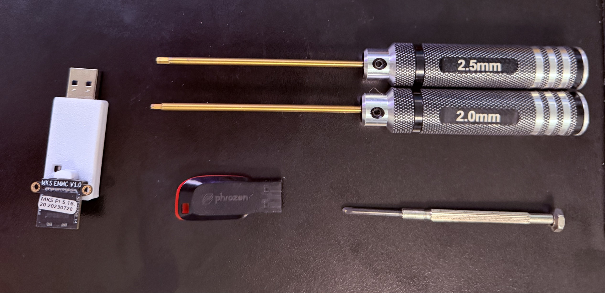</p>

**Tools** (left→right above): a **USB-to-eMMC adapter** (the white MKS eMMC case), a **2.5 mm** and
**2.0 mm hex/Allen key** (rear extruder cover + the printer's lower housing cover), the **FAT32 USB
stick**, and a **small Phillips screwdriver** (the eMMC's retaining screws on the mainboard).

> **Taking path A?** You still need the **hex keys**: path A skips the eMMC teardown, but *every* route
> ends at Step 5, which opens the toolhead to reach two buttons. Only the adapter and the Phillips
> screwdriver are path B-only.
>
> **A spare eMMC module** (optional, and the same MKS V1.0 part) is worth considering on either path:
> flash the spare and the original stays a guaranteed way back to stock. See
> [Step 1](#step-1--remove-the-emmc-module).
>
> **About the stick:** the original Phrozen one is a good fit, but **start it empty**. The tools match
> their inputs by pattern (`Arco-Unleashed*.img.gz`, `Arco_FW_V*.zip`) and take the **first** match, so
> an older firmware zip or a `(1)` copy left on it can win silently and install something you did not
> intend. Format it, then put on only what the table below lists.

**Space** — for the first install, put the printer somewhere you can **work all the way around it**, not
in its usual corner. You will reach inside for the eMMC on the mainboard (underneath) and, in Step 5,
open the toolhead itself to press two buttons on its board. Both are fiddly with the machine wedged
against a wall, and neither is something you want to do twice.

> **Running a PentaShield (or any add-on panels)?** Take **at least the rear panel off before you
> start.** Step 5 needs the two buttons *inside the toolhead*, and the panel is in the way of both the
> covers and your hands. Doing it up front saves interrupting the flash halfway through — see
> [the toolhead button step](#the-toolhead-f103-button-step).

**Media & software** — one **FAT32 USB stick, ≥ 4 GB** (the original Phrozen one is ideal). What you copy
onto it depends on the path — the key difference is that **path A carries the image on the stick**, while
**path B writes the image onto the eMMC** with balenaEtcher, so its stick only holds the first-boot files:

| File | Path A (self-flash) | Path B (this manual) | Where from |
|---|:---:|:---:|---|
| `Arco-Unleashed_bookworm_6.18.30.img.gz` | ✅ | — → onto the eMMC | inside [`Arco-Unleashed-USB.zip`](https://github.com/solutionphil/arco-unleashed/releases) |
| `…img.gz.sha256` **+** `…img.gz.rawsize` | ✅ | — | Releases |
| `unleashed-selfflash.tar.gz` **+** `prepare_unleashed_self_flash.sh` | ✅ | ( ✅ ) — **needed for [Step 0b](#step-0b--optional-image-the-whole-printer-first)** | Releases |
| `Arco_FW_V*.zip` — **optional**, see below | ( ✅ ) | ( ✅ ) | [Phrozen](https://fs.phrozen3d.com/arco/Arco_199/Arco_FW_V199.zip) — *you download it* |
| **`arco-phrozen-ams.tar.gz`** | ✅ | ✅ | Step 0 (`collect_data_arco.sh`) |
| *optional* `wifi-seed.txt` / `no_wifi.txt` | ✅ | — | you create it (see [`selfflash/`](selfflash/README.md)) |

> **When do you need `Arco_FW_V*.zip`?** Normally you don't. Phrozen publishes the display module in
> their own public repository, and the printer offers to fetch it from there — you confirm once, it
> downloads, and the checksum is verified before anything is installed. Bring the zip if **either** of
> these applies to you:
> - **the printer will have no internet while you set it up** (a stick with the zip is the offline route), or
> - **you want the PhrozenGo cloud app** — it is only in Phrozen's own package, not in the repository.
>
> Display and AMS firmware are *not* a reason: those are updated through Phrozen's own USB firmware
> update, not from this stick.
>
> The zip always wins: if one is on the stick, nothing is downloaded at all. Added, it looks like this
> — the same stick as in Step 0, with Phrozen's package beside the AMS backup:
>
> <p align="center">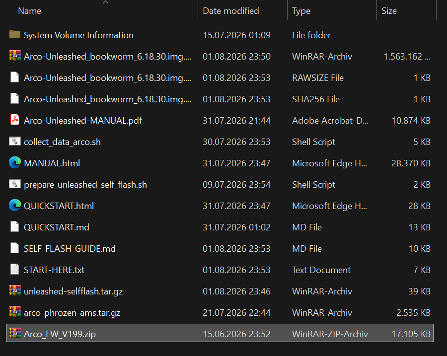</p>

*Nothing proprietary is bundled with this project. Phrozen's module is either read from the zip you
supply, or — only after you confirm — downloaded from **Phrozen's own** public repository onto your
printer. Nothing of Phrozen's is hosted, mirrored or redistributed here.*
**Path B additionally needs [balenaEtcher](https://etcher.balena.io/) on a PC** plus the tools pictured above.

---

<a id="step-0"></a>

## Step 0 — Collect data from your still-running printer · **do this first**

> 🛑 **This is not a backup of your printer.** It rescues **two files** that exist nowhere else — nothing
> more. Everything else on the printer (your calibration, uploaded G-code, settings, Phrozen's own system)
> is **erased by the flash and cannot be brought back** afterwards.
>
> 💾 **If you want a way back, make one first — see [Step 0b](#step-0b--optional-image-the-whole-printer-first).**
> It copies the entire eMMC onto your USB stick as one file you can write back later, without opening the
> printer. Phrozen publish no stock image, so this is the only way to keep the machine you have today.
>
> **This is also the only moment it can be done.** An image taken later, from Unleashed, restores
> Unleashed. The one that takes the printer back to Phrozen's system has to be a copy of Phrozen's
> system, and after the flash that system no longer exists here to copy. The setup menu's
> *b — going back to Buster* needs exactly this file; without it, that road is closed.

**Before you flash anything, grab data off the original printer while it still boots.** The AMS server
(**`phrozen_master` + `~/hdlDat`**) lives **only** in the original base OS — it is *not* in Phrozen's
`Arco_FW_V*.zip`. The flash wipes it, and without it AMS detection hangs and the display won't return home
after calibration. There is **no way to recover it later** — so do this **now, on the original printer**:

1. Copy **`collect_data_arco.sh`** (from this repo) onto the FAT32 USB stick and plug it into the printer.
2. SSH into the *original* printer (PuTTY on Windows, `ssh` on Mac/Linux): *Host* = the printer's **IP**
   (from your router or the Phrozen display), *Port* `22`, login **`mks`** / **`makerbase`**.
3. Run:
   ```bash
   bash ~/printer_data/gcodes/USB/collect_data_arco.sh ~/printer_data/gcodes/USB
   ```
   *(`~/printer_data/gcodes/USB` is where the Arco auto-mounts the stick.)*

   > **If that command fails because the folder is empty,** the stick did not auto-mount. Mount it
   > yourself — **to that same path**, because the script and everything after it expect it there.
   > Find the partition with `lsblk`, then:
   > ```bash
   > sudo mkdir -p /home/mks/printer_data/gcodes/USB
   > sudo mount /dev/sda1 /home/mks/printer_data/gcodes/USB
   > ```
   > Only needed if the folder is empty — normally the Arco mounts the stick there by itself, on the
   > stock system and on Unleashed alike.
4. It writes **`arco-phrozen-ams.tar.gz`** onto the stick. **On your PC, confirm the file is really
   there** — if it's missing, re-insert the stick and run the command again.

When you're done the stick holds this — keep it, you'll reuse the same stick in Step 3:

<p align="center">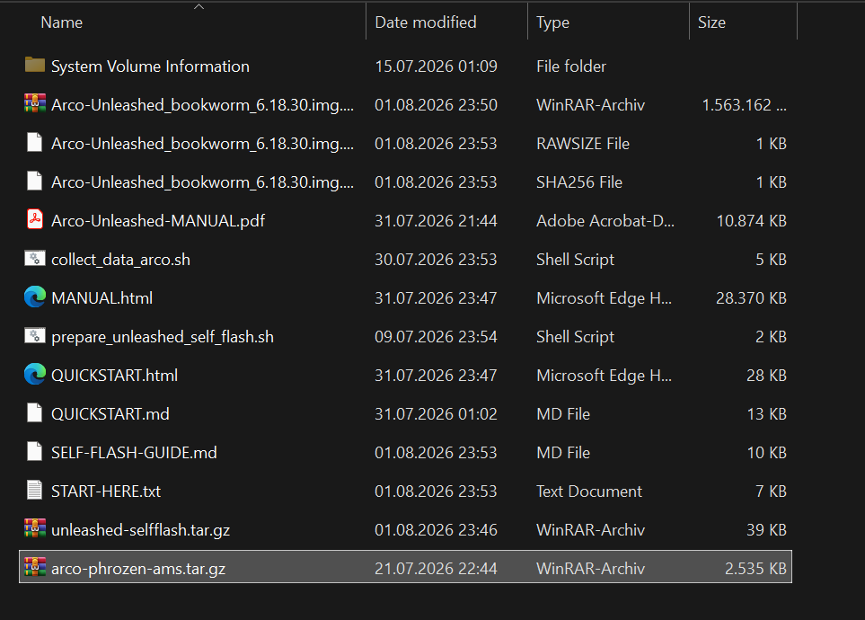</p>

Everything above the highlighted line came out of **`Arco-Unleashed-USB.zip`**, extracted to the top
level of the stick. The highlighted **`arco-phrozen-ams.tar.gz`** is what Step 0 just produced — the
one file no download and no Phrozen package can replace. The new system re-installs it by itself on
first boot.

---

<a id="step-0b--optional-image-the-whole-printer-first"></a>

## Step 0b — *optional:* image the whole printer first

**This is the way back.** Phrozen do not publish a stock image, so once the eMMC is overwritten, the
machine you have today is gone unless you copied it first. This copies **all of it** — every file, the
partition table, the bootloader — onto your USB stick as one `arco-emmc-backup-*.img.gz`, and it needs no
teardown: no screws, no eMMC removal, no PC.

It is entirely optional. Skip it if you have no intention of ever going back.

**You need two things on that stick.** First, room for the image — **8 GB or larger**, plugged
**straight into the printer, never through a USB hub**. Second, the self-flash tool itself:

| On the stick | From |
|---|---|
| `unleashed-selfflash.tar.gz` | inside [`Arco-Unleashed-USB.zip`](https://github.com/solutionphil/arco-unleashed/releases) |
| `prepare_unleashed_self_flash.sh` | the same zip |

> **Why these, when you are flashing the eMMC externally?** Because right now your printer is still
> running Phrozen's original system, and none of this project's files are on it yet. The backup tool has
> to come from the stick — that is the whole reason it ships as a standalone package that needs no
> installation. Path A users have both files on the stick anyway; on path B they are the one thing you
> have to add for this step.

> ⚠️ **The backup is one single file, and FAT32 cannot hold a file of 4 GiB or more.** Everything in
> this manual uses FAT32, and so does this — but it does mean the backup has to stay under that ceiling.
> The tool measures first and tells you the estimate before anything happens, so you find this out in a
> sentence rather than half an hour in.
>
> If it says the backup is too large, **deleting files will not help.** This is an image of the whole
> eMMC, not a copy of its files: everything you delete stays in the freed blocks byte for byte, and
> compresses no better than noise. Two things do help, in the order worth trying:
>
> **1. Zero the free space, then run the backup again.** Usually decisive on a printer that has seen a
> lot of prints. It fills the disk for a few minutes and then releases it again:
>
> ```bash
> sudo dd if=/dev/zero of=/zero.tmp bs=1M 2>/dev/null; sync; sudo rm -f /zero.tmp; sync
> ```
>
> Do not print while that runs, and reboot afterwards. The backup itself also zeroes free space on its
> own, in the moment the filesystem is unmounted — this is the same trick, done early enough to be
> visible in the estimate.
>
> **2. Compress harder.** Slower, and buys roughly 10–15 %:
>
> ```bash
> sudo ARCO_BACKUP_GZIP=6 bash ~/selfflash/install-unleashed.sh --backup
> ```
>
> If it still will not fit, image the eMMC on a PC instead (path B, step 1) — that has no size limit at
> all.

On the printer:

```bash
sh ~/printer_data/gcodes/USB/prepare_unleashed_self_flash.sh
sudo bash ~/selfflash/install-unleashed.sh --backup
```

It measures the eMMC (about a minute, silent), tells you how big the backup will be and whether the stick
has room, then asks. Say yes and it reboots, images the eMMC **before the system starts** — the only
moment nothing is using it, which is what makes the copy trustworthy — and shows its progress on the
display. **Nothing on the printer is written to or changed**, and pulling the stick cancels it.

When it finishes it says so on the display, holds that screen for a moment and then carries on booting on
its own — no power-cycle, no restart. Nothing on the printer was touched, so there is nothing to restart
*for*. Take the stick out whenever you like. On it you will find:

| File | What it is |
|---|---|
| `arco-emmc-backup-stock.img.gz` | the image itself — **`-stock`** when taken from Phrozen's system, **`-unleashed`** when taken from this one |
| `…img.gz.sha256` | its checksum — the restore refuses without it |
| `…img.gz.rawsize` | its uncompressed length, used to reject an image that cannot fit |

> **Why the name says which system it holds.** An image of Phrozen's original system cannot be made
> again once the printer has been migrated, and Phrozen publish none. With a single name, the next two
> routine backups would have pushed it aside and then deleted it. Each kind now rotates on its own, so
> an Unleashed backup can never displace a stock one — and the restore menu can tell you what each file
> is instead of asking you to remember. Backups made by older versions keep their plain name and still
> work.

**Measured on a printer with a 32 GB eMMC:** about half an hour, and the file came out at 2.3 GB. A stock
8 GB eMMC is proportionally quicker and smaller.

> 🔒 **Keep it to yourself.** It is a byte-for-byte copy of your printer, so it contains your WiFi
> password, your SSH keys and any API tokens on the machine — and, taken from a factory printer,
> Phrozen's own software, licensed to you. Never post or share it.

> 🔌 **No USB hub, for this or for flashing.** Put the stick directly in the printer. A hub is the most
> common reason a file copies fine and then reads back different, which surfaces much later as a
> checksum mismatch. And if you ever see **CRC or I/O errors** in the log, stop changing settings — that
> is the stick failing, or one this printer cannot drive. Use another, preferably a plain USB 2.0 one.

**To write it back later** — the ordinary flash, pointed at your own file instead of a release:

```bash
sudo bash ~/selfflash/install-unleashed.sh --arm --image /path/to/arco-emmc-backup-stock.img.gz
```

It verifies the checksum, refuses if the image cannot fit this printer's eMMC, and skips the WiFi and
first-boot-file steps — a restore is not an install, and your image already carries both. Restoring a
32 GB image takes appreciably longer than a normal flash, because it writes the whole eMMC.

**It runs once per arming.** Arming writes a marker onto that stick and the backup consumes it before it
starts, so it fires exactly once, for that stick. Run the command again for another one — including after
a failed attempt, where the marker is spent either way.

Once Arco Unleashed is installed, both halves are in the setup menu under **i) WHOLE SYSTEM: save /
restore**, which lists the images on your stick and hands the chosen one to the same flasher.

---

<a id="path-a--easy-direct-flash-self-flash--alternative-to-steps-13"></a>

## Path A — Easy direct flash (self-flash) · *alternative to Steps 1–3*

No teardown, no PC: the running printer overwrites its **own** eMMC, streaming the image from the USB
stick. ✅ **Proven on hardware** — but **one shot, no net**: once the write begins, a failure is recovered
with Steps 1–2 below. If you already own an eMMC adapter, path B stays the safer choice.
Full detail: [`selfflash/README.md`](selfflash/README.md). *Prefer path B? Skip ahead to Step 1.*

> 🛑 **Path A gives you no chance to save the factory system.** It never removes the eMMC and never
> touches a PC, so the stock Buster install is overwritten in place and cannot be imaged first. If you
> may ever want to go back to stock, **take path B** and make the dump in
> [Step 1](#step-1--remove-the-emmc-module).

**Prepare the stick.** On the same FAT32 stick as Step 0, also put: the **image** (`.img.gz` + `.sha256` +
`.rawsize`), **`unleashed-selfflash.tar.gz`** and **`prepare_unleashed_self_flash.sh`** — all from the
release. Phrozen's `Arco_FW_V*.zip` only if one of the two cases above applies to you; the flasher says
which files it found before it arms anything.

**WiFi** *(recommended — the printer must come online for the SSH MCU-flash in Step 5)*: add **nothing** and
it **live-captures** the network the printer already uses (known-good, keeps its country), **or** create a
`wifi-seed.txt`:
```
SSID=YourNetworkName
PSK=YourWiFiPassword
COUNTRY=US
```
(plain text, no quotes, a **2.4 GHz** network. **`COUNTRY`** is your **2-letter WiFi region code** — US, CA,
GB, AU, …; **set it to yours**, the region must match your router or the printer may not join.)
A wrong or missing WiFi falls through to the first-boot phone portal (where you pick your network **and
your country** from dropdowns). With WiFi details seeded it allows **about 90 seconds** for the radio to
come up, associate and get an address before falling back to the portal; with none configured it goes to
the portal almost at once. A network that connects returns in a second or two, so a correct WiFi costs no
real delay. If the portal does not appear either, you can still hand the printer your network from the USB
stick afterwards — see Step 3.

**1) Unpack the tool, then look before you leap.** SSH in as `mks` ([Step 4](#step-4--connect-via-ssh-putty)
shows how). The stick auto-mounts at `~/printer_data/gcodes/USB` (on a stock printer and on Unleashed);
unpack the tool from there and run the inspect pass, which **changes nothing**:

```bash
cd ~/printer_data/gcodes/USB          # where the USB stick auto-mounts
sh prepare_unleashed_self_flash.sh    # unpacks the tool to ~/selfflash
sudo bash ~/selfflash/install-unleashed.sh   # inspect only
```

> If `~/printer_data/gcodes/USB` is empty, the stick didn't auto-mount. Mount it **to that same path** —
> then the commands above work unchanged (`lsblk` tells you the partition):
> ```bash
> sudo mkdir -p /home/mks/printer_data/gcodes/USB
> sudo mount /dev/sda1 /home/mks/printer_data/gcodes/USB
> ```

**2) Arm it.** `--arm` prints the disclaimer, verifies the image's checksum against its `.sha256`, and names
the target eMMC — read that line and make sure it is the device you mean:

<p align="center">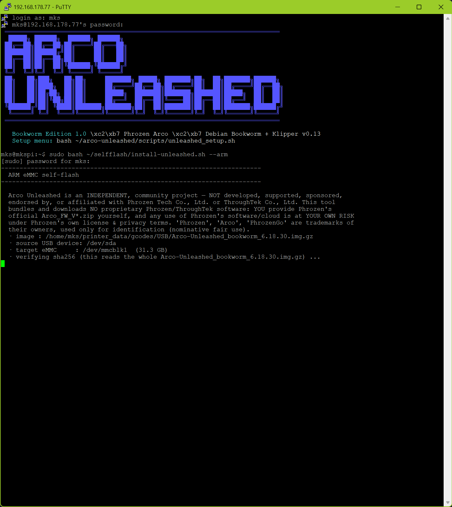</p>

Then it asks you to type `yes`, and after that the device name in full. Two separate confirmations, on
purpose: once the write starts it cannot be stopped or reversed:

<p align="center">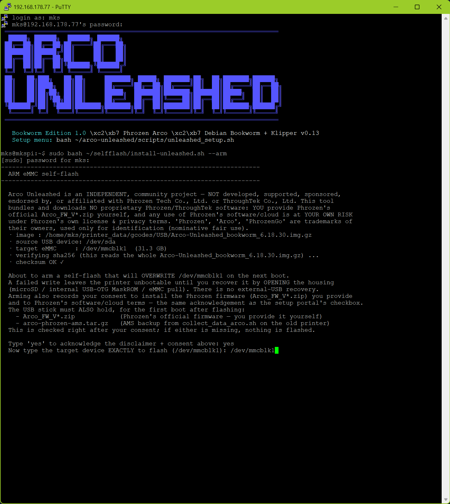</p>

It checks the stick for the files the **first boot** needs, then **shows the WiFi it will use** (live-captured
from the running system, or from your `wifi-seed.txt`) and asks you to **confirm** it — decline, and it offers
the first-boot portal instead. Then it rebuilds the initramfs and arms the flash:

<p align="center">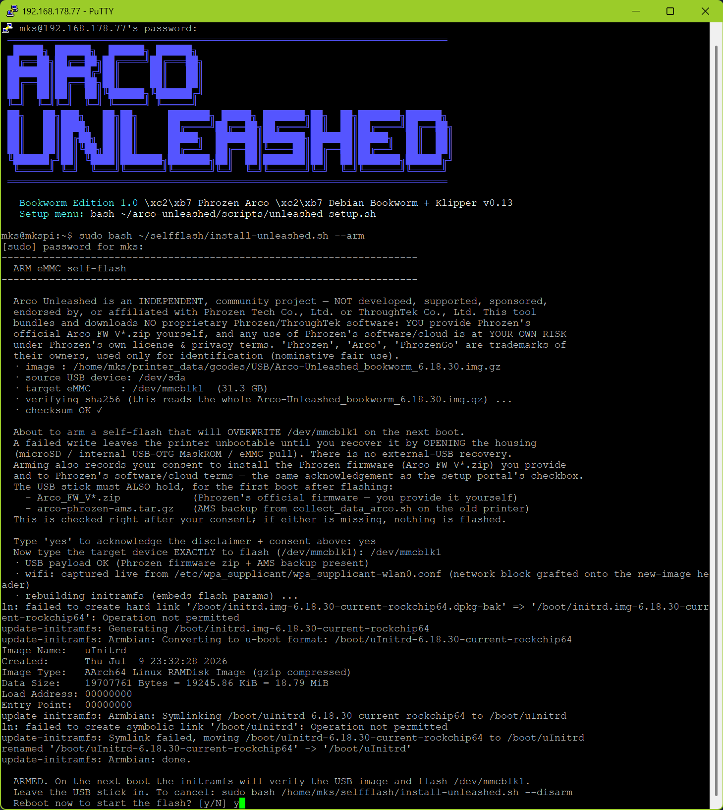</p>

> The screenshot predates the WiFi-confirm prompt; current builds print the captured/seeded SSID and ask you
> to confirm it (or fall back to the portal) right before arming.

> The two `ln: failed to create … Operation not permitted` lines in that screenshot were **harmless**:
> `/boot` is FAT32, which has neither hard links nor symlinks, so `update-initramfs` simply falls back to
> copying. Current builds filter those lines out — the screenshot predates that.

**3) Reboot.** Answer `y`. Your SSH session drops immediately. **That is the reboot, not a fault:**

<p align="center">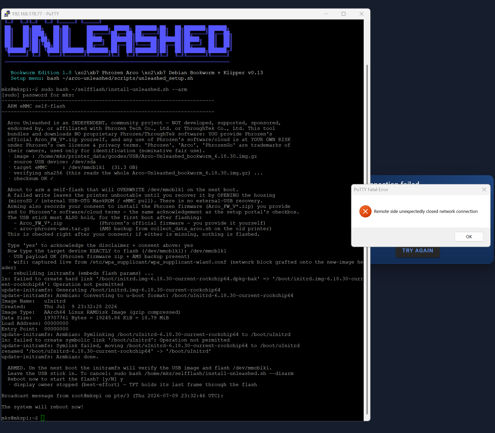</p>

**4) Watch the display.** Three named steps run in order — *check → write → verify*. Only the write phase
tells you not to power off, because only then is anything actually being overwritten:

<p align="center">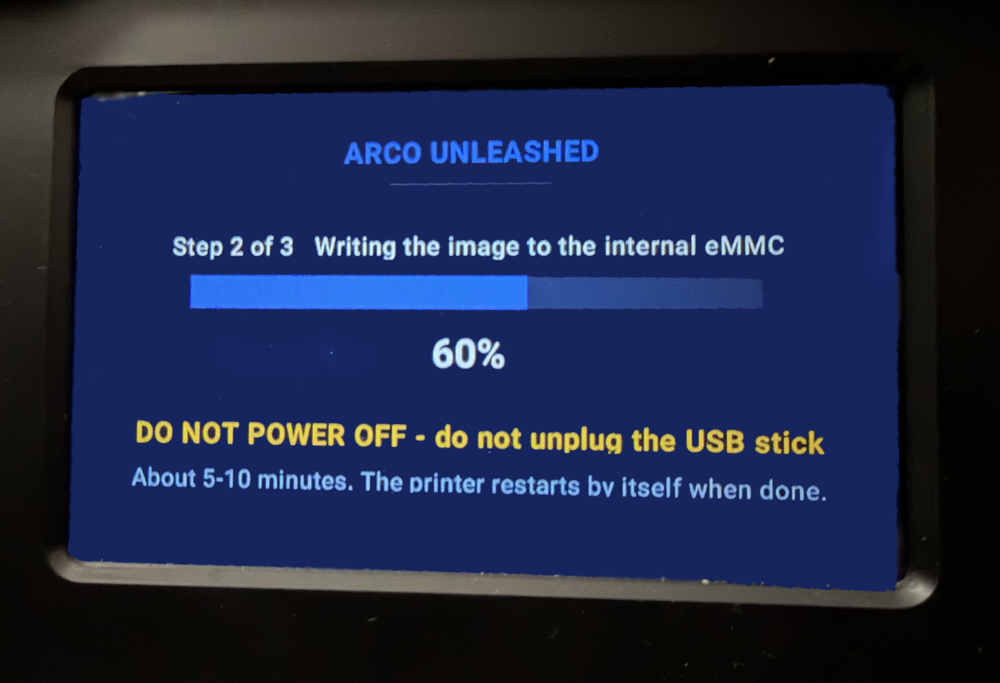</p>

When the write and verify finish, the display shows **"Done — Restarting now"** and reminds you to keep the stick plugged in while the printer finishes setup:

<p align="center">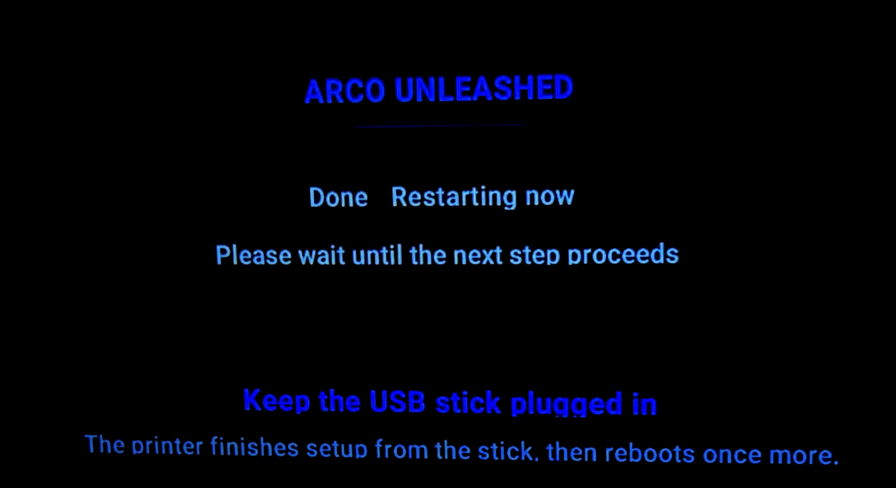</p>

**Leave the USB stick plugged in.** The printer reboots itself, brings up the WiFi you seeded and installs
Phrozen's parts from it, rebooting once more. Then continue at
**[Step 4](#step-4--connect-via-ssh-putty)** — Steps 1–3 do not apply to you.

> **What the display shows on that first boot** — after the Phrozen install it shows **"Update complete —
> wait for restart…"**, **restarts itself once** a few seconds later, and then settles on a
> **"Notice — Error occurred"** screen. **That last one is expected, not a fault** — Klipper can't start until
> the MCUs are flashed, and *no amount of restarting/power-cycling clears it*. **Wait for the settled
> "Error occurred" screen** — that means the automatic restart is done — **then** connect over SSH for
> **Step 5 (Flash the MCUs)**. Don't SSH *before* that (the auto-restart would drop the session), and don't
> try to set up on the display.
>
> You should **not** see a Phrozen *first-time setup wizard* (language → name → chute calibration → homing).
> It is switched off deliberately: it ends in a homing move, which cannot finish before Step 5, so it is a
> dead end. If one ever does appear, don't work through it — **power-cycle once or twice** and it clears
> itself.

> **If that WiFi doesn't connect** (wrong password, changed/5 GHz network, or you chose `no_wifi.txt`), the
> printer falls back to its **setup portal** on the first boot — join **`Arco-Unleashed-Setup`** from a phone
> (`192.168.4.1`) and enter your network — it gives up on the seeded WiFi after about 90 seconds, so do not pull
> the plug before that. This matters here because until the MCUs are flashed (Step 5) the display shows an MCU
> error and cannot set WiFi itself. If even the portal fails to come up, the `wifi-seed.txt` rescue in Step 3
> still gets the printer onto your network.

> 🚪 **If it goes wrong *before* the write begins** — image missing, checksum mismatch, or the flasher
> hangs — **pull the USB stick and power-cycle.** With no image on the stick the flasher stands down and
> your existing system boots normally. Once the write has begun, only Steps 1–2 can recover the printer.
>
> **The flash stays armed, and that is how you retry:** put a good image back on the stick, power-cycle,
> and it simply tries again. But if you stop here and carry on using the old system, **cancel it first** —
> otherwise the next boot with that image on a plugged-in stick overwrites the eMMC without asking:
> ```bash
> sudo bash ~/selfflash/install-unleashed.sh --disarm
> ```

---

## Path B — eMMC replacement / recovery · *Steps 1–3*

The proven route: pull the eMMC, flash the image onto it with **balenaEtcher** on a PC, put it back. This is
also how you **recover** a printer if a path-A self-flash ever fails. Steps 1–3 below are this path; then
both paths meet again at **[Step 4](#step-4--connect-via-ssh-putty)**.

> *Took **path A** above? The eMMC is already flashed — skip straight to
> [Step 4](#step-4--connect-via-ssh-putty).*

<a id="step-1--remove-the-emmc-module"></a>

## Step 1 — Remove the eMMC module

> 🛑 **This is your only chance to save the factory system.** The printer has **one** eMMC. Step 2 writes
> over it, and the stock Buster install on it is gone for good — Phrozen do not publish an image of it.
> Two ways to keep a road back, and you must choose now:
>
> * **Keep the original module.** Fit a **spare eMMC** (they are cheap and the same MKS V1.0 part), flash
>   *that* in Step 2, and put the original in a drawer. Refitting it is then a two-minute job.
> * **Or image it before you overwrite it.** With the module in the adapter, take a full dump *first*:
>   **Windows** — [Win32DiskImager](https://sourceforge.net/projects/win32diskimager/), the **Read**
>   button (balenaEtcher cannot do this; its *Clone* is drive-to-drive and produces no file).
>   **Mac/Linux** — `sudo dd if=/dev/sdX of=buster.img bs=4M`, with `sdX` from `lsblk`.
>   It dumps the whole ~31 GB, so have the space free and expect it to take a while.
>
> This is not precaution for its own sake: the kit's own way back,
> [`revert-to-buster/`](revert-to-buster/PACKAGE-START-HERE.txt), lists as its **first** requirement
> *"YOUR OWN buster.img — a 1:1 full-disk dump of a WORKING Buster eMMC"*. This step is the only moment
> it can be made.

**Power the printer off and unplug it.** Then open the **lower housing cover** — undo the circled bottom
screws with the hex key:

<p align="center">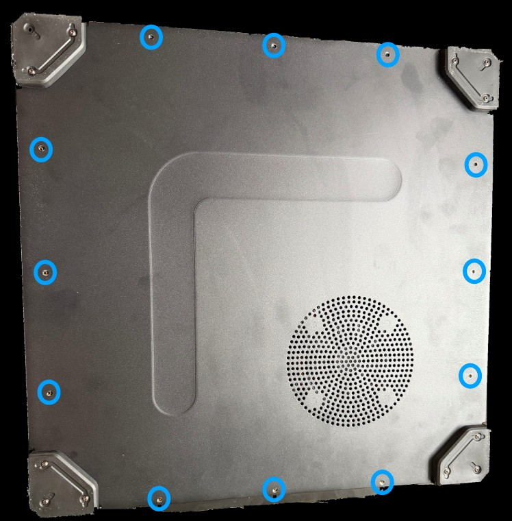</p>

On the **Phrozen Bumblebee** mainboard, find the **MKS eMMC V1.0** module (labelled *MKS PI …*). It's
held by **two Phillips screws** (arrows). Undo them:

<p align="center">
  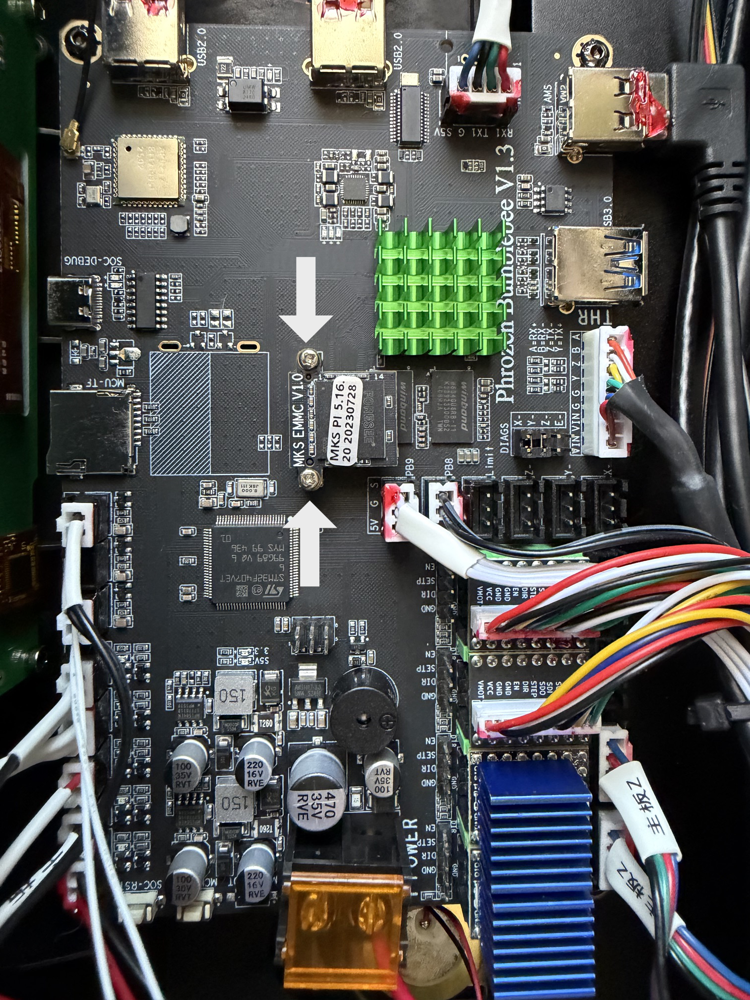
  &nbsp;&nbsp;
  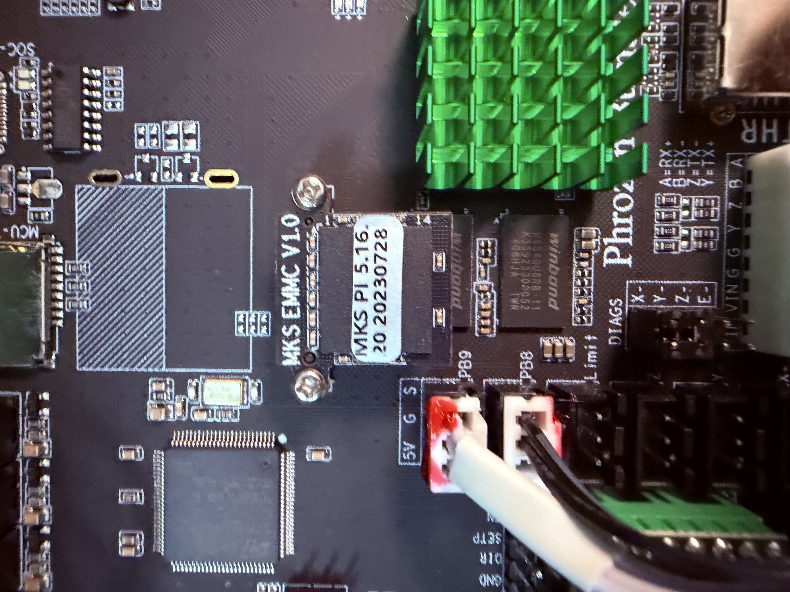
</p>

Lift the module out and slide it into the **USB-to-eMMC adapter**:

<p align="center">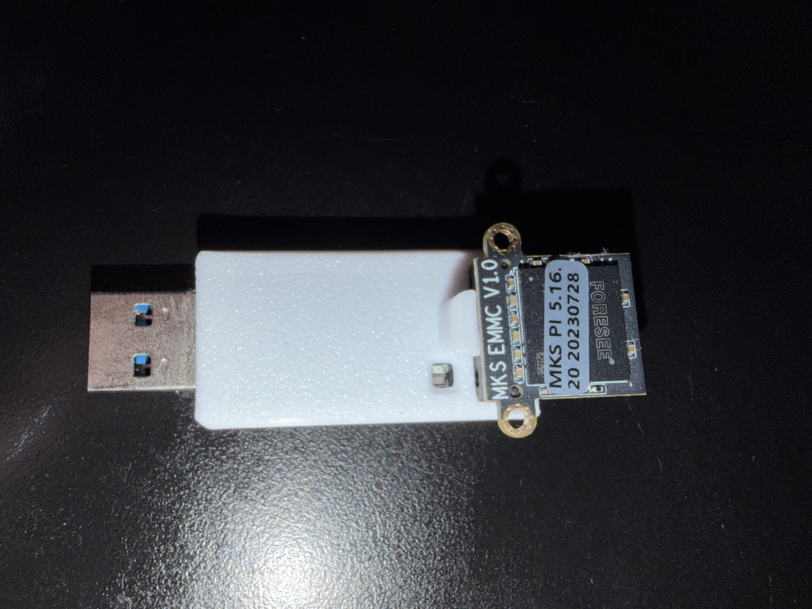</p>

---

## Step 2 — Flash the image with balenaEtcher

Plug the adapter into your PC and open **balenaEtcher**. (Use the GUI — no WSL needed.)

**2.1 — Flash from file:** click **Flash from file** and pick the Arco Unleashed `.img`
(unzip the `.img.gz` first if your Etcher can't read `.gz` directly).

<p align="center">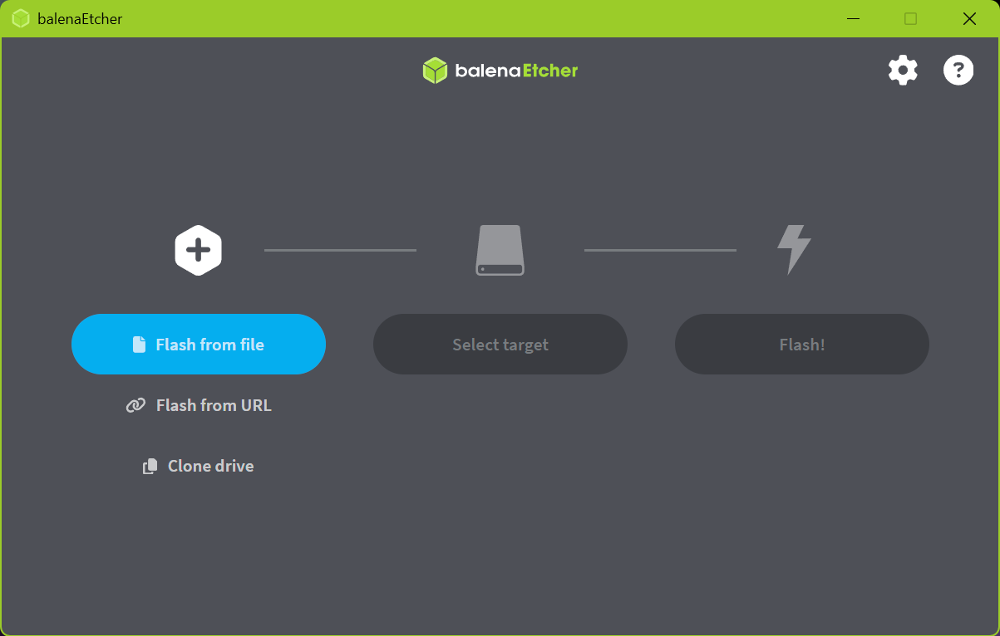</p>

**2.2 — Select target:** click **Select target**.

<p align="center">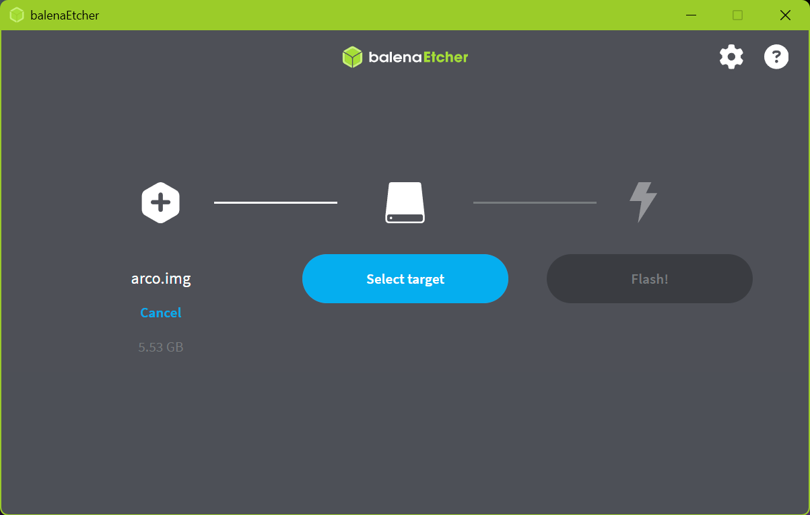</p>

**2.3 — Pick the *right* drive:** choose the **eMMC** (here the ~**31 GB** "Generic STORAGE … USB
Device"). ⚠️ **Do not** pick your big system disk (the 500 GB "Large drive" is flagged for a reason) —
Etcher **erases** whatever you select.

<p align="center">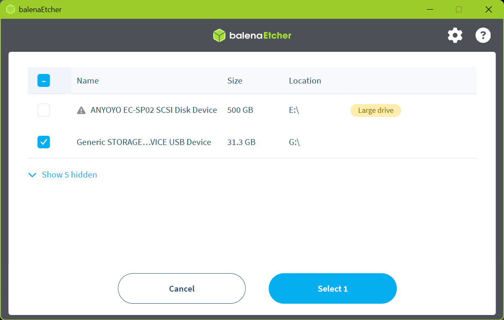</p>

**2.4 — Flash!** Confirm the file and target, then click **Flash!**

<p align="center">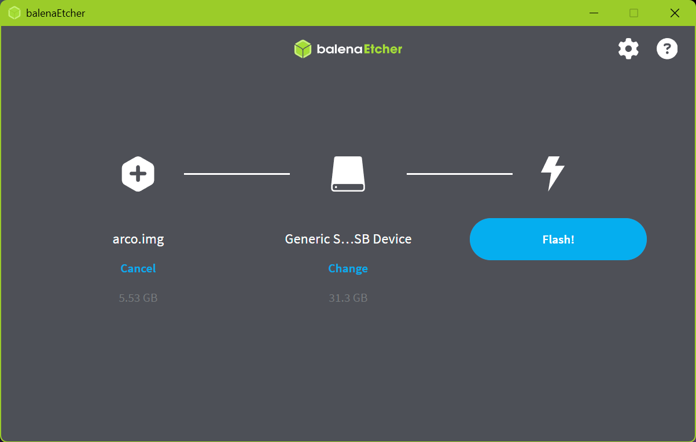</p>

**2.5 — Ignore the Windows "format disk" popup.** Windows can't read the Linux partitions and will offer
to format the drive — click **Cancel / Abbrechen**. **Never** click *Format disk*.

<p align="center">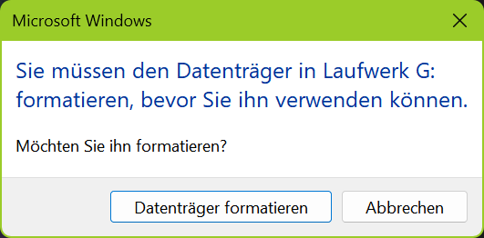</p>

**2.6 — Done.** When Etcher shows **Flash Completed!**, safely eject the adapter.

<p align="center">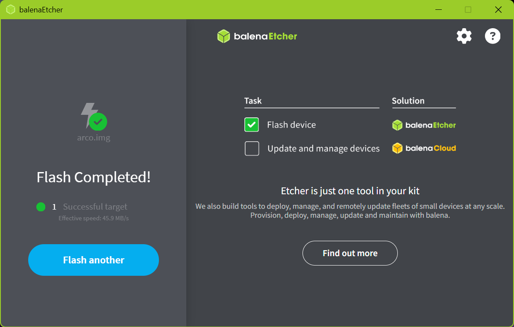</p>

Put the eMMC **back into the mainboard** (re-fit the two screws) and **close the housing**.

---

## Step 3 — First boot: WiFi portal + USB install

The public image ships **without** Phrozen's software, so the first boot brings up a **WiFi setup
portal**, then installs Phrozen's module — from your stick if a zip is on it, otherwise by fetching it
from Phrozen's own repository after you have confirmed.

**3.1 — Prepare the USB stick.** On the FAT32 stick you need the **`arco-phrozen-ams.tar.gz`** from
Step 0 (see the picture there). Add **Phrozen's `Arco_FW_V*.zip`** beside it only if the printer will
have **no internet** during setup, or if you want PhrozenGo — see the note under
[What you need](#what-you-need).

**3.2 — Plug the stick in, *then* connect.** Power the printer on and **insert the prepared USB stick into
the printer's USB port now — before you press Connect.** On your **phone**, join the
**`Arco-Unleashed-Setup`** Wi-Fi; the captive portal pops up (`192.168.4.1`). Pick your network, enter the
password, **select your country (WiFi region)**, **tick the consent box**, and press **Connect**. The printer
reboots onto your WiFi.

<p align="center">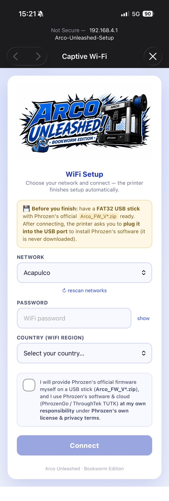</p>

> **No hotspot showing?** Give it **~90 seconds** first — that is how long the printer tries any seeded
> WiFi before it gives up and raises the hotspot. If neither the printer nor the hotspot appears, you can
> hand it the network from the USB stick: create **`wifi-seed.txt`** in the stick's top-level folder with
> the three lines `SSID=` / `PSK=` / `COUNTRY=`, put the stick back in and **power-cycle**. This stage runs
> again on every boot until the Phrozen install finishes, so it picks the file up and joins your network.
> (Beware Notepad saving it as `wifi-seed.txt.txt`; the network must be **2.4 GHz**.)
>
> Each `wifi-seed.txt` is applied **once** on purpose — a later boot must not overwrite a network you set
> through the portal in the meantime — and is renamed `wifi-seed.txt.applied` so you can see it was picked
> up. "Once" is judged by the file's **contents**, recorded on the printer, not by its timestamp: FAT
> sticks record local time and Linux reads it as UTC, so timestamps were unusable. To try again the
> details must genuinely differ (a corrected password); rewriting the identical file changes nothing.

<details><summary>Flashed a release from before this one? (the two-file rescue)</summary>

Older images do not read `wifi-seed.txt` yet. There the rescue takes **two** files on the stick — note the
leading dots:

* `.arco-skip-portal` — an empty file
* `.arco-wifi.conf` — a complete wpa_supplicant config:
  ```
  ctrl_interface=/run/wpa_supplicant
  update_config=1
  country=US

  network={
      ssid="YourNetworkName"
      psk="YourWiFiPassword"
  }
  ```

Then power-cycle. This route still works on current images too.
</details>

**3.3 — USB install.** After the reboot the install runs from that stick and the **display** shows a
progress bar (Reading → Installing → Patching):

<p align="center">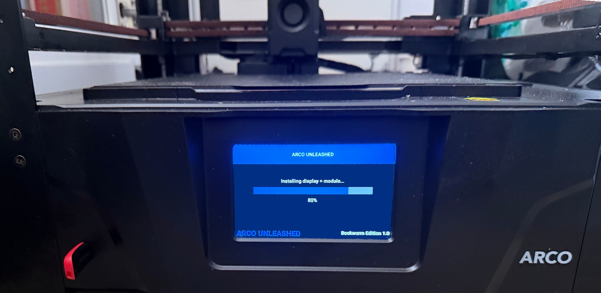</p>

**3.4 — It restarts itself.** At 100 % the display shows **"Update complete — wait for restart…"** and the
printer **reboots on its own** a few seconds later. Let it. **Don't switch it off:** the filesystem batches
writes for up to two minutes, so pulling the power here can cost you most of the install.

> **Phrozen's own "Update Complete — restart printer manually" screen no longer appears**, and that is
> deliberate. It is the same screen that arms a one-time setup wizard, and on a printer whose MCUs aren't
> flashed yet that wizard ends in a homing move that never finishes — a dead end you can't click out of.
> Both are switched off; the screen above replaces them, and the reboot is automatic.

After the restart you can remove the stick. *(The full-card rootfs resize also happens here; SSH host keys
are generated on the first boot.)* Once the MCUs are flashed in [Step 5](#step-5-flash-the-mcus-essential),
the normal Phrozen display WiFi screen handles future network changes.

> **What you see now is "Notice — Error occurred", and that is expected.** Klipper cannot start yet,
> because the MCUs still carry the old firmware — so the display settles on an error popup. The install
> did **not** fail, and restarting or power-cycling will not clear it. **Wait for that settled screen**
> (it means the automatic restart has finished), then go on to Step 4 and flash the MCUs in Step 5.

> **Skip any built-in "print test"** the first-run or a factory reset offers — the bundled test file was
> compiled for the old Klipper and can't run on v0.13. Your first print comes from OrcaSlicer later.

> **Display firmware (.tft).** This project never updates the touch panel. If you install from Phrozen's
> zip, that package happens to carry the panel firmware and Phrozen's own updater may flash it when the
> versions differ; the download route carries none, and nothing about the display changes. **If your
> printer was on an older Phrozen firmware** and the display looks off, **run one official Phrozen USB
> firmware update once** — that is how panel firmware is meant to be updated, and it is safe here: the
> self-heal guards re-apply the v0.13 Klipper patches automatically on the next boot. *(This applies to
> both install paths.)*

---

<a id="step-4--connect-via-ssh-putty"></a>

## Step 4 — Connect via SSH (PuTTY)

1. Find the printer's **IP** (router device list, or on the display).
2. Open **PuTTY** → *Host Name* = that IP, *Port* `22`, *Connection type* **SSH** → **Open** (accept the
   host-key warning on first connect).
3. Login **`mks`** / password **`makerbase`**. You're greeted by the Arco Unleashed banner:

<p align="center">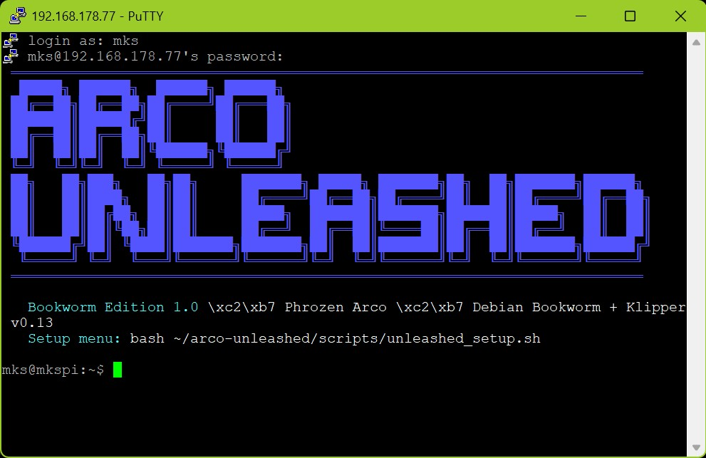</p>

---

## Step 5 — Flash the MCUs  ⚠️ essential

Open the setup menu — everything from here on runs from it:

```bash
bash ~/arco-unleashed/scripts/unleashed_setup.sh
```

<p align="center">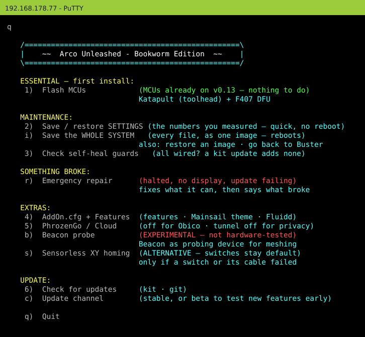</p>

Take **1 — Flash MCUs**. It is the only item that is not optional, which is why it does not wait until
you have read the rest of the menu; the tour of everything else is Step 6.

First boot did everything else automatically. The **one** thing you must still do by hand: the host now
runs Klipper **v0.13**, but your printer's MCUs still carry the old firmware — flash them or Klipper can't
talk to them (`mcu: Unable to connect` / `Command format mismatch`).

Until you do this, the display settles on a **"Notice — Error occurred"** popup and Klipper stays in an error
state. **That is expected, not a fault** — tapping *Confirm*/*Restart* just reboots into the same screen,
because the display cannot recover from an MCU-firmware mismatch on its own. **Don't set anything up on the
display** — the fix is the SSH MCU-flash below (this is why WiFi/SSH access matters after a self-flash).

<p align="center">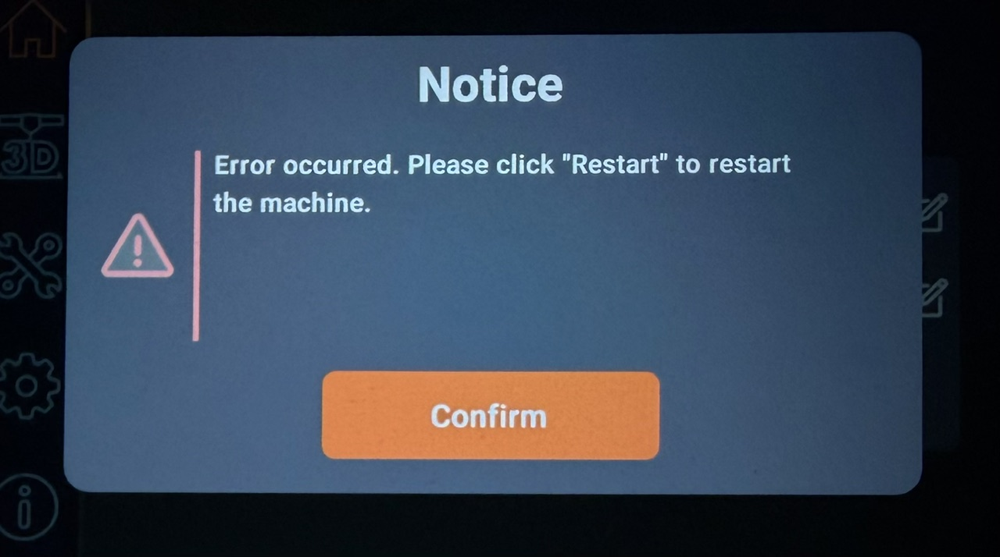</p>

You are now in the **Flash MCUs** submenu. Flash all three in one go, or one at a time — **all three have
to end up flashed**:

<p align="center">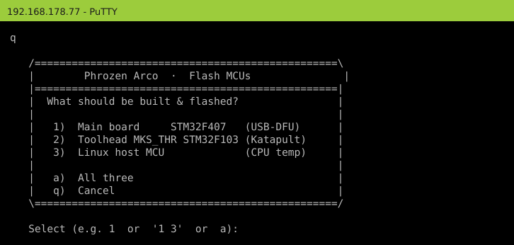</p>

- **1) Main board — STM32F407 (USB-DFU)** — flashes automatically, **no buttons**. It also **reads your
  board's chip id before flashing and writes it into `printer_MCU.cfg`** for you (the id is burned into the
  chip and survives the flash).
- **3) Linux host MCU (CPU temp)** — flashes automatically, no buttons.
- **2) Toolhead — MKS_THR STM32F103 (Katapult)** — the **only** one that needs a hands-on button step,
  and only for its **one-time Katapult install**. Read
  [that section](#the-toolhead-f103-button-step) *before* you pick `2`: it needs the toolhead covers off
  **and** the printer running, and the script first offers `[i]nstall Katapult`, then fetches packages
  and builds the firmware — several minutes before it asks for the buttons. Do not pull the power while
  the script or a DFU write is in flight.

  > The Katapult build configures itself from a setting the kit carries for this toolhead. If it ever
  > opens a configuration menu instead, that setting was missing or a Katapult update renamed something
  > — the script prints which value disagreed and what to set it to.

<a id="the-toolhead-f103-button-step"></a>

### The toolhead F103 button step

The buttons sit **inside** the toolhead, so two covers come off first — **power the printer off and unplug
it for the teardown only.** The flash itself needs the printer *running*, so you will switch it back on
before you touch a button.

> **PentaShield or other add-on panels fitted?** Remove **at least the rear panel** now. The toolhead's
> back cover and its four screws are not reachable past it, and you need both hands free at the
> printhead. Move the toolhead to a comfortable position by hand first — the motors are off.

**1) Front cover.** Take it off — but it is still wired: **unplug the fan** before you set it aside.

<p align="center">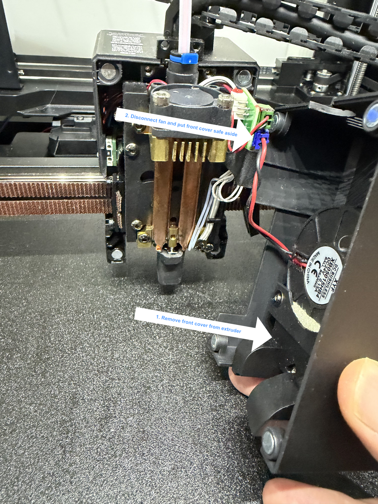</p>

**2) Back cover — four screws.** Two on top, seen from behind the toolhead:

<p align="center">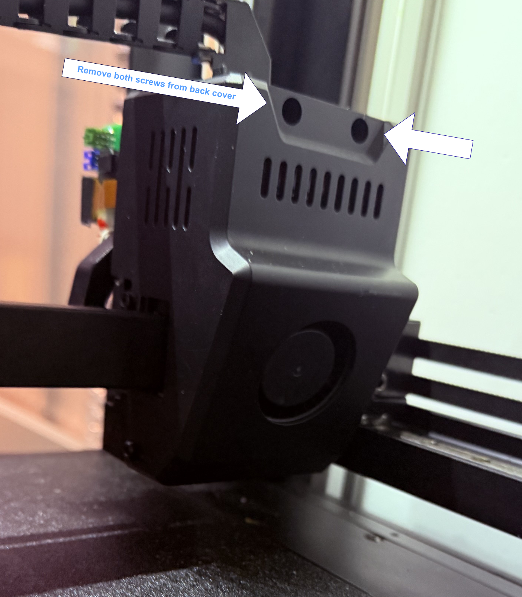</p>

…and one low on each side — left, then right:

<p align="center">
  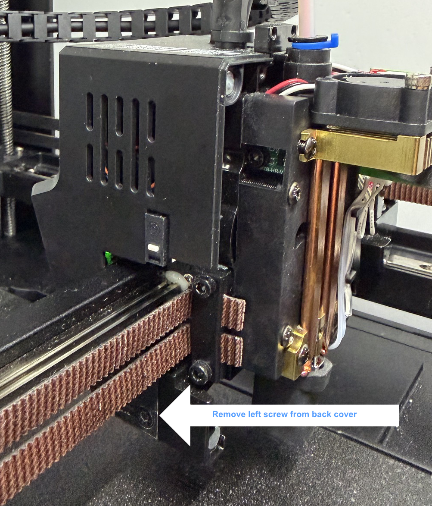
  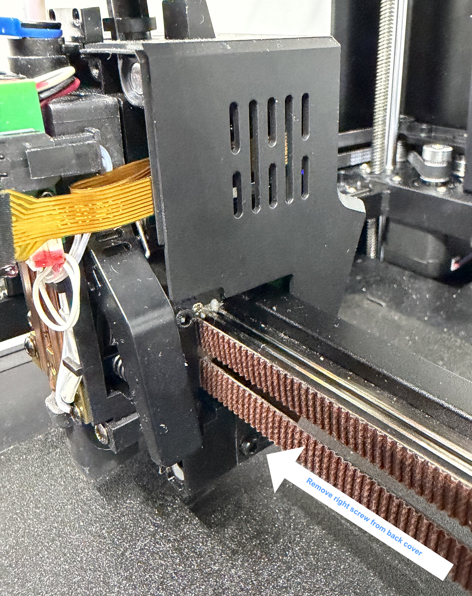
</p>

> ⚠️ **Two things that catch people here.**
>
> **The two screws on top drop backwards.** As the last thread lets go they tip away from you — straight
> down the purge chute, where you will not get them back without taking more of the printer apart. Hold
> a finger behind each one as you loosen it, or lay a rag over the chute opening before you start.
>
> **The back cover is still attached on the right.** A ribbon cable runs to it, and it is short. Ease the
> cover away from the left first and swing it open like a door rather than pulling it straight back —
> pulling is what tears the cable or its connector, and that is not a five-minute repair.

**3) Power back up and get the script waiting.** Plug in, switch on, wait for the boot, connect with
PuTTY again ([Step 4](#step-4--connect-via-ssh-putty)) and run:

```bash
bash ~/arco-unleashed/scripts/unleashed_setup.sh
```

→ `1` (Flash MCUs) → the toolhead F103. The toolhead stays open from here: the flasher stops Klipper, so
nothing homes and nothing heats — just leave the part-cooling fan unplugged until the covers go back on.
Work through the prompts until the script says it is waiting for you to put the toolhead into its
bootloader. **That prompt is where the button procedure below belongs** — the buttons do nothing before
it, because an unpowered board cannot reset and there would be nothing listening.

**4) The board is now exposed.** On the **toolhead board** (*Phrozen-A V1.5*), find the two buttons labelled
**RESET** and **BOOT**:

<p align="center">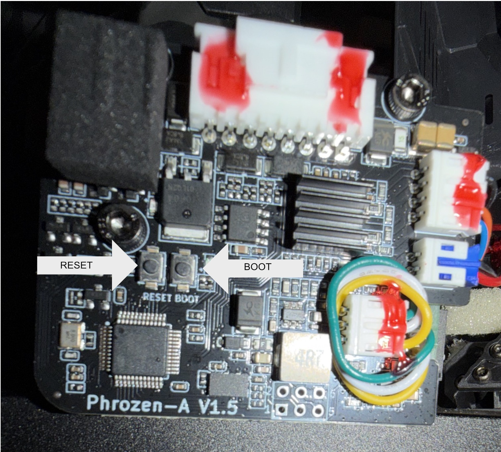</p>

<p align="center">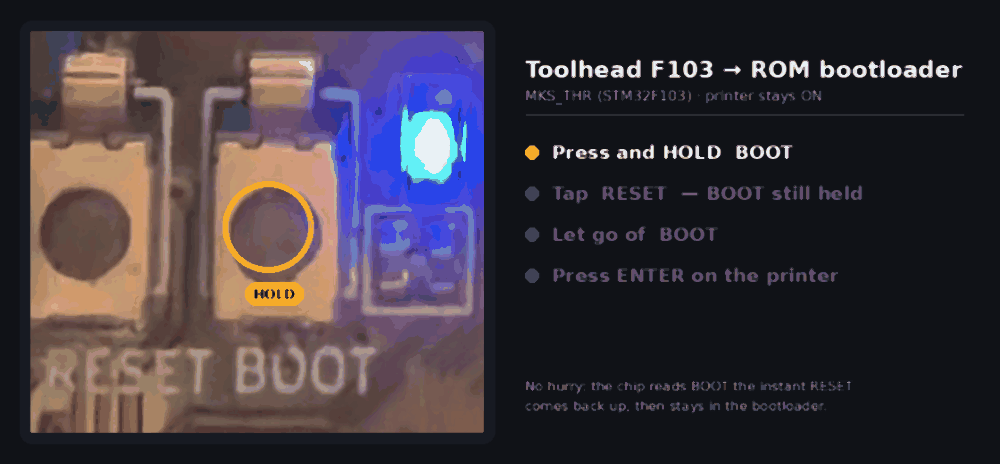</p>

Procedure:
1. **Press & hold BOOT.**
2. **Tap RESET** — press and release it — while BOOT is still held.
3. **Let go of BOOT.**
4. **Press ENTER** at the waiting prompt. Take your time.
5. **Wait** until the flash runs through (~40 s at 9600 baud, after a mass-erase).

> **There is no countdown.** One instant decides it, and it is not one you
> can miss by being slow: the chip reads BOOT the moment RESET comes back up — ST documents it as latched
> on the *fourth rising edge of SYSCLK after reset release*, half a microsecond in. Hold BOOT before that
> and it is in the bootloader; afterwards BOOT does nothing, and it stays there until something resets it
> again. The old "~3 second window" cannot have been true of this procedure anyway: step 5 alone transfers
> ~40 KB at 9600 baud, so the session lasts about a minute. If the bootloader gave up after three seconds,
> this step could never have worked once.

> **Tip:** after the *one-time* Katapult install, future F103 flashes run over the same serial link without
> the button dance (Katapult keeps it flashable).

<details>
<summary><b>Why can't this one step be automated?</b> (short answer: the F103's boot ROM)</summary>

Nothing to do with Arco Unleashed — it is how the STM32F103 starts up.

- **The chip.** The F103's built-in ROM bootloader — the one `stm32flash` talks to — is selected **only by
  the BOOT0 pin at reset**. Unlike newer STM32 families it has no `nBOOT_SEL` option byte that software
  could set to choose it. *(ST reference manual RM0008.)*
- **Klipper confirms the asymmetry.** Klipper can ask an MCU to reboot into a bootloader, and for the
  **F407 that works**: in Klipper's source, `src/stm32/stm32f4.c` ends `bootloader_request()` with
  `dfu_reboot()` — which is exactly why the main board flashes with no buttons at all. The F103 path,
  `src/stm32/stm32f1.c`, has no such call. It can only hand off to a bootloader that is **already in
  flash** (Katapult, HID, stm32duino). A stock board has none, so the request does nothing. In other
  words: to install Katapult in software you would already need Katapult.
- **Auto-reset wiring doesn't exist here.** The DTR→BOOT0 / RTS→RESET trick belongs to USB-serial
  adapters. The toolhead sits on a real SoC UART, which has no DTR line at all — and on this board that
  port muxes only TX/RX and CTS (checkable in the device tree), so there is no driven control line that
  could reach BOOT0.

Hence **one press, once, ever** — and installing Katapult is precisely what makes it *once*. The migration
has to reflash the F103 anyway (the v0.13 host needs matching MCU firmware), so Katapult costs you no extra
button press and saves every future one.
</details>

### Finish: power-cycle and check

**1) Power-cycle.** Full power **off** (~10 s), then on — a reboot is *not* enough here. Freshly flashed MCUs
only start their new firmware after a real power cut, which is why the flasher deliberately leaves Klipper
stopped: the power-cycle brings it up cleanly.

**2) Check.** Open **Mainsail** in a browser — **`http://<printer-ip>/`** (or **`:81`**), the same IP you
gave PuTTY in Step 4. It should come up **ready**, with no MCU error, and the display's *Notice — Error
occurred* popup is gone too. That's Step 5 done.

<details>
<summary><b>If Klipper says <code>mcu: Unable to connect</code></b> — the chip id</summary>

Every STM32F407 carries a **unique chip id**, so its `/dev/serial/by-id/usb-Klipper_stm32f407xx_…` path is
different on every board — which is why the image ships a `CHANGE-your-chip-id` placeholder instead of an id
that could only ever match one printer. The flasher normally fills it in for you: it reads the id from your
running board **before** putting it into DFU, and the id survives the flash because it is burned into the
chip.

That read only fails if the board was **already in DFU** when you started (you pressed BOOT0, or an earlier
attempt left it there) — a DFU device doesn't announce a Klipper serial. Then the placeholder is still in the
config. Fix it in one command, with the printer powered on and running its new firmware:

```bash
bash ~/arco-unleashed/scripts/set-mcu-serial.sh
sudo systemctl restart klipper
```
</details>

---

## Step 6 — The rest of the setup menu

With the MCUs flashed, the printer is complete — everything below is optional. The power-cycle at the end
of Step 5 ended your SSH session. Give the printer a minute to finish booting, connect again as in
[Step 4](#step-4--connect-via-ssh-putty), and re-open the menu — you can do this at any time, from now on:

```bash
bash ~/arco-unleashed/scripts/unleashed_setup.sh
```

This is what it has to offer.

The menu groups it: **ESSENTIAL** (1 — Flash MCUs, done), **MAINTENANCE** (2 — backup / restore your
settings · 3 — check the self-heal guards), **SOMETHING BROKE** (r — emergency repair), **EXTRAS**
(4 — AddOn.cfg + features · 5 — PhrozenGo/Cloud · b — Beacon · s — sensorless XY), **UPDATE**
(6 — check GitHub).

**2 — Backup / restore settings** covers the one thing no guard can do for you: guessing back numbers
your machine measured — worth running **once you have calibrated (Step 7)**, since that is when those
numbers first exist. It saves your printer configuration and calibration, the web interface's own
settings (theme, presets, macro groups, history — none of which live in `printer.cfg`), your WiFi and
the phrozen_dev module, and puts them back on request. It can also write the backup to a **USB stick**,
which is the copy that survives a reflash — the local one sits on the very eMMC it is protecting.

<p align="center">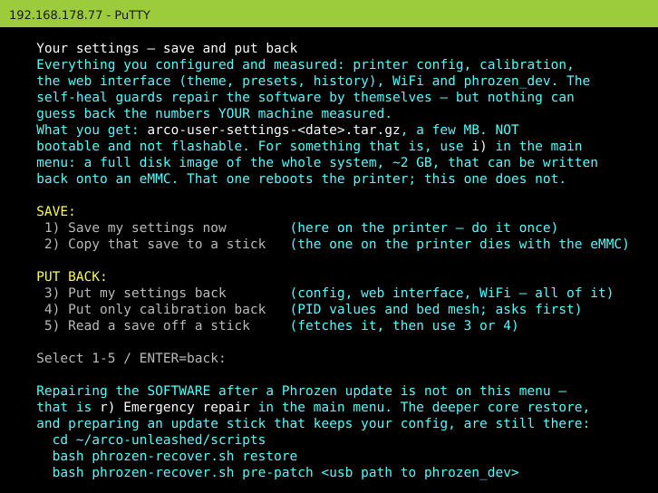</p>

**i — WHOLE SYSTEM: save / restore** is the other kind of backup, and the two are easy to confuse, so the
screens say what each one *produces*. Entry 2 above writes an archive of your settings, a few MB, which
cannot be flashed and will not revive a printer that no longer boots. This one writes a **bootable disk
image** of the entire eMMC — every file, the partition table, the bootloader — that can be written back.
It reboots to do it, images the eMMC before the system starts, and comes back on its own. The same entry
restores: it lists the images on your stick and hands the chosen one to the flasher, which still asks for
the target device to be typed out in full. Full walk-through in [Step 0b](#step-0b--optional-image-the-whole-printer-first).

<p align="center">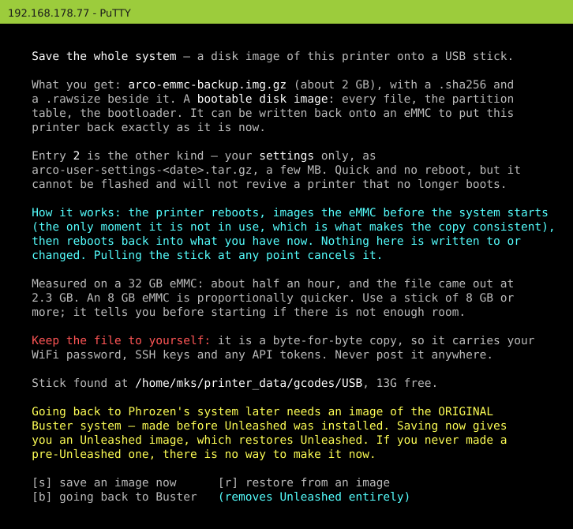</p>

The same screen holds **b — going back to Buster**, which undoes this project completely and puts
Phrozen's original system back. It needs an image of that original system on the stick, **made by you
before Unleashed was installed** — Phrozen's firmware zip is not one, that is an update package rather
than a system, and once Unleashed is running the original can no longer be copied because it is gone.
If you think you may ever want to go back, that image is the thing to make first, in
[Step 0b](#step-0b--optional-image-the-whole-printer-first).

It is a guided action rather than a note in this manual because of the order. Swapping the eMMC back to
Buster is only half of it: the MCU firmware sits on the chips, and a Buster host running Klipper v0.11
will not talk to MCUs left on v0.13 — the printer boots and then cannot find its own hardware. The
flasher for those chips needs *this* system, so it has to run first; do it the other way round and only
opening the printer helps. The menu therefore flashes both MCUs back to v0.11, checks that this
actually succeeded, and only then arms the eMMC restore. If a flash fails it stops there and changes
nothing else — that is the safe outcome, and the printer still works.

Before any of it you are told what disappears — Klipper v0.13, the self-heal guards, sensorless homing,
the AddOn macros, Fluidd, the theme, the WiFi portal and this backup feature itself — asked to confirm
that the chosen image really predates Unleashed, and finally asked to type **`REMOVE UNLEASHED`** in
full. Your prints, Orca profiles and AMS are unaffected: this is about the printer's system, not your
files. Nothing is undone by pressing ENTER at the wrong moment.

<a id="ams-ships-switched-off"></a>

**`a` — AMS / Chroma Kit on·off. If you own an AMS, this is not optional.** Every image ships with the
AMS **switched off**, and that is deliberate: most printers do not have one, and a printer that opens an
AMS serial port with nothing on the other end waits, retries and reports errors for something the owner
never attached. So `printer.cfg` ships `[phrozen_dev] auto_connect: false`, and the tool commands `T1`
to `T15` are removed from Klipper's command table until you say otherwise.

The consequence is easy to misread as a fault: **with the AMS physically connected but never switched
on, the spools simply do not turn.** Nothing is broken and nothing needs repairing — the printer has not
been told the unit is there. Switch it on once, from the menu or from the Mainsail console:

```
AMS_ON
```

It homes first (deliberately — the following move goes to the spit area), sets `auto_connect: true`,
raises the `ams` flag that the Orca start G-code reads, brings `T1`–`T15` back without a restart, and
connects. `AMS_OFF` reverses all of it. `AMS_STATUS` shows where you stand. Do this **once**, whenever
you physically attach or remove the unit — not per print.

> If the spools still do not move afterwards, the missing piece is almost always **`phrozen_master`**
> from [Step 0](#step-0). It exists only on the original printer, no download contains it, and without
> it AMS detection hangs. `AMS_STATUS` says whether it is installed.

**3 — Check self-heal guards** answers a question you would otherwise have no way to ask: the guards are
installed when the image is built, so a printer that has been running for a while may be missing ones the
kit has gained since. It compares what is wired against what the kit expects, and offers to fix it.

<p align="center">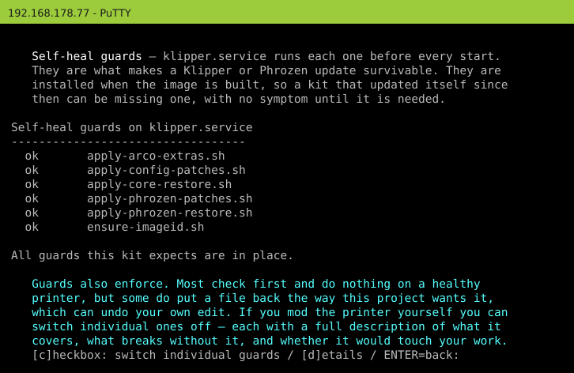</p>

**r — Emergency repair** is the single action for "something broke and I do not know what". It does not
ask you to diagnose first — every step is check-first and idempotent, so running it on a healthy printer
changes nothing — it is described under *Updating Klipper and Moonraker* further down.

<p align="center">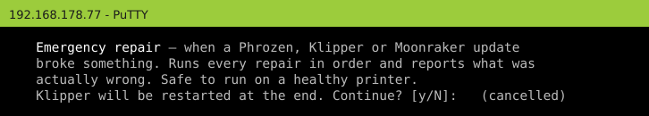</p>

---

## Step 7 — Calibrate

Bed mesh, z-offset, PID, input shaper and purge position are measured per printer, and the image ships
none of them — another machine's numbers are worthless. **Nothing here is optional if you want to print.**
Pick one route; they reach the same place.

**Route 1 — factory-reset auto-calibration (easiest).** Started from the **Arco's own touch display**, in
its settings/calibration area. It runs input shaper, bed mesh and purge position back to back and returns
to the home screen by itself. Expect it to take a while and to move the toolhead a lot — that is the
routine working. **Done when** it is back at the home screen on its own.
*(The exact menu path is Phrozen's own UI and can differ between display firmware versions, so it is not
pictured here — look for calibration or factory reset in the display's settings.)*

**Route 2 — one routine at a time, from the display's calibration menu.** Same routines, run individually.
Use this if one value needs redoing later rather than all of them.

**Route 3 — from Mainsail**, if you would rather see what is happening:

```gcode
G28                      ; home
SHAPER_CALIBRATE         ; input shaper — needs the accelerometer
BED_MESH_CALIBRATE       ; bed mesh
PID_BED                  ; bed PID      (macros from AddOn.cfg)
PID_NOZZLE               ; nozzle PID
SAVE_CONFIG              ; writes the results and restarts Klipper
```

**Done when** `SAVE_CONFIG` has restarted Klipper and Mainsail comes back **ready**. No z-offset step: the
Arco probes with a **load cell**, so the Z reference is found automatically.

> 🛑 **Skip any "print test" the factory reset offers.** The bundled test file was compiled for the old
> Klipper and cannot run on v0.13, so the flow stalls on it. Skipping it costs nothing — your first print
> comes from OrcaSlicer in Step 9. *(Path B readers already met this warning in Step 3; it is repeated
> here because path A skips that step entirely.)*

**Now back up what you just measured.** Open the setup menu and take **2 — Backup / restore settings**,
then **copy the backup to a USB stick**:

```bash
bash ~/arco-unleashed/scripts/unleashed_setup.sh
```

The menu calls it *"do this once, right after setup"* — this is that moment. Your calibration numbers
exist from here on, nothing can guess them back, and the local copy lives on the very eMMC it is meant
to protect.

That's the essential install done — the printer runs.

---

## Step 8 — Optional: AddOn features, theme & verify

### AddOn.cfg + features
From the setup menu pick **`4) AddOn.cfg + Features`**:

<p align="center"></p>

Choose **`[c]heckbox features`** to toggle individual add-ons — space toggles, Tab jumps to `<Ok>`:

<p align="center">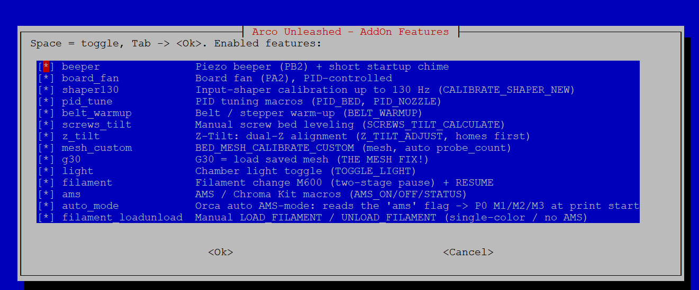</p>

These are the quality-of-life macros: AMS auto-mode, the `G30` mesh fix, Z-tilt / bed-mesh / screw-tilt
helpers, M600 filament change, chamber light, PID board-fan, input shaper, piezo chime. Toggling restarts
Klipper and verifies it comes back up (with a one-click rollback if a config error slips in).

> Turning **G30** off reverts to Phrozen's original throwaway-mesh behaviour (the mesh fix is lost) — the
> menu warns you before it lets you disable it.

### Beacon as new probing device for meshing 🧪 *experimental*
Setup menu → **`b) Beacon probe`**. Only relevant if you have physically fitted a **Beacon** eddy-current
probe in place of Phrozen's piezo. It switches Z homing to the probe's virtual endstop and scans the bed
mesh instead of poking it. The config was contributed by **Philippe Humeau** (unPhrozen) from a real
conversion; nobody on the Unleashed side has run it, which is what "experimental" means here.

The toggle is reversible — `off` restores `printer.cfg` exactly and keeps your calibrated `beacon.cfg` —
and it refuses to change anything unless both the Beacon module and the probe are present.

> ⚠️ **With a Beacon fitted, do not use the Arco display for anything Z-related** — no Z-calibration, no
> auto-levelling, no mesh from the touchscreen. That flow was written for the piezo probe: it declares Z
> positions instead of measuring them, and loads a mesh probed against a different Z reference, which can
> drive Z out of safe bounds. Use Mainsail or Fluidd for homing, probing, mesh and Z-offset. Printing from
> the display still works normally.
>
> ⚠️ **Check the `z_positions` order in `beacon.cfg` before trusting `Z_TILT_ADJUST`** — it must match the
> physical Z motors, not the config order. Swapped, z_tilt diverges instead of converging. Verify with
> `STEPPER_BUZZ STEPPER=stepper_z` / `stepper_z1` and watch which side moves.
>
> ⚠️ **A Phrozen firmware update replaces `printer.cfg`** and would silently put the piezo config back
> under a Beacon. The kit re-applies Beacon mode automatically before every Klipper start, but run the
> menu's *Backup / restore settings* step anyway — see the [README](README.md#beacon-as-new-probing-device-for-meshing--experimental).

First steps after switching, all in Mainsail/Fluidd: `STEPPER_BUZZ` both Z steppers → `G28` →
`Z_TILT_ADJUST` → `BEACON_CAL` → `BEACON_MESH`.

### Sensorless XY homing — *for when a switch has failed*
Setup menu → **`s) Sensorless XY homing`**. X and Y stop by detecting motor load (Trinamic StallGuard)
instead of by a microswitch. Z is untouched and keeps its load-cell probe.

> **This is an alternative, not an upgrade.** The microswitches are the default and the recommendation:
> they stop at the same physical place every time, for free, with nothing to tune. **If your switches
> work, leave this off.**

It earns its place in one situation, and it is a good one. X's microswitch hangs off the **toolhead**
MCU, while the driver's DIAG line goes to the **main** MCU — so a broken toolhead cable kills the switch
but not the sensorless path. That can get a printer homing again without waiting for a spare part.

Proven on this hardware: `G28 X`, `G28 Y` and a full `G28` all home on StallGuard, and the (now
electrically disconnected) switches still **click audibly** at the end of the move. That click matters:
it means the stall happens *at* the mechanical stop, so the zero point does not shift — the filament
cutter at X=319, the wipe position at Y=322 and any saved bed mesh keep their meaning.

The toggle equalises both homing speeds (levelling *down*, never up) because StallGuard's reading is
velocity-dependent, and installs a small `sensorless.cfg` that gates StallGuard by velocity. Without
that gate Klipper arms StallGuard at standstill and every `G28` ends in a twitch — which is the single
most confusing failure mode here.

> ⚠️ **Watch the first few homings and keep `M112` within reach.** If the sensitivity is wrong the
> carriage grinds into the rail instead of stopping, and on CoreXY it drags the other axis with it.
> Listen for the switch to click — that is how you know it reached the wall, because Klipper reports
> position `0` either way.
>
> ⚠️ **Sensitivity is `driver_SGT` in the `[tmc5160 stepper_x]` / `[stepper_y]` sections, and the scale
> is counter-intuitive: LOWER is MORE sensitive.** Grinds without stopping → lower it. Stops early with
> no click → raise it. The shipped value of `1` is the one proven here at 30 mm/s and 1.2 A.
>
> ⚠️ **Calibrate at your running current.** A value found at a reduced current does not transfer: with
> too little current the motor slips instead of building the load StallGuard measures, and nothing ever
> triggers.

`off` restores `printer.cfg` byte-for-byte, including the original homing speed. A Phrozen firmware
update replaces `printer.cfg` and would quietly hand back the switch you may have switched away from —
the kit re-applies sensorless mode before every Klipper start whenever it is enabled.

### Web interfaces — Mainsail and Fluidd
Your Arco shipped with **two** of them, and so does this build. Both talk to the same printer; use whichever
you prefer, or both at once.

| | URL | |
|---|---|---|
| **Mainsail** | **`http://<printer-ip>/`** or **`:81`** | `:80` is the address the stock Arco uses, so old bookmarks keep working. `:81` is where the migration put it and stays valid. |
| **Fluidd** | **`http://<printer-ip>:8808/`** | Phrozen's own port for it. Install or update with the setup menu → **4** → **[w]**, or `bash ~/arco-unleashed/scripts/install-fluidd.sh`. |

The branded Arco Unleashed theme exists for both (optional). Mainsail: switch with the `SWITCH_THEME` macro or
`unleashed-theme.sh`. Fluidd: `bash ~/arco-unleashed/fluidd-theme/setup-fluidd-theme.sh` — then reload with
**Ctrl+F5** and pick the **dark** theme with Primary Color `#2E74F2`. Fluidd has no hook for a custom logo or
favicon, so those stay Fluidd's own.

<p align="center">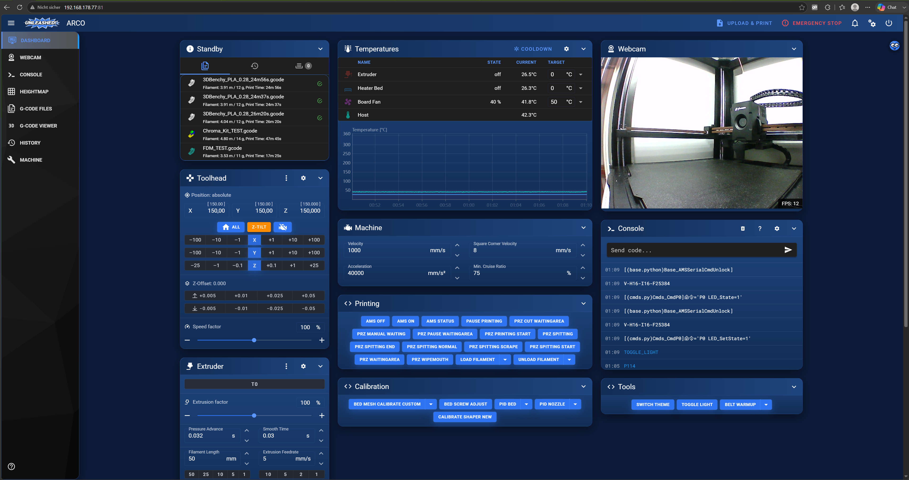</p>

### Updating Klipper and Moonraker — what the update manager will and will not do
**Moonraker updates normally.** Nothing in this project touches its source tree, only its config file.

**Klipper is not pinned either.** It sits on `master` with `HEAD` attached, so the update manager offers
newer versions exactly as it does on any other Klipper machine. The repository itself is **clean and valid**
— everything this project adds lives in untracked files, so no tracked file is modified and nothing is
greyed out. Earlier images did pin the built commit, and that pin came paired with a detached `HEAD`, which
is what actually cost the update button. Both are gone.

One thing is worth knowing before you take an update: the phrozen_dev module is patched for the Klipper API
this build ships, so a jump to a much newer Klipper can need those patches redone. The guards below re-apply
them on every start, but update deliberately rather than by reflex. If you would rather hold a known-good
version, `scripts/pin-klipper-updates.sh` does that — it is opt-in, and nothing on the image does it for you.

> Earlier images showed Klipper as *invalid* with *"repo is dirty"*, because the MCU timing was patched
> into the tracked `klippy/mcu.py`. That was more than a cosmetic badge: Moonraker **refuses to update a
> dirty repo**, so Klipper could never be updated at all. Those three values now come from the untracked
> `arco_mcu_timing` extra instead.

**The three recovery actions are not equally harmless:**

| Action | What it does | Effect here |
|---|---|---|
| **Update** | refuses on a modified repo, otherwise pulls | safe |
| **Soft recover** | resets tracked files; never runs `git clean` | safe — untracked files survive |
| **Hard recover** | `git reset --hard` + `git clean -d -f` | **deletes everything untracked**, `phrozen_dev` included |

On its own that would halt the printer: the config would declare sections whose modules just vanished. It
needs no action from you — `klipper.service` runs seven guards before klippy starts, which
reinstall our modules, and a copy of *your own* `phrozen_dev` is kept outside the Klipper tree
(`~/.arco-phrozen-backup`) precisely for this. Phrozen's software is never shipped with this kit, so that
copy is made on your printer, from your own installation.

**If something does go wrong**, the setup menu's **Emergency repair** is the single action to run — it
repairs everything it can without needing to know what broke, and tells you what was actually wrong.

**To update Klipper** — safe, for the same reason:

```bash
cd ~/klipper && git checkout master && git pull && sudo systemctl restart klipper
# (Klipper is not pinned by default any more — pin-klipper-updates.sh is only for holding a version)
```

Nothing is lost: every patch is re-applied before klippy loads. Be aware you are then off the version this
build was tested against.

### Verify the migration
**Machine → System Loads** confirms the whole stack is on the new versions — all three MCUs and the host
on **Klipper v0.13**, OS **armbian … bookworm**:

<p align="center">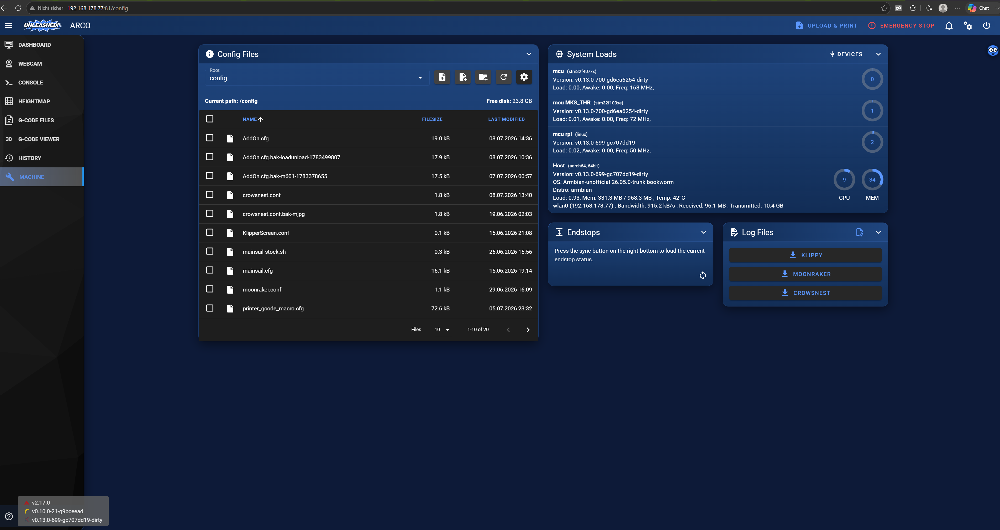</p>

---

## Step 9 — First print: OrcaSlicer Machine G-code

Stock OrcaSlicer already ships the **Phrozen Arco** profile (vendor `Phrozen`). The easiest path is to
**import a kit profile** via *File → Import → Import Configs…* — it inherits from that official preset
and changes only what this kit needs. Two to choose from, in [`orca/`](orca/):

| Profile | Bed mesh at print start |
|---|---|
| `Phrozen Arco 0.4 (Unleashed).json` | **`G30`** — loads the mesh you saved as `phrozen`. Instant. |
| `Phrozen Arco 0.4 (Unleashed, adaptive mesh).json` | **probes the print area** each print (~30–60 s), leaving your saved mesh untouched |

Import whichever you want; both fill in all four fields below. *Label objects*, which adaptive meshing
needs, is already on in the official Arco print profiles — nothing to tick.

To set the fields by hand instead, open the printer preset with the **edit (pencil)** icon next to the
printer name:

<p align="center">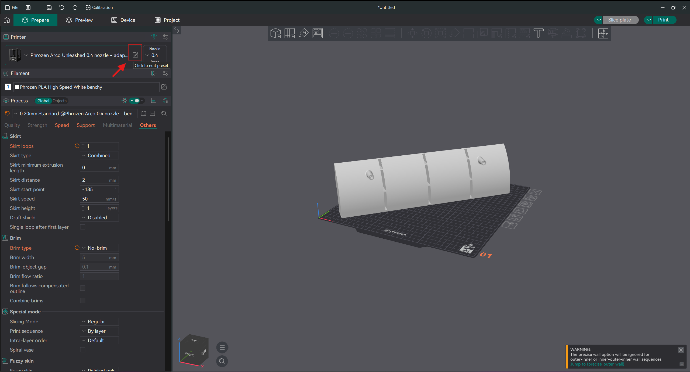</p>

In **Printer settings**, open the **Machine G-code** tab — all four fields live here:

<p align="center">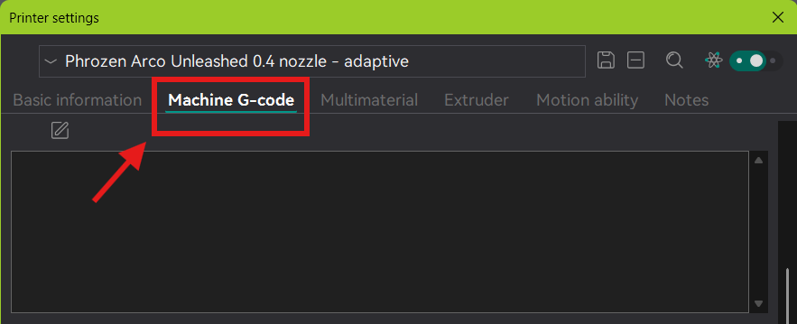</p>

Each field below is given in full, ready to copy. If you imported the kit profile they are already set —
this is for setting them by hand, or checking an existing profile against the current version.

**Machine start G-code** — the kit's start sequence. Its last lines are the **AMS auto-mode**
(`PHROZEN_AMS_START` picks single / multi / AMS by itself):

```gcode
M107
G90
M104 S140 ; nozzle warm-up (stays cool = no ooze during probe)
M140 S[bed_temperature_initial_layer_single] ; bed straight to print temp (no 65C detour)
M109 S140
M190 S[bed_temperature_initial_layer_single] ; heat-soak at target temp
PG28
;AUTO_LEVELING_2
G30
G21
M83
M104 S[nozzle_temperature_initial_layer] ; nozzle up to print temp
M109 S[nozzle_temperature_initial_layer]
{if size(filament_diameter) > 1}PHROZEN_AMS_START MULTI=1{else}PHROZEN_AMS_START MULTI=0{endif}
{if size(filament_diameter) == 1}
T0
{endif}
```

<p align="center">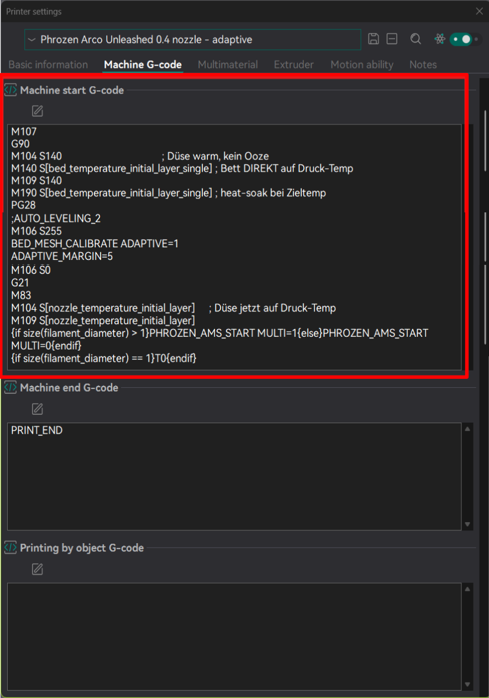</p>

> The screenshot shows the optional **adaptive bed-mesh** variant (probes the print area each print,
> ~30–60 s). The default block printed here uses `G30`, which loads the saved mesh instantly. To switch,
> replace the `G30` line with:
> ```gcode
> M106 S255
> BED_MESH_CALIBRATE ADAPTIVE=1 ADAPTIVE_MARGIN=5
> M106 S0
> ```
> The fan lines keep the nozzle tip clean while probing. **Also tick OrcaSlicer's *Label objects*
> checkbox** (*Others → Label objects*) — adaptive meshing reads the object bounding boxes from the
> `EXCLUDE_OBJECT_DEFINE` lines that checkbox emits, and **without it Klipper silently probes the whole
> bed**, which looks like adaptive meshing not working. Full detail: *Adaptive bed mesh* in the
> [README](README.md#adaptive-bed-mesh-optional).

> **`PHROZEN_AMS_START` also arms the filament runout sensor.** The toolhead sensor is watched by
> Phrozen's own module, but only once a print mode has been set (`P0 M1`/`M2`/`M3` — the macro picks
> the right one). A start G-code **without** that line prints with **no runout protection at all**,
> and the stock firmware says nothing about it. Unleashed does: you get a console warning a few
> minutes into such a print, and `FILA_STATUS` shows the state at any time —
> ```
> Filament: LOADED (adc 0.2134, threshold 0.3630 — below threshold = loaded)
> Mode: standalone runout
> Runout protection: ACTIVE
> ```
> The same values are in `printer['arco_fila_status']`, so your own macros can check
> `protection_active` and `filament_present` too.

**Machine end G-code**:

```gcode
PRINT_END
```

<p align="center">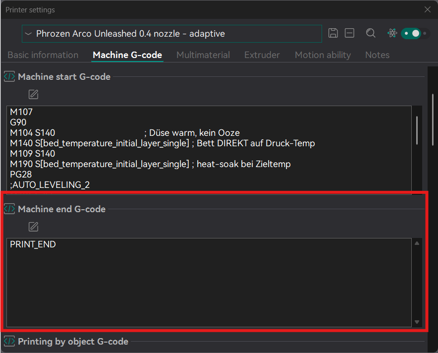</p>

**Change filament G-code** — the AMS-aware colour change: with an AMS it retracts and purges the flush
volume (a sized `P10` spit); without one it runs the manual `M600` change:

```gcode
PHROZEN_TOOLCHANGE FLUSH=[flush_length]
```

<p align="center">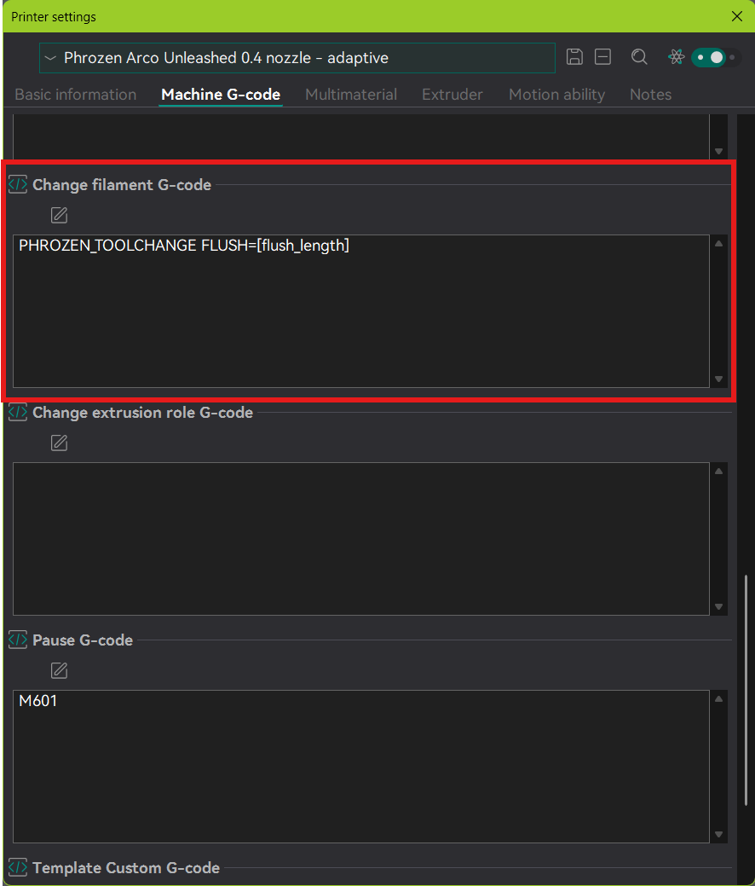</p>

> **Printing multi-*material* with an AMS?** Add one more parameter:
>
> ```
> PHROZEN_TOOLCHANGE FLUSH=[flush_length] TEMP=[new_filament_temp]
> ```
>
> `TEMP` passes the **incoming** tool's nozzle temperature. Without it every colour change after the
> first re-heats and purges at the temperature the print *started* with — invisible when all your
> spools are the same material, but wrong the moment you mix (PETG purged at PLA temperature jams;
> PLA held at PETG temperature strings and cooks).
>
> It is **safe to add permanently**: with a single material it changes nothing, and it is simply
> ignored unless the optional [Unleashed × KAOS](#kaos) add-on is
> installed. So one profile covers every case and you never need to re-slice when switching.
>
> Give your filament presets their real nozzle temperatures — that is what `TEMP` reads.

**Pause G-code** — the kit maps `M601` to Klipper's `PAUSE` alias:

```gcode
M601
```


<p align="center">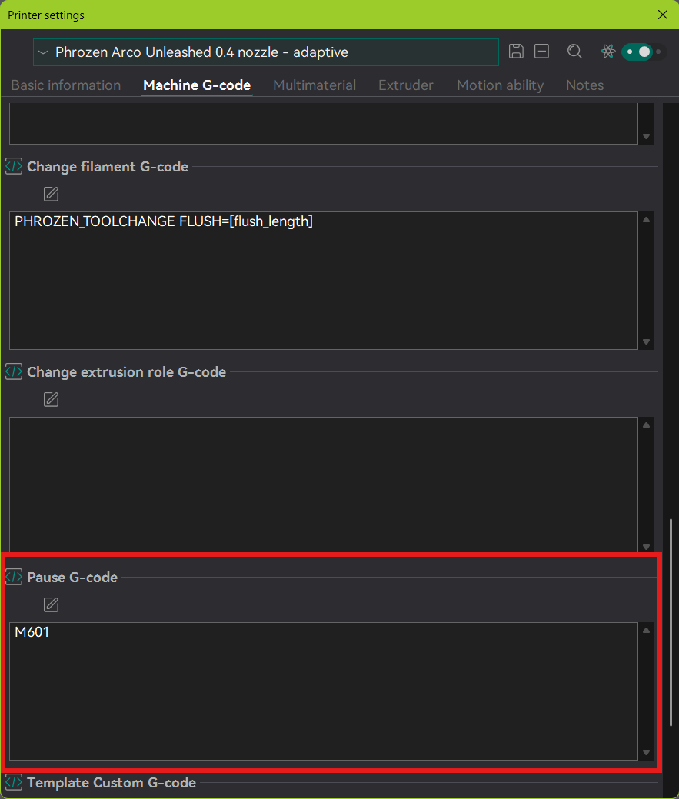</p>

Finally, under **Others → G-code output**, tick **Label objects** — required for the adaptive bed mesh
(per-object bounding boxes) and Mainsail per-object exclusion:

<p align="center">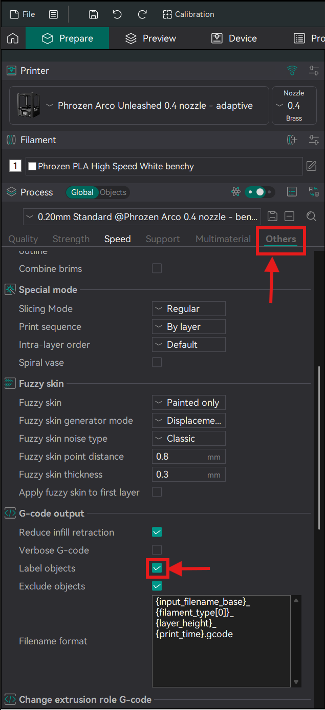</p>

Finally, set the AMS flag **on/off once** to match whether an AMS is attached — either from the **SSH setup
menu**, or with **one click in Mainsail's Macros panel** (`AMS ON` / `AMS OFF`, and `AMS STATUS` to check):

<p align="center">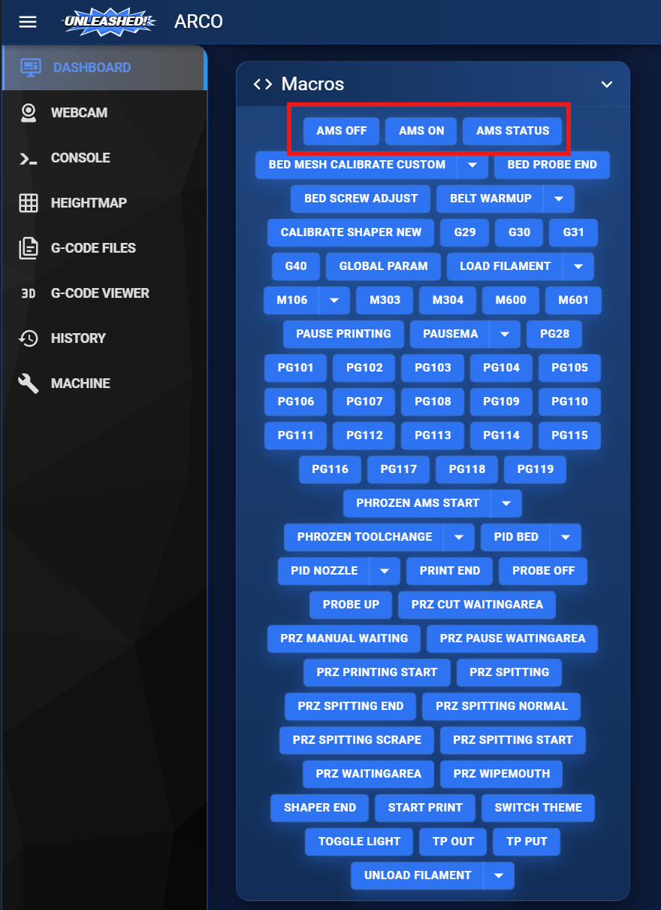</p>

Orca then prints in the right mode automatically.

---

<a id="kaos"></a>

## Step 10 — Optional: Unleashed × KAOS

**KAOS** (*Klipper Add-On System*) is a separate, third-party add-on for the Arco by *sanders.chris*
([gitlab.com/sanders.chris/phrozenarco](https://gitlab.com/sanders.chris/phrozenarco)) — a popup menu,
fan/light/logging control, safety guards, and a rewritten multicolour purge. It is **not part of this
kit**, is **not installed by default**, and nothing here depends on it. This step is entirely optional.

KAOS and Arco Unleashed are **sibling forks of the same ancestor**, our neighbouring repository
[solutionphil/PhrozenArco](https://github.com/solutionphil/PhrozenArco), which KAOS extended massively
into what it is today. That shared parentage is why a bridge is needed at all: the two are not
strangers, so they declare the *same inherited* Klipper sections, and simply dropping KAOS next to an
Unleashed config makes klippy refuse to start. It is also why the fix is tractable — an ownership
split rather than a rewrite.

**Unleashed × KAOS** is our bridge that installs KAOS *next to* Unleashed instead of over it, so both
survive and you can switch it off again cleanly.

**It also makes installing KAOS considerably simpler.** KAOS's own route is a Phrozen firmware package:
download a `.zip`, unpack it on a PC, copy the nested `phrozen_dev/` folder to a **USB stick**, plug it
into the printer, run the Phrozen update flow, then power-cycle. With the bridge, none of that applies —
**no USB stick, no firmware package, no unpacking.** You type `KAOS_ON` in the web console, and it
fetches KAOS straight from the project's repository (~3 MB), verifies it against your configuration, and
installs it. Updating later is one command, `KAOS_UPDATE`.

> ### 🛑 Never install or update KAOS the normal way on Unleashed
>
> **Do not** use KAOS's USB-stick packages (`Arco_FW_V199_KAOS_*.zip`) or the printer's Phrozen update
> flow to install or update it here. Use **`KAOS_ON` / `KAOS_UPDATE`** instead — always.
>
> Those packages are built as **Phrozen firmware for the stock printer** — the old Debian Buster system
> with its older Klipper — and they are installed by the *Phrozen updater*, which replaces
> `printer.cfg`, `printer_gcode_macro.cfg` and the whole `phrozen_dev/` folder. On Unleashed
> (Debian Bookworm, Klipper v0.13) that removes `[include AddOn.cfg]` and with it every feature of this
> kit, and drops in files meant for a different operating system and Klipper version. The result is a
> printer that will not start correctly — and unlike `KAOS_OFF`, there is no clean way back.
>
> The same applies to KAOS's **System Prep** helpers: they tune the stock Buster system (one of them is
> literally `fix-buster-apt-sources.sh`) and would work against Unleashed's own tuning. The bridge
> deliberately never installs them.
>
> If you already run KAOS on a **stock** printer and are moving to Unleashed: flash the image as usual,
> then add KAOS again with `KAOS_ON`. Flashing wipes the printer, so your KAOS settings start at their
> defaults again — note down any you have changed before you flash.

### Nothing to install — the bridge is already on your printer

The image ships it: the bridge lives in `~/arco-unleashed/unleashed-x-kaos`, its console commands are registered, and
its boot guard is in place. **None of KAOS itself is in the image** — only our bridge, which does
nothing at all until you ask it to. There is no root step, no USB stick and no download to prepare.

So Step 10 is one command, below. (If you ever want to remove even the bridge, or need to undo a
half-finished switch by hand, `~/arco-unleashed/unleashed-x-kaos/docs/removal.md` is the complete list.)

### Switch it on and off

From the **Mainsail/Fluidd console** — each restarts Klipper and refuses to run mid-print:

| Command | What it does |
|---|---|
| `KAOS_ON` | downloads KAOS (~3 MB, needs network the first time), verifies it, installs and activates |
| `KAOS_OFF` | deactivates; files stay cached so `KAOS_ON` is instant and offline afterwards |
| `KAOS_UPDATE` | pulls the latest version and re-activates if it was on |
| `KAOS_STATUS` | what is installed, which version, active or not |

`KAOS_OFF` returns the printer **byte-for-byte** to its pre-KAOS state. If you ever need to remove it
by hand, follow `~/arco-unleashed/unleashed-x-kaos/docs/removal.md` — the order matters.

### Open the KAOS menu

Once active, type in the console:

```
KAOS_MENU
```

A popup menu opens in Mainsail/Fluidd with the KAOS settings (lights, sound, fans, logging/language,
safety, print features). If your interface does not show popups, use the plain-text version instead:

```
KAOS_MENU_TEXT
```

Other commands you can type directly: `KAOS_LIGHTS_TOGGLE`, `KAOS_FILAMENT_LOAD` /
`KAOS_FILAMENT_UNLOAD`, `KAOS_PAUSE` / `KAOS_RESUME`, `KAOS_HEALTH_CHECK`.

### ⚠️ If you have an AMS: KAOS replaces the purge

KAOS includes **magic_ams**, which replaces the Arco's proven firmware purge with a slicer-driven one
(split into portions with a cooling kick between). With `KAOS_ON` **and** the AMS flag on, that is what
runs on every colour change — the same behaviour KAOS users get upstream, where it cannot be switched
off at all.

Two things to know:

* **Add `TEMP=[new_filament_temp]`** to your *Change filament G-code* (see Step 9) — magic_ams uses it
  for per-tool temperature, which is what makes multi-*material* printing correct.
* **You can step back without removing KAOS.** In the console:

  | Command | Effect |
  |---|---|
  | `MAGIC_AMS_STAGE STAGE=1` | keeps the **proven** purge, but still fixes per-tool temperature — takes effect immediately, no restart |
  | `MAGIC_AMS_OFF` | removes the purge rewrite entirely, rest of KAOS stays |
  | `MAGIC_AMS_STATUS` | shows what is active |

  Worth doing a **short two-colour test print** the first time, and watching the first colour change.

With **no AMS attached** (`ams = 0`) magic_ams stays inert — colour changes fall back to the manual
`M600` exactly as without KAOS.

---

---

<a id="troubleshooting"></a>

## Troubleshooting

Every entry below is something that actually happened — on the development printer or to someone
testing this kit. They are grouped by *when* you see them, because the same words on screen mean
different things at different stages.

### While flashing

**"sha256 MISMATCH" — refusing to flash**
The image on the stick is not the image the checksum describes. In practice the download is almost
never the problem, the stick is. In order:
1. Take the stick **off any USB hub** and plug it straight into the printer. A hub is the single most
   common reason a file copies fine and reads back different.
2. Copy the image again and eject the stick properly before unplugging it — Windows may still be
   flushing its cache when you pull it.
3. Check the copy on your PC: `certutil -hashfile <image> SHA256` (Windows) or
   `sha256sum -c <image>.sha256` (Linux). If the PC copy is already wrong, download it again.
4. If the log also shows **CRC or I/O errors**, stop swapping settings — that stick is failing, or is
   one this printer cannot drive. Use a different one, preferably a plain USB 2.0 stick.

**Nothing happens on reboot — the old system just boots**
The flasher only fires when it finds the armed image on the stick. Check the stick is in, that the
image is at the top level (not in a folder), and that its name still matches. It stays armed, so
correcting the stick and power-cycling is the retry. `arco-selfflash.log` on the stick says what it
looked for.

**The display says "Write incomplete" or "Verify FAILED — do not trust this eMMC"**
Do not power-cycle repeatedly. Pull the stick and power-cycle **once**:
- **It boots** → the write was fine and a check misfired. Confirm with
  `cat ~/arco-unleashed/.kit-commit` — if it shows the version you flashed, the eMMC has it.
- **It does not boot** → the write really was incomplete. That needs path B: open the printer, take
  the eMMC out and write it on a PC. Your backup on the stick is unaffected.

**The stick is in, but the printer does not see it**
It auto-mounts at `~/printer_data/gcodes/USB`. If that folder is empty, find the partition with `lsblk`
and mount it **to that same path** — the tools look there by name:
```bash
sudo mkdir -p /home/mks/printer_data/gcodes/USB
sudo mount /dev/sda1 /home/mks/printer_data/gcodes/USB
```

**More than one image on the stick**
The tools match by pattern (`Arco-Unleashed*.img.gz`, `Arco_FW_V*.zip`) and take the **first** match, so
an older firmware zip or a `(1)` re-download can win silently and install something you did not intend.
The flasher warns when it sees more than one — start from an empty stick and put only the listed files
on it.

### Path B — eMMC on a PC

**The adapter shows no drive, or Etcher cannot see it**
Seat the module fully — it is easy to have it in the socket but not contacted — and try a different USB
port, directly on the PC rather than through a hub. The eMMC is a `.img.gz`; Etcher handles the
decompression itself, so do not unpack it first.

**Flashed fine, but the printer does not come up**
Check the module is the right way round and its retaining screws are in. If the printer still does not
boot and the eMMC is definitely written, the MCUs are the other half — a printer whose host was
replaced but whose MCUs still carry factory firmware cannot start Klipper. That is Step 5.

### First boot after flashing

**"Notice — Error occurred" on the display**
Expected, and not a fault. Klipper cannot start until the MCUs are flashed (Step 5), so the display
has nothing to show. Restarting or power-cycling will not clear it. Do not set anything up on the
display; wait for the screen to settle, which is how you know the automatic restarts have finished.

**The printer never appears on the network**
Put a `wifi-seed.txt` on the stick (`SSID=` / `PSK=` / `COUNTRY=`, plain text, no quotes, 2.4 GHz —
the Arco has no 5 GHz radio) and power-cycle. Each seed is used **once, by its content**: writing out
an identical file changes nothing, so a retry needs details that actually differ. If the details were
right and it still did not join, use the setup portal instead — join the **Arco-Unleashed-Setup**
network from a phone.

**The display module was not installed — "no internet and no USB package"**
The first boot fetches Phrozen's display module from Phrozen's own repository, and that did not work.
The usual cause is a network that hands out an address but has no route to the internet, which the
Wi-Fi check cannot tell apart from a working one. Nothing is lost and nothing is disabled: the printer
tries again on the next boot, so either give it real internet and reboot, or take the offline route:

1. on your PC, download `Arco_FW_V*.zip` from Phrozen's website
2. copy it **still zipped** to the **top level** of a FAT32 stick (do not extract it)
3. plug the stick into the printer and power-cycle — or, over SSH:

```bash
bash ~/arco-unleashed/scripts/fetch-phrozen-fw.sh
```

The zip always takes priority over the download, so this also works on a printer that does have
internet — and it is the only route that brings PhrozenGo.

**The download was refused with "CHECKSUM MISMATCH"**
The module that arrived is not the build this kit pins, so it was not installed — deliberately, since
the display binary has to match the firmware on the panel. Retry once in case the transfer was
truncated; a captive portal on the network is the other common cause. If it keeps happening, use the
USB route above and open an issue: it means Phrozen moved the pinned commit.

### Flashing the MCUs

**The toolhead flash ends with "FlashError" although the output looked complete**
Tap **RESET** on the toolhead board once, then re-run the step. The chip reads its BOOT pin the
instant RESET is released and then stays in the bootloader; a tap is sometimes what it takes for the
host to see it again. There is no timing window to hit — hold BOOT, tap RESET, release BOOT.

**`flash_mcus.sh` cannot find the toolhead at all**
Check the front cover's fan is unplugged and the printer is **switched on** — the flash itself needs
power. Only removing the covers happens with the printer off.

### After an update

**A fix that the changelog promises has not taken effect**
Config repairs are applied by a guard that runs when the klipper **service** starts. Klipper's own
`RESTART` and `FIRMWARE_RESTART` do **not** run it:
```bash
sudo systemctl restart klipper
```

**A new self-heal guard is not active**
Guards are systemd drop-ins, and a kit update ships the scripts without rewiring them. Menu
**3 — Check self-heal guards** compares what is wired against what the kit expects and offers to fix
it, or:
```bash
sudo bash ~/arco-unleashed/scripts/optimize-boot.sh
```
It is idempotent — on an up-to-date printer it changes nothing.

**Obico disappeared after a Phrozen firmware update**
Phrozen's own start scripts delete `moonraker-obico` on every boot, and disabling PhrozenGo works by
commenting those lines out — inside Phrozen's module. Anything that replaces that module brings the
original lines back. Reinstall Obico, then open **5 — PhrozenGo / Cloud** and disable PhrozenGo
again: that records the choice outside the module, and from then on it is restored automatically
before every start.

**`update-from-usb.sh` says "Permission denied" and then "bad or truncated tarball"**
The tarball is fine. The script was started from a copy outside the kit (`/tmp/scripts/…`) and tried
to work in the wrong place. Current versions detect this and update the installed kit anyway; if
yours does not, run it from the kit itself:
```bash
bash ~/arco-unleashed/scripts/update-from-usb.sh
```

### Backup and restore

**The printer starts a backup by itself after a restore**
A backup image contains whatever was armed when it was taken, and restoring it brings that back.
Current versions make the arming one-shot, so it lands harmlessly. An image taken before that fix
still expects a marker file — create it on the stick before restoring such an image:
```bash
touch ~/printer_data/gcodes/USB/.arco-backup-done
```

**Which backup file is the good one**
The name tells you which system it holds — `-stock` is Phrozen's, `-unleashed` is this one — and the
restore menu spells that out beside each candidate. Beyond that, the sidecars are written last, on
purpose: a `.img.gz` **without** its `.sha256` and `.rawsize` is an interrupted run, whatever its
size. To check a complete one in a second, without reading the whole file:
```bash
cd ~/printer_data/gcodes/USB && sha256sum -c arco-emmc-backup-*.img.gz.sha256
```

**"This image does not fit the eMMC in this printer"**
The backup came from a machine with a larger eMMC — a 32 GB image cannot be written to an 8 GB one.
The comparison is against the image's *uncompressed* size, which is why a 2 GB file can be refused.

### Printing

**A print ends with `bed_mesh: Unknown profile [phrozen]` and the display shows an error**
The printer has never saved a mesh under that name — the image ships no calibration on purpose,
because another machine's numbers are worthless. Current versions make this harmless. To fix it
properly, calibrate once:
```gcode
G28
BED_MESH_CALIBRATE PROFILE=phrozen
SAVE_CONFIG
```

**The printer halts after a Klipper or Moonraker update, display dead**
Moonraker's "hard recover" runs `git reset --hard` plus `git clean`, which deletes every untracked file
in the Klipper tree — `phrozen_dev` among them. `printer.cfg` declares it, so klippy refuses the config
outright. That is what **r — Emergency repair** in the setup menu is for: seven steps, no diagnosis
needed, and it restores the module from the safety copy the kit keeps outside the tree.

**AMS messages every few minutes although no AMS is attached**
Phrozen's cloud component polls on a timer. Set AMS **off** once in the setup menu (`a`) — the kit then
swallows that poll instead of letting it fill the console.

**"Timer too close" during calibration or a fast print**
The real-time tuning is what keeps this machine stable at high acceleration: performance governor, CPU
affinity, IRQ pinning, and the MCU timing declaration. If they are not all in place the step queue
starves at a burst start. Menu **3 — Check self-heal guards** tells you what is missing, and
`optimize-boot.sh` puts it back. Do not run anything heavy on the printer during a calibration.

**Belt tension readings disagree with each other**
Measure where **both spans are equal** — `BELT_TENSION` parks there, and it is neither the middle of
the bed nor the middle of the travel. Leave the steppers energised: `M84` lets the belts go slack and
the reading is void. Aim for equal pitch between the two belts, not for any particular frequency.

**The cutter position calibration stops dead at X 0.0 — and other travel refused after homing**
Only with the KAOS add-on, and the rule that fixes it is one line long: **home the printer fully
once, then calibrate.**

KAOS refuses every travel until a home has physically established where the toolhead is. Klipper's
own `homed_axes` is not evidence of that on this machine — the display routinely writes a position
with `SET_KINEMATIC_POSITION` instead of measuring one, which makes Klipper believe it is homed when
nothing has moved. That is the whole reason the guard keeps its own record.

The display's cutter calibration never homes. Its very first action is to lift Z, before any homing
at all, and that lift is what gets refused — so the screen sits at 0.0 having done nothing. It is not
a crash and nothing is broken. A full `G28` beforehand satisfies the guard, and KAOS then stands down
for the rest of the session.

**Watch the end of the calibration.** It finishes with `SAVE_CONFIG`, which restarts Klipper — and a
restart clears the trust again. Calibrating twice in a row therefore needs a `G28` in between. The
same applies after `KAOS_ON`, after a firmware restart, and after any print that ends in
`SAVE_CONFIG`.

**If a home does not help.** Then the trust wiring itself is incomplete, which is a different fault.
Menu **3 — Check self-heal guards** says so under "Unleashed x KAOS trust chain" — it reports `ok`
when either KAOS's own `[homing_override]` or the post-home hook is in place, and names the repair
when neither is. That state arises on printers set up before the bridge could install it, or after a
Phrozen firmware update replaces `printer.cfg`. Bringing the bridge up to date and restarting the
klipper **service** repairs it:
```bash
bash ~/arco-unleashed/scripts/unleashed_setup.sh
```
```bash
sudo systemctl restart klipper
```
then `G28` once. Klipper's own `RESTART` does not run the guard that performs the repair.

**Every command is rejected and `RESTART` does not help**
An MCU shutdown *latches*: `RESTART` restarts only the host side, so the latch outlives it and each
new command is answered with the original shutdown message. `FIRMWARE_RESTART` is what clears it.
When you then read the log, trust the **first** error and ignore what follows — everything after a
shutdown is a consequence of it, not a second fault.
```gcode
FIRMWARE_RESTART
```

---

<a id="faq"></a>

## FAQ

**How do I update the kit itself?**
Type `ARCO_UPDATE` in the Mainsail or Fluidd console. `ARCO_UPDATE_CHECK` looks first and changes
nothing. The kit shipped in the image is a flat copy of the repository rather than a clone, so the
first `ARCO_UPDATE` adopts it — your files stay exactly as they are, git is simply told where they
came from — and updates in the same run. If anything in the printer configuration changed, it takes
effect when the klipper **service** restarts (`sudo systemctl restart klipper`); Klipper's own
`RESTART` does not run the self-heal guards. Offline, or from a USB stick, the other route is
`update-from-usb.sh` with a kit tarball — that one needs no network at all.

**I already imaged my eMMC on a PC. Can I use that file here?**

Yes, with three small preparations. The flasher wants a **compressed** image with two sidecars beside
it, because that is what it can verify before it writes anything:

| | |
|---|---|
| `arco-emmc-backup-stock.img.gz` | the image, **gzipped** — a raw `.img` is not read |
| `…img.gz.sha256` | the checksum **of the .gz**. Without it the flasher refuses |
| `…img.gz.rawsize` | the **uncompressed** byte count. Optional, but it is what lets the flasher reject an image too big for this eMMC, and what drives the progress bar |

**The file name is not free.** The restore menu looks for a fixed set of names, so a file called
anything else will simply not appear in it. Use exactly `arco-emmc-backup-stock.img.gz` for an image
of Phrozen's system — the `-stock` part is also what keeps a later Unleashed backup from rotating it
away, and what the menu reads to label it for you.

On Windows this needs **no extra software** — PowerShell can do all three. Open PowerShell and paste:

```powershell
$img = "D:\YOUR_IMAGE_NAME.img"               # what you read off the eMMC
$dst = "F:\arco-emmc-backup-stock.img.gz"     # only F: changes — keep the file name

$in = [IO.File]::OpenRead($img); $out = [IO.File]::Create($dst)
$gz = New-Object IO.Compression.GZipStream($out, [IO.Compression.CompressionMode]::Compress)
$in.CopyTo($gz); $gz.Close(); $out.Close(); $in.Close()

(Get-Item $img).Length | Set-Content -Encoding ascii -NoNewline "$dst.rawsize"
"$((Get-FileHash $dst -Algorithm SHA256).Hash.ToLower())  $(Split-Path $dst -Leaf)" |
  Set-Content -Encoding ascii -NoNewline "$dst.sha256"
```

> **The two drive letters are examples — but only the letters.**
> `$img` is entirely yours: point it at the raw file you read off the eMMC, whatever it is called and
> wherever you saved it.
> In `$dst`, change **only `F:`** to whatever letter Windows gave your stick. The file name
> `arco-emmc-backup-stock.img.gz` must stay exactly as written, or the restore menu will not list it.

Expect it to take a while — several minutes per gigabyte, with no output until it finishes. If you
happen to have 7-Zip, `7z a -tgzip -mx=1 "$dst" "$img"` replaces the three middle lines and is quicker;
the two sidecar lines are still needed either way.

**Why must it be under 4 GB?**

FAT32 cannot hold a single **file** of 4 GiB or more. That is a per-file limit, not a limit on the
stick — a 64 GB stick is fine, one 4 GiB file on it is not. So a raw 8 GB image can never sit on the
stick at all; compressed it normally lands at 2–2.5 GB, unless the eMMC's free space is full of
deleted data, which does not compress.

Reformatting to exFAT or NTFS does **not** help: the small system that performs the flash runs before
Linux is up and can only mount FAT32. If your image will not go below 4 GiB, use **path B** instead —
write the raw `.img` straight to the eMMC on your PC, no stick involved.

**balenaEtcher does not create images**, it only writes them. To read one off an eMMC use
Win32DiskImager's *Read*, or `dd` on Linux/macOS. Or skip all of this and let the printer do it:
[Step 0b](#step-0b--optional-image-the-whole-printer-first) writes the image and both sidecars itself,
and reads the result back off the stick to prove it is good.

## Where to next
- **Slicing / multicolor / AMS auto-mode** → [README › OrcaSlicer](README.md#orcaslicer--multicolor--ams-auto-mode)
- **Every menu option explained** → [README › Menu reference](README.md#menu-reference)
- **Protecting your setup from Phrozen updates** → [README › Menu reference](README.md#menu-reference) (*Phrozen-update protection*)
