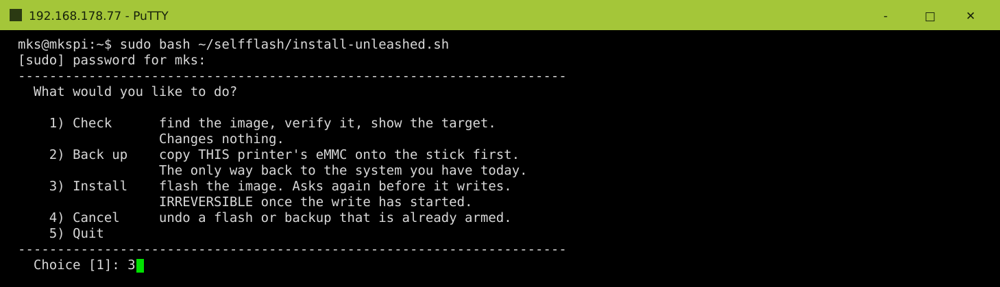

<p align="center">
  
</p>

# Arco Unleashed — Step-by-Step Install Manual

The illustrated long-form of the [README](README.md)'s **🟢 Flash & Run** section. It takes a stock
**Phrozen Arco** and moves it onto **armbian-mkspi (Debian Bookworm, kernel 6.18) · Klipper v0.13** using
the pre-built image.

**Work through Steps 1 to 5 in order.** Step 1 is the only one you may skip, and every screen you will
see along the way is pictured. Steps 6 to 10 come after the printer runs. Of those, **Step 7
(calibration) is required** if you
want to print; Steps 6, 8, 9 and 10 are optional.

The printer flashes **itself**, from a USB stick — no PC, no disassembly, nothing to unplug. You only
open the machine once, in **Step 5**, to press two buttons inside the toolhead. Taking the eMMC module
out is **not** part of the normal route; it lives in [Appendix A](#appendix-a) for recovery, for a spare
module, and for keeping a way back to the factory system.

> ⚠️ **Hardware-specific:** Phrozen Arco with MKS board (RK3328, STM32F407 + MKS_THR STM32F103), AP6212
> WiFi. Not a generic Klipper kit. Working inside the printer means mains and electronics — power the
> machine **off and unplug it** before you open the housing. Use at your own risk (see the README
> disclaimer).
>
> ⚠️ **Warranty:** replacing the factory OS/firmware and opening the printer will very likely **void your
> Phrozen warranty**. If you may ever want to go back, make the backup in [Step 1](#step-1) — it is the
> only moment that copy can be made without opening anything. Note that the eMMC alone is not the
> whole way back. Step 5 also reflashes both MCUs, so a full return to stock needs their v0.11
> firmware as well, and in the right order. See **[Going back to Phrozen's
> system](#back-to-buster)**.
>
> ℹ️ **This project is not affiliated with Phrozen.** Arco Unleashed is an independent, community-made
> project. It is not endorsed, supported or distributed by Phrozen, and **Phrozen cannot be asked for
> support on a printer running it** — if something is wrong, ask here, not them. *Phrozen* and *Arco*
> are the manufacturer's trademarks and are used only to say which machine this fits.

> 🛑 **The one thing that cannot be recovered later.** The new system needs Phrozen's gateway —
> `phrozen_master`, `phrozen_slave_ota`, `device_table` and `~/hdlDat`. The display talks to it, and
> the AMS work mode lives beside it. It exists **only on your original, still-running printer**, it is
> in no download and in none of Phrozen's packages, and the flash erases it for good. [Step 2](#step-2)
> now collects it for you, while the old system is still there, and refuses to flash if it cannot.
> If you take the eMMC out and write it from a PC instead, the installer never runs at all. Then you
> must do [A0](#appendix-a0) by hand first. Without those files the display spams *connect to the
> server fail* and stops returning to its home screen after calibration, and the AMS — runout
> protection included — does not work.

---

## Contents

**Install**

| | | |
|---|---|---|
| [Before you begin](#before-you-begin) | tools, space, what goes on the USB stick | |
| [Step 1](#step-1) | Back up the whole printer | optional, your way back to stock |
| [Step 2](#step-2) | **Flash the printer from the USB stick** | the printer overwrites its own eMMC |
| [Step 3](#step-3) | First boot: WiFi portal + USB install | from your phone |
| [Step 4](#step-4) | Connect via SSH | PuTTY |
| [Step 5](#step-5) | **Flash the MCUs** ⚠️ | the one step that opens the printer |

**Once it runs**

| | | |
|---|---|---|
| [Step 6](#step-6) | The rest of the setup menu | backup/restore, guards, repair |
| [Step 7](#step-7) | Calibrate | |
| [Step 8](#step-8) | AddOn features, theme, verify | optional |
| [Step 9](#step-9) | First print | OrcaSlicer machine G-code |
| [Step 10](#step-10) | Unleashed × KAOS | optional add-on |

**Reference**

| | |
|---|---|
| [Appendix A](#appendix-a) | **Removing the eMMC** — recovery, spare module, way back to stock. Starts at [A0](#appendix-a0): rescue Phrozen's gateway first |
| [Appendix B](#appendix-b) | Troubleshooting |
| [Appendix C](#appendix-c) | FAQ |

> **Read this manual before?** Rescuing Phrozen's gateway is no longer a step of its own: [Step 2](#step-2)
> does it for you while it flashes. By hand it only matters on the eMMC-out road, where it is now
> **[A0](#appendix-a0)**. Everything else kept its number. Older editions also called the self-flash
> **path A** and the eMMC route **path B** — those are [Step 2](#step-2) and [Appendix A](#appendix-a).

<a id="before-you-begin"></a>

## Before you begin

<p align="center"></p>

### First: bring the printer up to Phrozen V199

> 🛑 **Do this before anything else, on the printer as it stands today.** Install Phrozen's firmware
> **V199** the ordinary way — their own USB firmware update — and let it finish.
>
> V199 carries the **touch-panel firmware** this project expects. The panel is the one part Arco
> Unleashed never touches or ships: it is Phrozen's, it is updated only through their updater, and
> nothing here can put it right afterwards. Start from an older version and the display can behave
> oddly or stay dark — and the display is how you follow every remaining step.
>
> It is also the cleanest starting point for everything else — the module, the AMS and the display
> firmware all match versions that way.

### What you need

A **FAT32 USB stick**, two hex keys (**2.5 mm** and **2.0 mm**), and a PC with an SSH client (PuTTY on
Windows). That is the whole list.

Use **8 GB or larger** if you intend to make the backup in [Step 1](#step-1) — that backup is the
only way to keep a copy of the factory system. Without it, 4 GB is enough. Plug it **straight into
the printer** — never
through a hub. The original Phrozen stick is a good fit.

**Start the stick empty.** The tools pick their inputs by pattern (`Arco-Unleashed*.img.gz`,
`Arco_FW_V*.zip`) and take the **first** match. So an older firmware zip, or a `(1)` copy left over
from last time, can win silently and install something you did not intend. Format it, then put on only what
the table below lists.

The photo also shows a **USB-to-eMMC adapter** (the white MKS case) and a **small Phillips screwdriver**.
You do **not** need those. They belong to [Appendix A](#appendix-a), which takes the eMMC module out for
recovery or for a spare — and if everything goes normally you will never open the machine that far.

> **A spare eMMC module** is still worth considering (the same MKS V1.0 part): flash the spare and the
> original stays untouched. Note that swapping it back also needs the MCU firmware put back to v0.11 —
> [Going back to Phrozen's system](#back-to-buster) does both halves in the right order.

### Space to work

Put the printer somewhere you can **reach all the way around it**, not in its usual corner. In
[Step 5](#step-5) you open the toolhead to press two buttons on its board. That is fiddly with the
machine against a wall, and it is not something you want to do twice.

> **Running a PentaShield or other add-on panels?** Take at least the **rear panel off before you start**
> — it is in the way of both the toolhead covers and your hands. Doing it now saves interrupting the
> flash halfway through. See [the toolhead button step](#the-toolhead-f103-button-step).

### What goes on the stick

Extract [`Arco-Unleashed-USB.zip`](https://github.com/solutionphil/arco-unleashed/releases) to the **top
level** of the stick. That covers everything marked *release zip* below. One file cannot come from
any download: the AMS archive. The printer collects it for you while it flashes, so you do not have
to make it first.

| File | | Where from |
|---|:---:|---|
| `Arco-Unleashed_bookworm_6.18.30.img.gz` | required | the release zip |
| `…img.gz.sha256` **+** `…img.gz.rawsize` | required | the release zip |
| `unleashed-selfflash.tar.gz` **+** `prepare_unleashed_self_flash.sh` | required | the release zip |
| **`arco-phrozen-ams.tar.gz`** | automatic | collected for you in [Step 2](#step-2) — or by hand, [A0](#appendix-a0) |
| `Arco_FW_V*.zip` | optional | [Phrozen](https://fs.phrozen3d.com/arco/Arco_199/Arco_FW_V199.zip) — see below |
| `wifi-seed.txt` *or* `no_wifi.txt` | optional | you write it — see [Step 2](#step-2) |

**Do you need Phrozen's `Arco_FW_V*.zip`? Usually not.** Phrozen publish the display module in their own
public repository, and the printer offers to fetch it from there: you confirm once, it downloads, and the
checksum is verified before anything is installed. Bring the zip in only two cases: the printer will
have **no internet** while you set it up, or you want the **PhrozenGo** cloud app. PhrozenGo is in
Phrozen's package and not in the repository. Display and AMS firmware are *not* a reason — those
come through Phrozen's own
USB firmware update, not from this stick.

If a zip is on the stick it always wins and nothing is downloaded. On the stick it sits beside the AMS
archive:

<p align="center"></p>

*Nothing proprietary is bundled with this project. Phrozen's module is either read from the zip you
supply, or — only after you confirm — downloaded from **Phrozen's own** public repository onto your
printer. Nothing of Phrozen's is hosted, mirrored or redistributed here.*

---

<a id="step-1"></a>

## Step 1 — *Optional:* back up the whole printer

**This is your way back.** Phrozen do not publish a stock image for download, though their support
has supplied one on request.
A copy you make here is a different thing: it is *this* printer, with your calibration and your
settings, ready the moment you need it, without having to ask anyone. Step 1 writes that copy —
every file, the partition table, the bootloader — as one `.img.gz` on your
USB stick. No screws,
no eMMC removal, no PC.

Skip it if you have no intention of ever going back to the factory system.

### What you need

A **USB stick of 8 GB or more**, plugged **straight into the printer** — never through a hub.

The backup tool runs from that stick: `unleashed-selfflash.tar.gz` and `prepare_unleashed_self_flash.sh`.
Both came out of the release zip you extracted in [Before you begin](#before-you-begin), so they should
be there already — worth a glance before you start. They have to come from the stick because your printer
is still running Phrozen's system and has nothing of this project installed yet.

**If the eMMC itself is nearly full**, a backup can come out larger than one FAT32 file allows — that
is handled by [splitting](#backup-too-large) and needs nothing from you. If you want it smaller
anyway, look at what is actually large before you delete anything. Remove named files, not a whole
folder:

```bash
ls -lhS ~/printer_data/gcodes/ | head -20
```

```bash
rm -f ~/printer_data/gcodes/<the-one-you-named>.gcode      # one at a time, and read it back
df -h /
```

### Run it

```bash
sh ~/printer_data/gcodes/USB/prepare_unleashed_self_flash.sh
```

It unpacks the flasher fresh from the stick and asks whether to start it. Answer **y**, give your
password, then take **menu item 2 — Back up**. (From a script, or if you prefer the flag:
`sudo bash ~/selfflash/install-unleashed.sh --backup`.)

It measures the eMMC first — about a minute with no output, which is normal. Then it tells you how
large the backup will be and whether the stick has room, and it asks before doing anything.

Say yes and the printer reboots and images the eMMC **before the system starts**. That is the only
moment nothing is using it, and it is what makes the copy trustworthy. The display shows the progress.
When it is done it says so, waits a moment and carries on booting by itself. Pulling the stick at any
point cancels it.

> **It writes nothing to your printer.** The eMMC is only read; the one thing written is the arming
> token, and that goes onto the USB stick. Pulling the stick cancels it at any point. Size is handled by
> **splitting**, not by asking you to tidy up — see [below](#backup-too-large).

### What you end up with

| File | What it is |
|---|---|
| `arco-emmc-backup-stock.img.gz` | the image — **`-stock`** from Phrozen's system, **`-unleashed`** from this one |
| `…img.gz.sha256` | its checksum; the restore refuses without it |
| `…img.gz.rawsize` | its uncompressed length, used to reject an image that cannot fit |

The two kinds rotate separately on purpose. Once the printer has been migrated, an image of
Phrozen's original system can never be made again. Under a single name, the next two routine backups
would have pushed it aside and then deleted it. Backups from older versions keep their plain name
and still work.

Writing one of these back later — including a set that had to be split — is
**[A3](#appendix-a3)**.

> 🔒 **Keep it to yourself.** It is a byte-for-byte copy of your printer: your WiFi password, your SSH
> keys, any API tokens — and from a factory printer, Phrozen's own software, licensed to you. Never post
> or share it.

**Measured on a 32 GB eMMC:** about half an hour, and a 2.3 GB file. A stock 8 GB eMMC is proportionally
quicker and smaller.

<a id="backup-too-large"></a>

### If the backup is large

FAT32 cannot hold a single file of 4 GiB or more, and FAT32 is the only format this guide asks you to
use. You no longer have to solve that: when the backup would cross 4 GiB, it is written as a
numbered set instead — `arco-emmc-backup-….img.gz.001`, `.002`, and so on.

**All the parts belong together.** They are one file cut into pieces, so a set with a part missing is
not a smaller backup, it is no backup at all. Keep them together, copy them together, and never delete
one to make room. Restoring from the printer handles the set for you; checking a set, or writing one
from a PC, is in the FAQ under [split backups](#split-backup).

What you still need is **room on the stick in total**. Before it starts, the tool measures the eMMC
and prints the size it expects and an upper bound, next to the free space it found. A stick that is
too small costs you one line of output rather than half an hour. If the stick is too small, delete
what you no longer need, or use a bigger stick. The `.previous`
copies are safe to remove; an image of Phrozen's original system is not.

**If the stick fills up anyway** — the estimate was optimistic, or something else took the room — the
backup stops and the printer **stays on that screen** instead of carrying on. It does not boot past it,
because a job you left running for half an hour is a job nobody is watching when it fails. Switch
the printer off and on when you have read it. Nothing on the printer was changed, and the
half-written backup is deleted, so it cannot be mistaken for a complete one. The same message is
left on the stick as
`BACKUP-STOPPED-READ-ME.txt`, for the case where the display is not the thing you are looking at.

**A smaller backup, if you want one.** `--small` compresses harder: perhaps 20 % less to store, and
about 1.5× as long to make. `--fast` is the default and is what you want unless space is tight.

```bash
sudo bash ~/selfflash/install-unleashed.sh --backup --small
```

> **Why deleting files does not shrink it.** A disk image copies blocks, not files. A deleted file
> stays in those blocks byte for byte until something writes over them, and to the compressor it looks
> like noise. So freeing 5 GB of files changes the backup very little. This is normal for disk images
> and is the reason the size is handled by splitting rather than by asking you to tidy up.

---

<a id="step-2"></a>

## Step 2 — Flash the printer from the USB stick

The printer overwrites its **own** eMMC, streaming the image from the USB stick. No teardown, no PC,
nothing to unplug.

> 🛑 **One shot.** Once the write begins it cannot be stopped, and a failure part-way through leaves a
> printer that will not boot — recovering from that means opening the machine ([Appendix A](#appendix-a)).
> **Before** the write starts, pulling the stick and power-cycling stands the flasher down safely.
>
> This is also the last moment the factory system exists. If you may ever want it back, make the copy in
> [Step 1](#step-1) first — or flash a **spare eMMC module** and keep the original untouched.

### First decide how the printer gets onto WiFi

It has to be online afterwards, because [Step 5](#step-5) is done over SSH. You have three choices, and
doing nothing is a perfectly good one:

| | What happens |
|---|---|
| **Add nothing** *(recommended)* | The flasher copies the network this printer is already using — known-good, keeps its region setting. |
| **`wifi-seed.txt` on the stick** | Your own network, useful if the printer is not online right now. |
| **`no_wifi.txt` on the stick** | Deliberately none: the new system raises its own setup hotspot on first boot. |

If you write a `wifi-seed.txt`, it is plain text with no quotes:

```
SSID=YourNetworkName
PSK=YourWiFiPassword
COUNTRY=US
```

The network must be **2.4 GHz** — the Arco has no 5 GHz radio — and `COUNTRY` is **your** two-letter
region code. Get the region wrong and the printer may refuse to join.

Nothing here is a dead end. If the WiFi does not connect, the first boot falls back to a setup
portal you reach from your phone. If even that fails, you can still hand the printer a network from
the stick afterwards ([Step 3](#step-3)).

### 1. Unpack and start — one command

SSH in as `mks` — *Host* is the printer's **IP** (from your router, or the Phrozen display), *Port*
`22`, login **`mks`** / **`makerbase`**. `unleashed.local` only exists after the flash; [Step
4](#step-4) explains how to connect with it. The stick mounts itself
at `~/printer_data/gcodes/USB`, on Phrozen's system and on this one alike.

```bash
cd ~/printer_data/gcodes/USB
sh prepare_unleashed_self_flash.sh
```

It unpacks the flashing tool to `~/selfflash`, replacing whatever was there, and then asks whether
to start it. So the version that runs is always the one on this stick, never a leftover from an
earlier image. Answer **y** and the menu below opens. It asks for your password first: the flasher needs root.

> **Nothing under `~/printer_data/gcodes/USB`?** Then the stick did not mount itself. Mount it to that
> same path and the commands above work unchanged — `lsblk` tells you which partition it is:
>
> ```bash
> sudo mkdir -p /home/mks/printer_data/gcodes/USB
> sudo mount /dev/sda1 /home/mks/printer_data/gcodes/USB
> ```

### 2. Choose, then install

One command, and it asks what you want:

<p align="center"></p>

**1** is the default and the safe one: it finds the image, checks it against its `.sha256`, names the
eMMC it would write to, and stops. Read that line and make sure it is the device you mean. **2**
runs the backup from [Step 1](#step-1), put here so you do not have to go back for it. Anything the
menu does not recognise
is taken as **1**.

Pick **3** to install. Choosing **3** from the menu does not confirm anything, and none of the
confirmation steps that follow are skipped:

<p align="center"></p>

It asks you to type `yes`, and then the device name in full. Two separate confirmations, on purpose:
once the write starts it cannot be stopped or reversed.

<p align="center"></p>

Then it makes sure the first boot will have what it needs. If `arco-phrozen-ams.tar.gz` is not on
the stick yet, it **collects it here**, from this
still-original printer. That collection is read-only: nothing on the machine is changed. If it does
not work, the flasher refuses to flash. An archive already on the stick is kept, never
overwritten. Then it shows you **the WiFi it is going to use** and asks you to confirm that too —
decline, and it sets up the phone portal instead. Finally it rebuilds the initramfs and arms the flash.

<p align="center"></p>

> Two things in that screenshot are older than the current build: it predates the WiFi confirmation
> prompt, and the two `ln: … Operation not permitted` lines are gone now. Those were harmless anyway —
> `/boot` is FAT32, which has no links, so `update-initramfs` just copies instead. Current builds filter
> them out.

### 3. Reboot and watch the display

Answer `y`. **Your SSH session drops immediately — that is the reboot, not a fault.**

<p align="center"></p>

Three named phases run in order: **check → write → verify**. The check phase is the only quiet one:
**write and verify both say DO NOT POWER OFF, and both mean it** — during the write the eMMC is
mid-write, and during the verify it is still unproven.

<p align="center"></p>

<p align="center"></p>

**Leave the stick plugged in.** The printer restarts by itself, brings up the WiFi, installs Phrozen's
parts from the stick and restarts once more. Then carry on at [Step 3](#step-3).

### What the first boot looks like

After the Phrozen install the display shows **"Update complete — wait for restart…"**, restarts itself a
few seconds later, and then settles on a **"Notice — Error occurred"** screen.

**That error is expected.** Klipper cannot start until the MCUs are flashed in [Step 5](#step-5), so the
display has nothing to connect to. Restarting or power-cycling will not clear it. Wait for that
screen to settle — that is how you know the automatic restart is finished. Only then connect over
SSH.
Connecting earlier just means the restart drops your session.

You should **not** see Phrozen's first-time setup wizard (language → name → chute calibration → homing).
It is switched off on purpose, because it ends in a homing move that cannot complete before Step 5. If
one does appear, do not work through it — power-cycle once or twice and it clears itself.

> **If the WiFi does not connect** — wrong password, a changed or 5 GHz network, or you chose
> `no_wifi.txt` — the printer raises its own hotspot instead. Join **`Arco-Unleashed-Setup`** from a
> phone, open `192.168.4.1` and enter your network. It waits about 90 seconds for the seeded WiFi before
> giving up, so do not pull the plug before then.

### If something goes wrong before the write begins

Image missing, checksum mismatch, the flasher hanging — **pull the USB stick and power-cycle.** With no
image on the stick the flasher stands down and your existing system boots normally. (Once the write has
begun, only [Appendix A](#appendix-a) can recover the printer.)

**The flash stays armed, and that is how you retry:** put a good image back on the stick, power-cycle,
and it tries again.

But if you stop here and go on using the old system, **cancel the armed flash first**. Otherwise the
next boot with that image on a plugged-in stick overwrites the eMMC without asking:

```bash
sudo bash ~/selfflash/install-unleashed.sh --disarm
```

---

<a id="step-3"></a>

## Step 3 — First boot: WiFi portal + USB install

The image ships **without** Phrozen's software. So the first boot does two things. First it asks you
for a WiFi network from your phone. Then it installs Phrozen's module: from the zip on your stick if
there is one, otherwise by downloading it from Phrozen's own repository once you confirm.

The stick needs `arco-phrozen-ams.tar.gz` on it — [Step 2](#step-2) put it there while flashing, unless
you had already made it yourself. Everything else it might use is already there from
[Before you begin](#before-you-begin).

### 1. Stick in first, then connect

**Only if the printer has no WiFi yet.** If you let the flasher copy the network it was already using —
the recommended route — the printer is on your network the moment it boots and there is no hotspot and
no portal. Skip to [§2](#step-3) and simply wait. The rest of this section is for a `no_wifi.txt`, or a
seed that did not join.

Power the printer on and **put the stick in before you press Connect** in the portal.

On your **phone**, join the WiFi network **`Arco-Unleashed-Setup`**. The captive portal opens by itself
(or go to `192.168.4.1`). Pick your network, enter the password, **choose your country**, **tick the
consent box**, and press **Connect**. The printer reboots onto your WiFi.

<p align="center"></p>

### 2. The install runs by itself

After that reboot the install starts from the stick, and the display shows its progress —
*Reading → Installing → Patching*:

<p align="center"></p>

At 100 % it shows **"Update complete — wait for restart…"** and **reboots on its own** a few seconds
later. Let it.

> **Do not switch it off here.** The filesystem batches writes for up to two minutes, so pulling the power
> at this point can cost you most of the install.

Once it is back up you can remove the stick. The rootfs is resized to the full card during this boot, and
the SSH host keys are generated.

### 3. What you see afterwards — an error screen, and that is correct

The display settles on **"Notice — Error occurred"**.

**The install did not fail.** Klipper cannot start yet because the MCUs still carry Phrozen's old
firmware, so the display has nothing to talk to. Restarting or power-cycling will not clear the
error. It clears by itself once you flash the MCUs in [Step 5](#step-5). Wait until that screen has
settled — that
is how you know the automatic restart is done — then continue with [Step 4](#step-4).

Two things you may be offered here, and should decline:

- **Any built-in "print test"** from the first run or a factory reset. The file itself is fine — this
  kit replaces it with its own, cut for the profile you are about to run.
  Decline it because the MCUs are not flashed until [Step 5](#step-5), so the printer cannot move yet,
  whatever you feed it. Your first
  print comes from OrcaSlicer in [Step 9](#step-9).
- **Phrozen's setup wizard** (language → name → chute calibration → homing). It is switched off
  deliberately, because it ends in a homing move that cannot finish before Step 5. If one appears anyway,
  do not work through it — power-cycle once or twice and it clears.

### If the hotspot never appears

The printer tries any WiFi you seeded for **about 90 seconds** before it gives up and raises the
hotspot. So wait that long — and up to 150 seconds if it is still making progress.

If neither the printer nor the hotspot turns up, hand it the network from the stick instead. Create
**`wifi-seed.txt`** in the stick's top-level folder:

```
SSID=YourNetworkName
PSK=YourWiFiPassword
COUNTRY=US
```

Put the stick back in and **power-cycle**. This stage runs again on every boot until the Phrozen install
has finished, so it will pick the file up. The network must be **2.4 GHz**, and watch out for Notepad
saving the file as `wifi-seed.txt.txt`.

> **Each seed file is used once, on purpose.** A later boot must not overwrite a network you set through
> the portal in the meantime. Once applied it is renamed `wifi-seed.txt.applied` so you can see it was
> picked up. "Once" is judged by the file's **contents**, recorded on the printer — not by its timestamp,
> because FAT sticks record local time and Linux reads it as UTC, which made timestamps useless. To try
> again the details have to genuinely differ, for example a corrected password; rewriting the identical
> file changes nothing.

<details><summary>Flashed a release from before this one? The two-file rescue</summary>

Older images do not read `wifi-seed.txt` yet. There the rescue takes **two** files on the stick — note the
leading dots:

* `.arco-skip-portal` — an empty file
* `.arco-wifi.conf` — a complete wpa_supplicant config:
  ```
  ctrl_interface=/run/wpa_supplicant
  update_config=1
  country=US

  network={
      ssid="YourNetworkName"
      psk="YourWiFiPassword"
  }
  ```

Then power-cycle. This route still works on current images too.
</details>

### A note on the touch panel

This project never updates the display firmware. If you install from Phrozen's zip, that package
happens to carry panel firmware, and Phrozen's own updater may flash it when the versions differ.
The download route carries no panel firmware, so nothing about the display changes.

If your printer was on an older Phrozen firmware and the display looks wrong, **run one official Phrozen
USB firmware update**. That is how panel firmware is meant to be updated, and it is safe here — the
self-heal guards re-apply the v0.13 Klipper patches by themselves on the next boot.

---

<a id="step-4"></a>

## Step 4 — Connect via SSH (PuTTY)

1. Open **PuTTY** → *Host Name* **`unleashed.local`**, *Port* `22`, *Connection type* **SSH** → **Open**
   (accept the host-key warning on first connect).
2. Login **`mks`** / password **`makerbase`**. You're greeted by the Arco Unleashed banner:

<p align="center"></p>

> **If `unleashed.local` is not found**, your network is not passing mDNS — some routers and most guest
> or corporate networks block it. Two ways to the address: the printer writes `ip.txt` onto the USB
> stick at every boot, holding both the IP and the `.local` name — so put the stick in, power-cycle, and
> read it on your PC. Or find it in your router's device list under the host name `unleashed`.
>
> You cannot read the IP off the display here. The panel is still on the "Error occurred" screen from
> [Step 3](#step-3) and stays there until the MCUs are flashed in the next step.

---

<a id="step-5"></a>

## Step 5 — Flash the MCUs  ⚠️ essential

Open the setup menu — everything from here on runs from it:

```bash
unleashed
```

*(If your shell says it does not know that command, you are on a printer set up from an older image:
the shortcut is installed on first boot, so it is not there yet. The long form still works —
`bash ~/arco-unleashed/scripts/unleashed_setup.sh` — and `sudo bash ~/arco-unleashed/scripts/optimize-boot.sh`
puts the shortcut in place, along with anything else the kit expects and your printer is missing.)*

<p align="center"></p>

Take **1 — Flash MCUs**. It is the only item you must run — everything else in the menu is optional.
That is why it comes first, before the tour of the rest in Step 6.

First boot did everything else automatically. This is the **one** thing you must still do by hand.
The host now runs Klipper **v0.13**, but your printer's MCUs still carry the old firmware. Flash
them, or Klipper can't talk to them (`mcu: Unable to connect` / `Command format mismatch`).

Until you do this, the display settles on a **"Notice — Error occurred"** popup and Klipper stays in an error
state. **That is expected, not a fault** — tapping *Confirm*/*Restart* just reboots into the same screen,
because the display cannot recover from an MCU-firmware mismatch on its own. **Don't set anything up on the
display** — the fix is the SSH MCU-flash below (this is why WiFi/SSH access matters after a self-flash).

<p align="center"></p>

You are now in the **Flash MCUs** submenu. Flash all three in one go, or one at a time — **all three have
to end up flashed**:

<p align="center"></p>

- **1) Main board — STM32F407 (USB-DFU)** — flashes automatically, **no buttons**. It also **reads your
  board's chip id before flashing and writes it into `printer_MCU.cfg`** for you (the id is burned into the
  chip and survives the flash).
- **3) Linux host MCU (CPU temp)** — flashes automatically, no buttons.
- **2) Toolhead — MKS_THR STM32F103 (Katapult)** — the **only** one that needs a hands-on button step,
  and only for its **one-time Katapult install**. Read
  [the toolhead button step](#the-toolhead-f103-button-step) *before* you pick `2`. It needs the toolhead
  covers off **and** the printer running. The script first offers `[i]nstall Katapult`, then fetches
  packages and builds the firmware — several minutes before it asks for the buttons. Do not pull the power while
  the script or a DFU write is in flight.

  > The Katapult build configures itself from a setting the kit carries for this toolhead. If it ever
  > opens a configuration menu instead, that setting was missing or a Katapult update renamed something
  > — the script prints which value disagreed and what to set it to.

### The toolhead F103 button step

The buttons sit **inside** the toolhead, so two covers come off first — **power the printer off and unplug
it for the teardown only.** The flash itself needs the printer *running*, so you will switch it back on
before you touch a button.

> **PentaShield or other add-on panels fitted?** Remove **at least the rear panel** now. The toolhead's
> back cover and its four screws are not reachable past it, and you need both hands free at the
> printhead. Move the toolhead to a comfortable position by hand first — the motors are off.

**1) Front cover.** Take it off — but it is still wired: **unplug the fan** before you set it aside.

<p align="center"></p>

**2) Back cover — four screws.** Two on top, seen from behind the toolhead:

<p align="center"></p>

…and one low on each side — left, then right:

<p align="center">
  
  
</p>

> ⚠️ **Two things that catch people here.**
>
> **The two screws on top drop backwards.** As the last thread lets go they tip away from you — straight
> down the purge chute, where you will not get them back without taking more of the printer apart. Hold
> a finger behind each one as you loosen it, or lay a rag over the chute opening before you start.
>
> **A microswitch sits behind the left edge.** The cover has to clear it, so press the housing slightly
> sideways as you lift that side off rather than pulling the cover straight towards you.
>
> On the right, a **ribbon cable** is tucked in behind the cover. It is loosely folded and has plenty of
> slack, so it will not stop you — just take the cover off gently and let the cable follow instead of
> dragging it.

**3) Power back up and get the script waiting.** Plug in, switch on, wait for the boot, connect with
PuTTY again ([Step 4](#step-4)) and run:

```bash
unleashed
```

→ `1` (Flash MCUs) → the toolhead F103. The toolhead stays open from here: the flasher stops Klipper, so
nothing homes and nothing heats — just leave the part-cooling fan unplugged until the covers go back on.
Work through the prompts until the script says it is waiting for you to put the toolhead into its
bootloader. **That prompt is where the button procedure below belongs** — the buttons do nothing before
it, because an unpowered board cannot reset and there would be nothing listening.

**Close it up when the flash is done.** Power the printer **off and unplug it**, plug the front cover's
fan back in, refit the front and back covers and their four screws, then power it on again. Klipper
needs the power-cycle in *Finish* below anyway, so do both now: refit the covers and power-cycle.

**4) The board is now exposed.** On the **toolhead board** (*Phrozen-A V1.5*), find the two buttons labelled
**RESET** and **BOOT**:

<p align="center"></p>

<p align="center"></p>

Procedure:
1. **Press & hold BOOT.**
2. **Tap RESET** — press and release it — while BOOT is still held.
3. **Let go of BOOT.**
4. **Press ENTER** at the waiting prompt. Take your time.
5. **Wait** until the flash runs through (~40 s at 9600 baud, after a mass-erase).

> **There is no countdown.** Only one instant matters, and being slow cannot make you miss it. The
> chip reads BOOT the moment
> RESET comes back up — ST documents it as latched on the *fourth rising edge of SYSCLK after reset
> release*, half a microsecond in. Hold BOOT before RESET comes back up and the chip enters the
> bootloader. After that moment BOOT does nothing, and the chip stays in the bootloader until
> something resets it again. The old "~3 second window" cannot have been true of this procedure
> anyway: step 5 alone transfers
> ~40 KB at 9600 baud, so the session lasts about a minute. If the bootloader gave up after three seconds,
> this step could never have worked once.

> **Tip:** after the *one-time* Katapult install, future F103 flashes run over the same serial link without
> the button dance (Katapult keeps it flashable).

<details>
<summary><b>Why can't this one step be automated?</b> (short answer: the F103's boot ROM)</summary>

Nothing to do with Arco Unleashed — it is how the STM32F103 starts up.

- **The chip.** The F103's built-in ROM bootloader — the one `stm32flash` talks to — is selected **only by
  the BOOT0 pin at reset**. Unlike newer STM32 families it has no `nBOOT_SEL` option byte that software
  could set to choose it. *(ST reference manual RM0008.)*
- **Klipper confirms the asymmetry.** Klipper can ask an MCU to reboot into a bootloader, and for the
  **F407 that works**: in Klipper's source, `src/stm32/stm32f4.c` ends `bootloader_request()` with
  `dfu_reboot()` — which is exactly why the main board flashes with no buttons at all. The F103 path,
  `src/stm32/stm32f1.c`, has no such call. It can only hand off to a bootloader that is **already in
  flash** (Katapult, HID, stm32duino). A stock board has none, so the request does nothing. In other
  words: to install Katapult in software you would already need Katapult.
- **Auto-reset wiring doesn't exist here.** The DTR→BOOT0 / RTS→RESET trick belongs to USB-serial
  adapters. The toolhead sits on a real SoC UART, which has no DTR line at all — and on this board that
  port muxes only TX/RX and CTS (checkable in the device tree), so there is no driven control line that
  could reach BOOT0.

Hence **one press, once, ever** — and installing Katapult is precisely what makes it *once*. The migration
has to reflash the F103 anyway (the v0.13 host needs matching MCU firmware), so Katapult costs you no extra
button press and saves every future one.
</details>

### Finish: power-cycle and check

**1) Power-cycle.** Full power **off** (~10 s), then on — a reboot is *not* enough here. Freshly flashed MCUs
only start their new firmware after a real power cut, which is why the flasher deliberately leaves Klipper
stopped: the power-cycle brings it up cleanly.

**2) Check.** Open **Mainsail** in a browser at **`http://unleashed.local/`** — the same address you
gave PuTTY in Step 4. The printer's IP works too, and **`:81`** on either address. It should come up
**ready**, with no
MCU error, and the display's *Notice — Error occurred* popup is gone too. That's Step 5 done.

<details>
<summary><b>If Klipper says <code>mcu: Unable to connect</code></b> — the chip id</summary>

Every STM32F407 carries a **unique chip id**, so its `/dev/serial/by-id/usb-Klipper_stm32f407xx_…`
path is different on every board. Any real id baked into the image would match one single printer,
so the image ships a `CHANGE-your-chip-id` placeholder instead. The flasher normally fills it in for
you: it reads the id from your
running board **before** putting it into DFU, and the id survives the flash because it is burned into the
chip.

That read only fails if the board was **already in DFU** when you started (you pressed BOOT0, or an earlier
attempt left it there) — a DFU device doesn't announce a Klipper serial. Then the placeholder is still in the
config. Fix it in one command, with the printer powered on and running its new firmware:

```bash
bash ~/arco-unleashed/scripts/set-mcu-serial.sh
sudo systemctl restart klipper
```
</details>

---

<a id="step-6"></a>

## Step 6 — The rest of the setup menu

With the MCUs flashed, the printer is complete. What follows is a menu tour; the one thing you still
have to do is **[Step 7 — Calibrate](#step-7)**. The power-cycle at the end of Step 5 ended your SSH
session. Give the printer a minute to finish booting, connect again as in
[Step 4](#step-4), and re-open the menu — you can do this at any time, from now on:

```bash
unleashed
```

This is what it has to offer.

The menu groups the entries into five sections: - **ESSENTIAL** — 1 Flash MCUs (done) -
**MAINTENANCE** — 2 Save / restore SETTINGS · i Save the WHOLE SYSTEM · 3 Check self-heal guards -
**SOMETHING BROKE** — r Emergency repair - **EXTRAS** — 4 AddOn.cfg + Features · 5 PhrozenGo / Cloud
· b Beacon probe · s Sensorless XY homing - **UPDATE** — 6 Check for updates · c Update channel

**2 — Save / restore SETTINGS** covers the one thing no guard can do for you: guessing back numbers
your machine measured — worth running **once you have calibrated (Step 7)**, since that is when those
numbers first exist. It saves your printer configuration and calibration, the web interface's own
settings (theme, presets, macro groups, history — none of which live in `printer.cfg`), your WiFi and
the phrozen_dev module, and puts them back on request. It can also write the backup to a **USB stick**,
which is the copy that survives a reflash — the local one sits on the very eMMC it is protecting.

<p align="center"></p>

**i — WHOLE SYSTEM: save / restore** is the other kind of backup, and the two are easy to confuse, so the
screens say what each one *produces*. Entry 2 above writes an archive of your settings, a few MB, which
cannot be flashed and will not revive a printer that no longer boots. This one writes a **bootable
disk image** of the entire eMMC — every file, the partition table, the bootloader. That image can be
written back.
It reboots to do it, images the eMMC before the system starts, and comes back on its own. The same entry
restores: it lists the images on your stick and hands the chosen one to the flasher, which still asks for
the target device to be typed out in full. Full walk-through in [Step 1](#step-1) for making one, and
[A3](#appendix-a3) for writing one back.

<p align="center"></p>

The same screen holds **b — going back to Buster**, which undoes this project completely and puts
Phrozen's original system back. It needs an image of that original system on the stick, **made by
you before Unleashed was
installed**. Phrozen's firmware zip is not such an image: it is an update package, not a system. And
once Unleashed is running, the original is gone and can no longer be copied.
(Their support has supplied a factory image on request; what that does and does not give you is in
[Going back to Phrozen's system](#back-to-buster).)
If you think you may ever want to go back, that image is the thing to make first, in
[Step 1](#step-1).

The menu drives this for you instead of leaving it to a note in this manual, because the MCU flash
and the eMMC restore only work in one order. Swapping the eMMC back to
Buster is only half of it: the MCU firmware sits on the chips, and a Buster host running Klipper v0.11
will not talk to MCUs left on v0.13 — the printer boots and then cannot find its own hardware. The
flasher for those chips needs *this* system, so it has to run first. Do it the other way round
and the only way to recover is to open the printer. The menu therefore flashes both MCUs back to
v0.11, checks that this
actually succeeded, and only then arms the eMMC restore. If a flash fails it stops there and changes
nothing else — that is the safe outcome, and the printer still works.

Before any of it, three prompts. First you are told what disappears: Klipper v0.13, the self-heal
guards, sensorless homing, the AddOn macros, Fluidd, the theme, the WiFi portal and this backup
feature itself. Then you confirm that the chosen image really predates Unleashed. Finally you type
**`REMOVE UNLEASHED`** in full. Your prints, Orca profiles and AMS are unaffected: this is about the
printer's system, not your
files. Nothing is undone by pressing ENTER at the wrong moment.

**AMS / Chroma Kit — the menu entry is gone, and so is the need for it.** Most printers do not have an
AMS, and a printer that opens an AMS serial port with nothing on the other end waits, retries and
reports errors for something the owner never attached. So the tool commands `T1` to `T15` stay out of
Klipper's command table until an AMS is actually attached.

The AMS enumerates as a USB serial device, so the printer can simply look instead of asking you. It
watches for the unit and keeps the `ams` flag in step with what is actually plugged in — that flag
is the one the Orca start G-code reads. `T1`–`T15` come back within seconds of connecting, and
disappear again when the unit is removed. Never mid-print: if the port disappears
while a job is running, both the tools and the flag stay as they are until the job has finished.

Earlier versions had `AMS_ON`, `AMS_OFF` and `AMS_STATUS` macros and a menu entry that ran them. They
are gone. They asked you to declare something the printer works out better by itself. And when that
declaration disagreed with the hardware, nothing told you: an attached, working AMS could read as
"no AMS" to every macro that asked, purely because nobody had pressed the button.
`FILA_STATUS` shows the current reading whenever you want to check.

> If the spools do not move, the missing piece is almost always **`phrozen_master`** from
> [A0](#appendix-a0). It exists only on the original printer, no download contains it, and without it
> AMS detection hangs and the display spams *connect to the server fail*. To see whether it is there:
> `ls ~/klipper/klippy/extras/phrozen_dev/frp-oms/`

**The waste conveyor hangs off the AMS, not the printer.** It connects to the **AMS** with a DC barrel
plug, and the AMS switches it on and off by itself as it works. There is therefore no setting for it
anywhere on the printer, and nothing to configure: with the AMS switched off it simply never gets
powered, and with the AMS connected it runs on its own.

**3 — Check self-heal guards** answers a question you could not otherwise ask: *does my printer have
all the guards?* They are installed when the image is built, so a printer that has been running for
a while may be missing guards the kit has added since. It compares what is wired against what the
kit expects, and offers to fix it.

<p align="center"></p>

**r — Emergency repair** is the single action for "something broke and I do not know what". It does
not ask you to diagnose first: every step is check-first and idempotent, so running it on a healthy
printer changes nothing. It is described under *Updating Klipper and Moonraker* further down.

<p align="center"></p>

---

<a id="step-7"></a>

## Step 7 — Calibrate

Bed mesh, PID, input shaper and purge position are measured per printer, and the image ships
none of them — another machine's numbers are worthless. **Nothing here is optional if you want to print.**
Pick one route. They do not quite reach the same place: the two display routes leave **PID** out, so
follow them with `PID_BED` and `PID_NOZZLE` from Mainsail and one `SAVE_CONFIG`.

**Route 1 — factory-reset auto-calibration (easiest).** Started from the **Arco's own touch display**, in
its settings/calibration area. It runs input shaper, bed mesh and purge position back to back and returns
to the home screen by itself. Expect it to take a while and to move the toolhead a lot — that is the
routine working. **Done when** it is back at the home screen on its own.
*(The exact menu path is Phrozen's own UI and can differ between display firmware versions, so it is not
pictured here — look for calibration or factory reset in the display's settings.)*

**Route 2 — one routine at a time, from the display's calibration menu.** Same routines, run individually.
Use this if one value needs redoing later rather than all of them.

**Route 3 — from Mainsail**, if you would rather see what is happening:

```gcode
G28                      ; home
SHAPER_CALIBRATE         ; input shaper — needs the accelerometer
BED_MESH_CALIBRATE       ; bed mesh
PID_BED                  ; bed PID      (macros from AddOn.cfg)
PID_NOZZLE               ; nozzle PID
SAVE_CONFIG              ; writes the results and restarts Klipper
```

*Route 3 misses the **purge position**, which only the display routines measure. If you enabled the
**shaper130** feature, `CALIBRATE_SHAPER_NEW` is the kit's shorter stand-in for `SHAPER_CALIBRATE`: it
sweeps to 130 Hz rather than 150, because above that nothing on this machine is real resonance.*

**Done when** `SAVE_CONFIG` has restarted Klipper and Mainsail comes back **ready**. No z-offset step: the
Arco probes with a **load cell**, so the Z reference is found automatically.

> **About the "print test" the factory reset offers.** The old warning here said the bundled file
> could not run at all. That is no longer true. This kit replaces both built-in test prints — the
> single-colour one and the four-colour one — with its own, each cut for the profile you have just
> calibrated. A guard puts them back after any Phrozen firmware update, so they stay current.
> What has **not** been tested is Phrozen's own factory-reset print flow on the display, which used to
> stall here. So if you want the test print, start `FDM_TEST.gcode` **from Mainsail**; that route is
> verified. Otherwise go straight to your own first print in Step 9.

**Now back up what you just measured.** Open the setup menu and take **2 — Save / restore SETTINGS**,
then **copy the backup to a USB stick**:

```bash
unleashed
```

The menu calls it *"do this once, right after setup"* — this is that moment. Your calibration numbers
exist from here on, nothing can guess them back, and the local copy lives on the very eMMC it is meant
to protect.

That's the essential install done — the printer runs.

---

<a id="step-8"></a>

## Step 8 — *Optional:* AddOn features, theme & verify

### AddOn.cfg + features
From the setup menu pick **`4) AddOn.cfg + Features`**:

<p align="center"></p>

Choose **`[c]heckbox features`** to toggle individual add-ons — space toggles, Tab jumps to `<Ok>`:

<p align="center"></p>

These are the quality-of-life macros: AMS auto-mode, the `G30` mesh fix, Z-tilt / bed-mesh / screw-tilt
helpers, M600 filament change, chamber light, PID board-fan, input shaper, piezo chime, and the AMS /
USB-stick connection indicators under *Miscellaneous* (green when connected, red when not — a light, not
a button: clicking it does nothing on purpose — in Fluidd they live in a card of their own that
Fluidd ships switched off, so the setup menu's **4 → [w] → [s]** turns it on). Toggling restarts
Klipper and verifies it comes back up (with a one-click rollback if a config error slips in).

> Turning **G30** off reverts to Phrozen's original throwaway-mesh behaviour (the mesh fix is lost) — the
> menu warns you before it lets you disable it.

### Beacon as new probing device for meshing 🧪 *experimental*
Setup menu → **`b) Beacon probe`**. Only relevant if you have physically fitted a **Beacon** eddy-current
probe in place of Phrozen's piezo. It switches Z homing to the probe's virtual endstop and scans the bed
mesh instead of poking it. The config was contributed by **Philippe Humeau** (unPhrozen) from a real
conversion; nobody on the Unleashed side has run it, which is what "experimental" means here.

The toggle is reversible — `off` restores `printer.cfg` exactly and keeps your calibrated `beacon.cfg` —
and it refuses to change anything unless both the Beacon module and the probe are present.

> ⚠️ **With a Beacon fitted, do not use the Arco display for anything Z-related** — no Z-calibration, no
> auto-levelling, no mesh from the touchscreen. That flow was written for the piezo probe: it declares Z
> positions instead of measuring them, and loads a mesh probed against a different Z reference, which can
> drive Z out of safe bounds. Use Mainsail or Fluidd for homing, probing, mesh and Z-offset. Printing from
> the display still works normally.
>
> ⚠️ **Check the `z_positions` order in `beacon.cfg` before trusting `Z_TILT_ADJUST`** — it must match the
> physical Z motors, not the config order. Swapped, z_tilt diverges instead of converging. Verify with
> `STEPPER_BUZZ STEPPER=stepper_z` / `stepper_z1` and watch which side moves.
>
> ⚠️ **A Phrozen firmware update replaces `printer.cfg`** and would silently put the piezo config back
> under a Beacon. The kit re-applies Beacon mode automatically before every Klipper start, but run the
> menu's *Save / restore SETTINGS* step anyway — see the
> [README](README.md#beacon-as-new-probing-device-for-meshing--experimental).

First steps after switching, all in Mainsail/Fluidd: `STEPPER_BUZZ` both Z steppers → `G28` →
`Z_TILT_ADJUST` → `BEACON_CAL` → `BEACON_MESH`.

### Sensorless XY homing — *for when a switch has failed*
Setup menu → **`s) Sensorless XY homing`** — it changes how X and Y find home, and nothing else: Z is
untouched and keeps its load-cell probe. What it actually does, and when it is worth having:
[README › Sensorless XY homing](README.md#sensorless-xy-homing--a-repair-option-not-an-upgrade).

> **This is an alternative, not an upgrade.** The microswitches are the default and the recommendation:
> they stop at the same physical place every time, for free, with nothing to tune. **If your switches
> work, leave this off.**

It earns its place in one situation, and it is a good one. X's microswitch hangs off the **toolhead**
MCU, while the driver's DIAG line goes to the **main** MCU — so a broken toolhead cable kills the switch
but not the sensorless path. That can get a printer homing again without waiting for a spare part.

Proven on this hardware: `G28 X`, `G28 Y` and a full `G28` all home on StallGuard, and the (now
electrically disconnected) switches still **click audibly** at the end of the move. That click matters:
it means the stall happens *at* the mechanical stop, so the zero point does not shift — the filament
cutter at X=319, the wipe position at Y=322 and any saved bed mesh keep their meaning.

The toggle equalises both homing speeds (levelling *down*, never up) because StallGuard's reading is
velocity-dependent, and installs a small `sensorless.cfg` that gates StallGuard by velocity. Without
that gate Klipper arms StallGuard at standstill and every `G28` ends in a twitch — which is the single
most confusing failure mode here.

> ⚠️ **Watch the first few homings and keep `M112` within reach.** If the sensitivity is wrong the
> carriage grinds into the rail instead of stopping, and on CoreXY it drags the other axis with it.
> Listen for the switch to click — that is how you know it reached the wall, because Klipper reports
> position `0` either way.
>
> ⚠️ **Sensitivity is `driver_SGT` in the `[tmc5160 stepper_x]` / `[stepper_y]` sections, and the scale
> is counter-intuitive: LOWER is MORE sensitive.** Grinds without stopping → lower it. Stops early with
> no click → raise it. The shipped value of `1` is the one proven here at 30 mm/s and 1.2 A.
>
> ⚠️ **Calibrate at your running current.** A value found at a reduced current does not transfer: with
> too little current the motor slips instead of building the load StallGuard measures, and nothing ever
> triggers.

`off` restores `printer.cfg` byte-for-byte, including the original homing speed. A Phrozen firmware
update replaces `printer.cfg` and would quietly hand back the switch you may have switched away from —
the kit re-applies sensorless mode before every Klipper start whenever it is enabled.

### Web interfaces — Mainsail and Fluidd
Your Arco shipped with **two** of them, and so does this build. Both talk to the same printer; use whichever
you prefer, or both at once.

| | URL | |
|---|---|---|
| **Mainsail** | **`http://unleashed.local/`** or **`:81`** — the IP works too | `:80` is the address the stock Arco uses, so old bookmarks keep working. `:81` is where the migration put it and stays valid. |
| **Fluidd** | **`http://unleashed.local:8808/`** — the IP works too | Phrozen's own port for it. Install or update with the setup menu → **4** → **[w]**, or `bash ~/arco-unleashed/scripts/install-fluidd.sh`. |

The branded Arco Unleashed theme exists for both (optional). Mainsail: switch with the `SWITCH_THEME` macro or
`unleashed-theme.sh`. Fluidd: `bash ~/arco-unleashed/fluidd-theme/setup-fluidd-theme.sh` — then reload with
**Ctrl+F5** and pick the **dark** theme with Primary Color `#2E74F2`. Fluidd has no hook for a custom logo or
favicon, so those stay Fluidd's own.

<p align="center"></p>

### Updating Klipper and Moonraker — what the update manager will and will not do
**Moonraker updates normally.** Nothing in this project touches its source tree, only its config file.

**Klipper is not pinned either.** It sits on `master` with `HEAD` attached, so the update manager offers
newer versions exactly as it does on any other Klipper machine. The repository itself is **clean and valid**
— everything this project adds lives in untracked files, so no tracked file is modified and nothing is
greyed out. Earlier images pinned the built commit and also left `HEAD` detached, and it was the
detached `HEAD` that actually cost the update button. Neither the pin nor the detached `HEAD` is in
this image.

**Klipper will always report "untracked source files" — that is correct, not a fault.** Open the update
manager's detail view and it names all seven: `gcode_shell_command.py`, `arco_tool_gate.py`,
`arco_mcu_timing.py`, `arco_sdcard_select.py`, `arco_fila_status.py`, `arco_virtual_pins.py` and
`arco_presence_sensor.py`. Those are this project's own
Klipper extras, and untracked is exactly where they belong — that is what keeps the repository
**`is_dirty: false`** and the update button working. Moonraker only sets `pristine: false` beside it,
which means "there is more here than the repository knows about", not "something is wrong". Moonraker's
and Unleashed's own entries say `pristine: true`; Klipper is the only one with this note, permanently.

> 🛑 **Do not answer that note with "Hard recover".** Moonraker offers that button in exactly this
> situation, and it deletes every untracked file: the five listed above, plus Phrozen's entire
> `phrozen_dev` module. See the table below.

**Right after a fresh flash both Klipper and Moonraker may show `INVALID` with version `?`.** That is a
timing artefact, not damage: Moonraker runs its first update check before the WiFi has associated, the
check cannot reach GitHub, and Moonraker caches that result rather than retrying. The printer works
normally throughout; only the update button is missing. The image clears this by itself a minute or two
after the first boot, and Moonraker is configured to re-check on its own as well. If you ever see it
linger, one press of the **refresh** icon at the top of the update manager panel is the whole cure.

One thing is worth knowing before you take an update: the phrozen_dev module is patched for the Klipper API
this build ships, so a jump to a much newer Klipper can need those patches redone. The guards below
re-apply those patches on every start. Even so, take a Klipper update on purpose, not out of habit.
If you would rather hold a known-good
version, `scripts/pin-klipper-updates.sh` does that — it is opt-in, and nothing on the image does it for you.

**"System — OS Packages" is the one entry that cannot work, and that is deliberate.** Moonraker runs as the
`mks` user, and this image gives it no password-free `sudo`. Its `apt-get update` therefore fails, and the
UPDATE button ends in *"sudo: a password is required"*. Granting that permission is the usual fix on a
Klipper machine and the wrong one here: Moonraker answers the whole network without a login, so anyone who
can reach the printer could then install packages as root. A printer login would become a root login.

Two consequences are worth knowing. The package list is refreshed when the image is built and **not again**
by itself — so a green *UP-TO-DATE* means "nothing pending as of the build date", and it will keep saying
that rather than visibly going stale. And packages are deliberately held back from upgrades. **Five of them
are the kit's doing and are the ones that matter**: the kernel, the device tree, u-boot, the board support
package and the BCM43430 WiFi firmware. Upgrading those is what replaces the custom device tree with a stock
one and brings the printer back with no WiFi at all.

A stock image carries three more — `linux-headers`, `base-files` and `armbian-zsh`. Those come with the base
system rather than from us, so `showhold` usually lists eight. They are not dangerous: the headers only ever
matter if you build kernel modules yourself, and the other two are the system's identity and its shell setup.

Do system updates over SSH instead, where you can type your password:

```bash
apt-mark showhold          # kernel, dtb, u-boot, armbian-bsp*, armbian-firmware must be listed
sudo apt update && sudo apt full-upgrade
```

That is safe while the holds are in place — apt keeps them back and upgrades everything else. If any of the
five above is missing from the list, put them back with `sudo bash ~/arco-unleashed/scripts/apt-hold.sh`
before you upgrade. That script restores those five and leaves the other three alone, on purpose:
the kit holds back only the packages it is responsible for, and leaves the base system's own choices
to the base system.

**If you use KIAUH, leave two of its entries alone.** It is a fine way to update Klipper, Moonraker and the
web interface, and a poor one for the rest of this printer.

*KlipperScreen* is the trap. There is a service called `KlipperScreen`, and a real KlipperScreen
checkout in your home directory. But that service starts Phrozen's touchscreen program, and nothing
ever runs the checkout. KIAUH cannot tell the difference: it looks for the directory and the service
name, both of which
are there. *Update* is merely wasteful — it stops the display for the duration, pulls code nobody executes
and installs packages nobody imports, then starts it again. **Remove deletes the directory and the service,
and the touchscreen is gone for good.**

*System packages* fail outright, with `Held packages were changed and -y was used without
--allow-change-held-packages`. That is the holds above doing their job: KIAUH hands apt an explicit list of
everything upgradable, held packages included, and apt refuses. Use the two commands above instead.

**Two update channels: stable and beta.** A fresh image follows `stable`, and that is where it should stay
unless you want to help test. `beta` is the same kit plus the changes that have not earned their way
over yet. It is not a separate fork: `stable` is always an ancestor of `beta`, never a branch off
it, so switching leaves nothing you have behind. Type `unleashed`, then **c**:

```bash
bash ~/arco-unleashed/scripts/channel.sh          # which channel, and what the other one would change
bash ~/arco-unleashed/scripts/channel.sh beta     # follow beta from now on
bash ~/arco-unleashed/scripts/channel.sh stable   # go back
```

Switching only moves the branch. The update manager follows at the next **moonraker** start. The
guard that writes `primary_branch:` into `moonraker.conf` runs when moonraker starts, not when
klipper does. `channel.sh` says
so at the end, and names two things that finish the switch:

1. `sudo systemctl restart moonraker` — `moonraker.conf` follows the channel. Its update panel keeps
   showing the old one until the next refresh.
2. **Power-cycle the printer once** — for everything that needs root, such as the login banner, which
   lives under `/etc` and no guard touches. If you are in a hurry, you can do that root work now
   instead:
   `sudo bash ~/arco-unleashed/scripts/optimize-boot.sh`.

Switching back does not undo everything: the files go back to the stable versions, your
configuration does not. If a beta feature was
merged into your `AddOn.cfg`, it stays, because that file is yours and nothing here edits it. Going back to
stable lists what beta added so you can switch those features off yourself under **AddOn features**.

There is a third channel, `alpha`, for changes that have not been tried anywhere yet. It asks for an
access phrase, and you get that phrase by arrangement with the project, not from the printer. Beta
is the channel for helping to test; alpha is the channel for helping to build. A change moves `alpha
→ beta → stable`, so everything that reaches a stable printer has already survived alpha and beta.
Whichever channel you are on, the login banner says so after the edition
line, and every update check names it.

> Earlier images showed Klipper as *invalid* with *"repo is dirty"*, because the MCU timing was patched
> into the tracked `klippy/mcu.py`. That was more than a cosmetic badge: Moonraker **refuses to update a
> dirty repo**, so Klipper could never be updated at all. Those three values now come from the untracked
> `arco_mcu_timing` extra instead.

**The three recovery actions are not equally harmless:**

| Action | What it does | Effect here |
|---|---|---|
| **Update** | refuses on a modified repo, otherwise pulls | safe |
| **Soft recover** | resets tracked files; never runs `git clean` | safe — untracked files survive |
| **Hard recover** | `git reset --hard` + `git clean -d -f` | **deletes everything untracked**, `phrozen_dev` included |

On its own that would halt the printer: the config would declare sections whose modules just vanished. It
needs no action from you. Before klippy starts, `klipper.service` runs a set of guards that
reinstall our modules. And for exactly this case, a copy of *your own* `phrozen_dev` is kept outside
the Klipper tree, in `~/.arco-phrozen-backup`. Phrozen's software is never shipped with this kit, so that
copy is made on your printer, from your own installation.

**If something does go wrong**, the setup menu's **Emergency repair** is the single action to run — it
repairs everything it can without needing to know what broke, and tells you what was actually wrong.

**To update Klipper** — safe, for the same reason:

```bash
cd ~/klipper && git checkout master && git pull && sudo systemctl restart klipper
# (Klipper is not pinned by default any more — pin-klipper-updates.sh is only for holding a version)
```

Nothing is lost: every patch is re-applied before klippy loads. Be aware you are then off the version this
build was tested against.

### Verify the migration
**Machine → System Loads** confirms the whole stack is on the new versions — all three MCUs and the host
on **Klipper v0.13**, OS **armbian … bookworm**:

<p align="center"></p>

---

<a id="step-9"></a>

## Step 9 — First print: OrcaSlicer Machine G-code

Stock OrcaSlicer already ships the **Phrozen Arco** profile (vendor `Phrozen`). This kit does not replace
it — it adds a preset that inherits from it and changes only what is needed here.

### The quick way: import a profile

**First get the files onto your PC** — OrcaSlicer runs there, the kit lives on the printer. Download
them from this project on GitHub:
[github.com/solutionphil/arco-unleashed/tree/main/orca](https://github.com/solutionphil/arco-unleashed/tree/main/orca)
— open a file and use *Download raw file*. They are also on the printer at `~/arco-unleashed/orca/` if
you would rather copy them across with WinSCP or `scp`.

Then in OrcaSlicer: *File → Import → Import Configs…*, and pick one:

| Profile | Bed mesh at print start |
|---|---|
| `Phrozen Arco 0.4 (Unleashed).json` | **`G30`** — loads the mesh you saved as `phrozen`. Instant. |
| `Phrozen Arco 0.4 (Unleashed, adaptive mesh).json` | **probes the print area** each print (~30–60 s), leaving your saved mesh untouched |

Either one fills in all four G-code fields for you, and you can stop reading here. *Label objects*, which
adaptive meshing needs, is already on in the official Arco print profiles.

<a id="machine-gcode"></a>

### Or set the four fields by hand

Open the printer preset with the **pencil** icon next to the printer name:

<p align="center"></p>

In **Printer settings → Machine G-code**, all four live on one tab:

<p align="center"></p>

Each is given in full below, ready to copy — useful too for checking an older profile against the current
version.

#### Machine start G-code

```gcode
M107
G90
M104 S140 ; nozzle warm-up (stays cool = no ooze during probe)
M140 S[bed_temperature_initial_layer_single] ; bed straight to print temp (no 65C detour)
M109 S140
M190 S[bed_temperature_initial_layer_single] ; heat-soak at target temp
PG28
;AUTO_LEVELING_2
G30
G21
M83
M104 S[nozzle_temperature_initial_layer] ; nozzle up to print temp
M109 S[nozzle_temperature_initial_layer]
{if size(filament_diameter) > 1}PHROZEN_AMS_START MULTI=1{else}PHROZEN_AMS_START MULTI=0{endif}
{if size(filament_diameter) == 1}
T0
{endif}
```

<p align="center"></p>

The last lines are the **AMS auto-mode**: `PHROZEN_AMS_START` picks single-colour, multi-colour or AMS by
itself.

> **That line also arms the filament runout sensor**, which is easy to lose by accident. Phrozen's
> module watches the toolhead sensor, but only after a print mode has been set: `P0 M1`, `M2` or
> `M3`. The macro picks the right one for you. A start G-code that leaves `PHROZEN_AMS_START` out
> prints with **no runout protection at all**,
> and the stock firmware never mentions this. Unleashed does: a console warning appears a few minutes
> into such a print, and `FILA_STATUS` tells you where you stand at any time:
>
> ```
> Filament: LOADED (adc 0.2134, threshold 0.3630 — below threshold = loaded)
> Mode: standalone runout
> Runout protection: ACTIVE
> ```
>
> The same values sit in `printer['arco_fila_status']`, so your own macros can read `protection_active`
> and `filament_present`.

> **Want the adaptive mesh instead?** That is what the screenshot above shows. Replace the `G30` line
> with:
>
> ```gcode
> M106 S255
> BED_MESH_CALIBRATE ADAPTIVE=1 ADAPTIVE_MARGIN=5
> M106 S0
> ```
>
> The fan lines keep the nozzle tip clean while probing — Phrozen wraps its own mesh probe the same way,
> and the plain `G30` load needs no fan because it does not probe.
>
> **Tick *Label objects*** as well (below). Adaptive meshing reads object bounding boxes from the
> `EXCLUDE_OBJECT_DEFINE` lines that checkbox emits. Without the checkbox, Klipper silently probes
> the whole bed — which looks exactly as if adaptive meshing had failed.
>
> **Then check one thing on your first slice:** the `EXCLUDE_OBJECT_DEFINE` lines must sit **before**
> `BED_MESH_CALIBRATE` in the sliced file. If they do not, set `enable_object_processing: True` under
> `[file_manager]` in `moonraker.conf`.
>
> What it costs and what it leaves behind: *[Adaptive bed mesh](README.md#adaptive-bed-mesh-optional)*
> in the README.

#### Machine end G-code

```gcode
PRINT_END
```

<p align="center"></p>

#### Change filament G-code

The AMS-aware colour change: with an AMS it retracts and purges the flush volume (a sized `P10` spit);
without one it runs the manual `M600` change.

```gcode
PHROZEN_TOOLCHANGE FLUSH=[flush_length]
```

<p align="center"></p>

> **Printing multi-*material* with an AMS?** Add one parameter:
>
> ```gcode
> PHROZEN_TOOLCHANGE FLUSH=[flush_length] TEMP=[new_filament_temp]
> ```
>
> `TEMP` passes the **incoming** tool's nozzle temperature. Without it, every colour change after the
> first re-heats and purges at the temperature the print *started* with — invisible while all your spools
> are the same material, and wrong the moment you mix. PETG purged at PLA temperature jams; PLA held at
> PETG temperature strings and cooks.
>
> It is safe to add permanently: with a single material it changes nothing, and it is ignored unless the
> optional [Unleashed × KAOS](#step-10) add-on is installed. One profile then covers every case and you
> never re-slice when switching. Give your filament presets their real nozzle temperatures — that is what
> `TEMP` reads.

#### Pause G-code

The kit maps `M601` to Klipper's `PAUSE`.

```gcode
M601
```

<p align="center"></p>

### Two settings outside that tab

**Others → G-code output → Label objects.** Required for the adaptive bed mesh (per-object bounding
boxes) and for Mainsail's per-object exclusion:

<p align="center"></p>

**Nothing to set for the AMS.** There used to be a flag here, switched by hand from the setup menu or
from Mainsail — it is gone, and nothing replaces it. The unit enumerates as a USB serial device, the
printer follows that by itself, and `PHROZEN_AMS_START` picks the right mode at the start of every
print. Attach the AMS and slice; unplug it and print single-colour. `FILA_STATUS` in the console shows
the current reading if you want to see it, and the **AMS** indicator under *Miscellaneous* shows it at
a glance.

**Which slot serves which tool, and refeed.** Both live in one dialog. Run **`AMS_SETUP`** from the
Mainsail console and it opens a panel: one row per tool with the four slots as buttons, and the refeed
switch underneath.

| | |
|---|---|
| **Slot per tool** | Left blank, the printer decides — and its default is the diagonal: `T0` from slot 1, `T1` from slot 2, and so on. Set it when the colours went into the AMS in a different order than you sliced, and you would rather remap than re-slice. |
| **Refeed** | Off by default. On, an ordinary **single-colour** print that runs a slot empty carries on from another slot holding the same material instead of stopping. |

The same two settings have plain commands, if you would rather type than click:

```gcode
AMS_SLOTS                 ; report the current table
AMS_SLOTS T0=2 T1=1       ; first tool from slot 2, second from slot 1
AMS_SLOTS T0=0            ; clear one entry, let the printer decide again
AMS_REFEED ENABLE=1       ; refeed on
```

> **Tools count from zero, slots from one.** `T0` is the first tool and slot `1` is the first slot, so
> `AMS_SLOTS T0=1` is the default rather than a change. A slot of `0` does not mean slot zero — it
> clears the entry.

**Why this exists at all.** The printer's own panel sends both values when a print is started *there*.
A print sent from Mainsail or a slicer never carries that block, so without this the table stays empty
and every tool simply takes the slot with its own number. Nothing in Phrozen's module is modified — the
values handed over are exactly the ones the panel would have supplied.

**Two real switches in the web interface.** The chamber light and the AMS refeed also appear as proper
toggle switches, not just as macros: in Mainsail under *Miscellaneous*, alongside the AMS and USB-stick
indicators. The light switch follows the display, so pressing the button on the panel moves the switch
in the browser too.

---

<a id="step-10"></a>

## Step 10 — *Optional:* Unleashed × KAOS

**KAOS** (*Klipper Add-On System*) is a separate, third-party add-on for the Arco by *sanders.chris*
([gitlab.com/sanders.chris/phrozenarco](https://gitlab.com/sanders.chris/phrozenarco)) — a popup menu,
fan/light/logging control, safety guards, and a rewritten multicolour purge. It is **not part of this
kit**, is **not installed by default**, and nothing here depends on it. This step is entirely optional.

KAOS and Arco Unleashed are **sibling forks of the same ancestor**, our neighbouring repository
[solutionphil/PhrozenArco](https://github.com/solutionphil/PhrozenArco), which KAOS extended massively
into what it is today. That shared parentage is why a bridge is needed at all: both still declare
the *same inherited* Klipper sections, so simply dropping KAOS next to an Unleashed config makes
klippy refuse to start. It is also why the fix is tractable — an ownership
split rather than a rewrite.

**Unleashed × KAOS** is our bridge that installs KAOS *next to* Unleashed instead of over it, so both
survive and you can switch it off again cleanly.

**It also makes installing KAOS considerably simpler.** KAOS's own route is a Phrozen firmware package:
download a `.zip`, unpack it on a PC, copy the nested `phrozen_dev/` folder to a **USB stick**, plug it
into the printer, run the Phrozen update flow, then power-cycle. With the bridge, none of that applies —
**no USB stick, no firmware package, no unpacking.** You type `KAOS_ON` in the web console, and it
fetches KAOS straight from the project's repository (~3 MB), verifies it against your configuration, and
installs it. Updating later is one command, `KAOS_UPDATE`.

> ### 🛑 Never install or update KAOS the normal way on Unleashed
>
> **Do not** use KAOS's USB-stick packages (`Arco_FW_V199_KAOS_*.zip`) or the printer's Phrozen update
> flow to install or update it here. Use **`KAOS_ON` / `KAOS_UPDATE`** instead — always.
>
> Those packages are built as **Phrozen firmware for the stock printer**: the old Debian Buster
> system with its older Klipper. They are installed by the *Phrozen updater*, which replaces
> `printer.cfg`, `printer_gcode_macro.cfg` and the whole `phrozen_dev/` folder. On Unleashed (Debian
> Bookworm, Klipper v0.13), that update does two things. It removes `[include
> AddOn.cfg]`, and with it every feature of this kit. And it drops in files meant for a different
> operating system and a different Klipper version. The result is a
> printer that will not start correctly — and unlike `KAOS_OFF`, there is no clean way back.
>
> The same applies to KAOS's **System Prep** helpers: they tune the stock Buster system (one of them is
> literally `fix-buster-apt-sources.sh`) and would work against Unleashed's own tuning. The bridge
> deliberately never installs them.
>
> If you already run KAOS on a **stock** printer and are moving to Unleashed: flash the image as usual,
> then add KAOS again with `KAOS_ON`. Flashing wipes the printer, so your KAOS settings start at their
> defaults again — note down any you have changed before you flash.

### Nothing to install — the bridge is already on your printer

The image ships it: the bridge lives in `~/arco-unleashed/unleashed-x-kaos`, its console commands are registered, and
its boot guard is in place. **None of KAOS itself is in the image** — only our bridge, which does
nothing at all until you ask it to. There is no root step, no USB stick and no download to prepare.

So Step 10 is one command, below. (If you ever want to remove even the bridge, or need to undo a
half-finished switch by hand, `~/arco-unleashed/unleashed-x-kaos/docs/removal.md` is the complete list.)

### Switch it on and off

From the **Mainsail/Fluidd console** — each restarts Klipper and refuses to run mid-print:

| Command | What it does |
|---|---|
| `KAOS_ON` | downloads KAOS (~3 MB, needs network the first time), verifies it, installs and activates |
| `KAOS_OFF` | deactivates; files stay cached so `KAOS_ON` is instant and offline afterwards |
| `KAOS_UPDATE` | pulls the latest version and re-activates if it was on |
| `KAOS_STATUS` | what is installed, which version, active or not |

`KAOS_OFF` returns the printer **byte-for-byte** to its pre-KAOS state. If you ever need to remove it
by hand, follow `~/arco-unleashed/unleashed-x-kaos/docs/removal.md` — the order matters.

### Open the KAOS menu

Once active, type in the console:

```
KAOS_MENU
```

A popup menu opens in Mainsail/Fluidd with the KAOS settings (lights, sound, fans, logging/language,
safety, print features). If your interface does not show popups, use the plain-text version instead:

```
KAOS_MENU_TEXT
```

Other commands you can type directly: `KAOS_LIGHTS_TOGGLE`, `KAOS_FILAMENT_LOAD` /
`KAOS_FILAMENT_UNLOAD`, `KAOS_PAUSE` / `KAOS_RESUME`, `KAOS_HEALTH_CHECK`.

### ⚠️ If you have an AMS: KAOS replaces the purge

KAOS includes **magic_ams**, which replaces the Arco's proven firmware purge with a slicer-driven one
(split into portions with a cooling kick between). With `KAOS_ON` **and** an AMS attached, the
slicer-driven purge runs on every colour change. KAOS users upstream get the same behaviour, and
there it cannot be switched off at all.

Two things to know:

* **Add `TEMP=[new_filament_temp]`** to your *Change filament G-code* (see Step 9) — magic_ams uses it
  for per-tool temperature, which is what makes multi-*material* printing correct.
* **magic_ams comes and goes with KAOS.** There is no console command to step back from it on its own —
  `KAOS_OFF` removes both. To keep KAOS *without* magic_ams, install it from the shell with the flag
  set: `KAOS_MAGIC_AMS=0
bash ~/arco-unleashed/unleashed-x-kaos/scripts/kaos-sideload.sh on`. You can also switch magic_ams
off later with `kaos-sideload.sh magic-off`, and back on with `magic-on`. The choice is remembered, so a
  later `KAOS_ON` does not quietly undo it. In the console, `MAGIC_AMS_STATUS` shows what is active.

  Worth doing a **short two-colour test print** the first time, and watching the first colour change.

With **no AMS attached** (`ams = 0`) magic_ams stays inert — colour changes fall back to the manual
`M600` exactly as without KAOS.

---

<a id="appendix-a"></a>

## Appendix A — Removing the eMMC (recovery, spare module, way back to stock)

**You do not need this appendix for a normal install.** [Step 2](#step-2) flashes the printer without
opening it. Come here for one of three reasons:

- **Recovery.** A self-flash that failed part-way leaves a printer that will not boot. Nothing on the
  machine can fix that, because nothing on the machine starts. Taking the eMMC out and writing it on a
  PC is the way back.
- **A spare module.** Flash a second eMMC (the same MKS V1.0 part) and keep the original in a drawer.
  It is the safest arrangement there is. But going back still takes two steps: refit the module, and
  flash the MCU firmware back, because [Step 5](#step-5) put it on v0.13. See [Going back to Phrozen's
  system](#back-to-buster).
- **Keeping a copy of stock.** With the module in a PC you can image it byte for byte, with no size
  limit and no compression to worry about. [Step 1](#step-1) does the same thing without opening the
  printer, and is no longer limited by size — a backup too large for one file on FAT32 is written as a
  numbered set.

> 🛑 **The installer never runs when you write the eMMC in a PC.** [Step 2](#step-2) rescues the
> gateway by itself while
> it flashes, and refuses to write without it. Writing the module in a PC skips all of that — so start
> with **[A0](#appendix-a0)** below, while the printer is still running Phrozen's original system.

**In addition to the usual tools you need:** a **USB-to-eMMC adapter** (the white MKS case), a **small
Phillips screwdriver** for the module's retaining screws, and **[balenaEtcher](https://etcher.balena.io/)**
on a PC.

When the module is back in and the printer boots, continue at **[Step 3](#step-3)**.

> ⚠️ Power the printer **off and unplug it** before opening the lower housing.

<a id="appendix-a0"></a>

### A0 — Rescue Phrozen's gateway · **before anything else**

> 🛑 **Not a backup of your printer.** This rescues **Phrozen's gateway** — `phrozen_master`,
> `phrozen_slave_ota`, `device_table` and the `~/hdlDat` folder — which exist nowhere else. Nothing
> more. Your calibration, uploaded G-code, settings and Phrozen's own system are **erased by the write**
> and cannot be brought back.** For a way back to the factory system, take one of the two options in
> [A1](#appendix-a1) below.

On the self-flash road ([Step 2](#step-2)) the installer does this for you. It rescues the files at
the last moment it still can, and it refuses to write if it cannot. Here it never runs, so it is on
you. `phrozen_master`, `device_table` and `~/hdlDat` live only in the original system, and no
download or
Phrozen package carries them. Without them the display spams *connect to the server fail* about eleven
times a minute and stops returning to its home screen after calibration, and AMS detection hangs —
runout protection included, because the work mode lives in `hdlDat`.

**If you are here for recovery and the printer no longer boots, this is already too late.** An archive
from an earlier run is then the only copy there will ever be, which is the argument for making one
before you need it — and for the **spare module** in [A1](#appendix-a1): the original keeps booting, so
you can collect from it at your leisure.

1. **`collect_data_arco.sh`** is inside `Arco-Unleashed-USB.zip`, so it is already on the stick if you
   extracted that to the top level. Plug the stick into the printer.
2. SSH into the *original* printer (PuTTY on Windows, `ssh` on Mac/Linux): *Host* = the printer's **IP**
   (from your router or the Phrozen display), *Port* `22`, login **`mks`** / **`makerbase`**.
3. Run:
   ```bash
   bash ~/printer_data/gcodes/USB/collect_data_arco.sh ~/printer_data/gcodes/USB
   ```
   *(`~/printer_data/gcodes/USB` is where the Arco auto-mounts the stick.)*

   > **If that command fails because the folder is empty,** the stick did not auto-mount. Mount it
   > yourself — **to that same path**, because the script and everything after it expect it there.
   > Find the partition with `lsblk`, then:
   > ```bash
   > sudo mkdir -p /home/mks/printer_data/gcodes/USB
   > sudo mount /dev/sda1 /home/mks/printer_data/gcodes/USB
   > ```
   > Only needed if the folder is empty — normally the Arco mounts the stick there by itself, on the
   > stock system and on Unleashed alike.
4. It writes **`arco-phrozen-ams.tar.gz`** onto the stick. **On your PC, confirm the file is really
   there** — if it's missing, re-insert the stick and run the command again.

When you're done the stick holds this — keep it, you'll reuse the same stick in Step 3:

<p align="center"></p>

Everything above the highlighted line came out of **`Arco-Unleashed-USB.zip`**, extracted to the top
level of the stick. The highlighted **`arco-phrozen-ams.tar.gz`** is the one file no download and no
Phrozen package can replace — collected here by hand, or by the installer in [Step 2](#step-2). The
new system re-installs it by itself on first boot.

<a id="appendix-a1"></a>

### A1 — Take the eMMC module out

> 🛑 **This is your only chance to save the factory system.** The printer has **one** eMMC. Appendix A2
> writes over it, and the stock Buster install on it is gone. Phrozen do not publish an
> image of it for download. Asking their support for one means waiting, and what you get is a
> factory image rather than this printer's own state. Two ways to keep a road back, and you must choose now:
> * **Keep the original module.** Fit a **spare eMMC** (they are cheap and the same MKS V1.0 part), flash
>   *that* in Appendix A2, and put the original in a drawer. Swapping the modules back is a
> two-minute job, but it is not the whole story. [Step 5](#step-5) flashed both MCUs to Klipper
> v0.13, and the original Buster system needs v0.11. Refitting the module alone gives a printer that
> boots and finds no
>   hardware. Flash the MCUs back too — see [Going back to Phrozen's system](#back-to-buster).
> * **Or image it before you overwrite it.** With the module in the adapter, take a full dump *first*:
>   **Windows** — [Win32DiskImager](https://sourceforge.net/projects/win32diskimager/), the **Read**
>   button (balenaEtcher cannot do this; its *Clone* is drive-to-drive and produces no file).
>   **Mac/Linux** — `sudo dd if=/dev/sdX of=buster.img bs=4M`, with `sdX` from `lsblk`.
>   It dumps the whole ~31 GB, so have the space free and expect it to take a while.
>
> This is not precaution for its own sake. The kit's own way back,
> [`revert-to-buster/`](revert-to-buster/PACKAGE-START-HERE.txt), puts one thing at the top of its
> requirements: *"YOUR OWN buster.img — a 1:1 full-disk dump of a WORKING Buster eMMC"*. This step is
> the only moment
> it can be made.

**Power the printer off and unplug it.** Then open the **lower housing cover** — undo the circled bottom
screws with the hex key:

<p align="center"></p>

On the **Phrozen Bumblebee** mainboard, find the **MKS eMMC V1.0** module (labelled *MKS PI …*). It's
held by **two Phillips screws** (arrows). Undo them:

<p align="center">
  
  &nbsp;&nbsp;
  
</p>

Lift the module out and slide it into the **USB-to-eMMC adapter**:

<p align="center"></p>

---

<a id="appendix-a2"></a>

### A2 — Write the image with balenaEtcher

Plug the adapter into your PC and open **balenaEtcher**. (Use the GUI — no WSL needed.)

**2.1 — Flash from file:** click **Flash from file** and pick the Arco Unleashed `.img`
(unzip the `.img.gz` first if your Etcher can't read `.gz` directly).

<p align="center"></p>

**2.2 — Select target:** click **Select target**.

<p align="center"></p>

**2.3 — Pick the *right* drive:** choose the **eMMC** (here the ~**31 GB** "Generic STORAGE … USB
Device"). ⚠️ **Do not** pick your big system disk (the 500 GB "Large drive" is flagged for a reason) —
Etcher **erases** whatever you select.

<p align="center"></p>

**2.4 — Flash!** Confirm the file and target, then click **Flash!**

<p align="center"></p>

**2.5 — Ignore the Windows "format disk" popup.** Windows can't read the Linux partitions and will offer
to format the drive — click **Cancel / Abbrechen**. **Never** click *Format disk*.

<p align="center"></p>

**2.6 — Done.** When Etcher shows **Flash Completed!**, safely eject the adapter.

<p align="center"></p>

Put the eMMC **back into the mainboard** (re-fit the two screws) and **close the housing**.

---

<a id="appendix-a3"></a>

### A3 — Writing an image back later

**Which image is it?** That decides the route, and choosing wrong leaves a printer that boots and then
cannot find its own hardware.

**An Unleashed image** — a backup of *this* system — is an ordinary flash pointed at your own file:

```bash
sudo bash ~/selfflash/install-unleashed.sh --arm --image /path/to/arco-emmc-backup.img.gz
```

It verifies the checksum and refuses an image that cannot fit this printer's eMMC. It also skips the
WiFi and first-boot steps, because a restore is not an install and your image already carries the
WiFi settings and a completed first boot. A 32 GB image takes
appreciably longer than a normal flash, because it writes the whole eMMC.

Once Arco Unleashed is installed, making a backup and writing one back both live in the setup menu
under **i) Save the WHOLE SYSTEM**. The menu lists the images on your stick and hands the chosen one
to the same flasher.

**A Buster image** — Phrozen's original system, from before you installed Unleashed — is **not** an
ordinary flash, and the command above is the wrong tool for it. The eMMC is only half the machine: the
MCU firmware lives on the chips, and a Buster host (Klipper v0.11) will not talk to MCUs running v0.13.
Write back only the eMMC and the printer comes up, finds no hardware, and says nothing about why. Use
the guided action instead — **[Going back to Phrozen's system](#back-to-buster)** in the FAQ.

> 🔌 **No USB hub — for this or for flashing.** A hub is the most common reason a file copies fine and
> then reads back different, which surfaces much later as a checksum mismatch. If you see **CRC or I/O
> errors** in the log, stop changing settings: the stick is failing, or this printer cannot drive it. Use
> another, preferably a plain USB 2.0 one.

**An armed write stays armed.** Arming embeds the parameters into a fresh initramfs, and they survive a
power-cycle — that is how a retry works after a bad stick. It also means you must cancel a write you
decided against, with `--disarm`. Leaving it alone does
not undo it.

---

<a id="appendix-b"></a>

## Appendix B — Troubleshooting

Every entry below is something that actually happened — on the development printer or to someone
testing this kit. They are grouped by *when* you see them, because the same words on screen mean
different things at different stages.

### While flashing

**"sha256 MISMATCH" — refusing to flash**
The image on the stick is not the image the checksum describes. In practice the download is almost
never the problem, the stick is. In order:
1. Take the stick **off any USB hub** and plug it straight into the printer. A hub is the single most
   common reason a file copies fine and reads back different.
2. Copy the image again and eject the stick properly before unplugging it — Windows may still be
   flushing its cache when you pull it.
3. Check the copy on your PC: `certutil -hashfile <image> SHA256` (Windows) or
   `sha256sum -c <image>.sha256` (Linux). If the PC copy is already wrong, download it again.
4. If the log also shows **CRC or I/O errors**, stop swapping settings — that stick is failing, or is
   one this printer cannot drive. Use a different one, preferably a plain USB 2.0 stick.

**Nothing happens on reboot — the old system just boots**
The flasher only fires when it finds the armed image on the stick. Check the stick is in, that the
image is at the top level (not in a folder), and that its name still matches. It stays armed, so
correcting the stick and power-cycling is the retry. `arco-selfflash.log` on the stick says what it
looked for.

**The display says "Write incomplete" or "Verify FAILED — do not trust this eMMC"**
Do not power-cycle repeatedly. Pull the stick and power-cycle **once**:
- **It boots** → the write was fine and a check misfired. Confirm with
  `cat ~/arco-unleashed/.kit-commit` — if it shows the version you flashed, the eMMC has it.
- **It does not boot** → the write really was incomplete. That needs [Appendix A](#appendix-a): open the printer, take
  the eMMC out and write it on a PC. Your backup on the stick is unaffected.

**The stick is in, but the printer does not see it**
It auto-mounts at `~/printer_data/gcodes/USB`. If that folder is empty, find the partition with `lsblk`
and mount it **to that same path** — the tools look there by name:
```bash
sudo mkdir -p /home/mks/printer_data/gcodes/USB
sudo mount /dev/sda1 /home/mks/printer_data/gcodes/USB
```

**More than one image on the stick**
The tools match by pattern (`Arco-Unleashed*.img.gz`, `Arco_FW_V*.zip`) and take the **first**
match. An older firmware zip, or a `(1)` re-download, can therefore win silently and install
something you did not intend.
The flasher warns when it sees more than one — start from an empty stick and put only the listed files
on it.

### Removing the eMMC (Appendix A)

**The adapter shows no drive, or Etcher cannot see it**
Seat the module fully — it is easy to have it in the socket but not contacted — and try a different USB
port, directly on the PC rather than through a hub. The eMMC is a `.img.gz`; Etcher handles the
decompression itself, so do not unpack it first.

**Flashed fine, but the printer does not come up**
Check the module is the right way round and its retaining screws are in. If the printer still does
not boot and the eMMC is definitely written, look at the MCUs. A printer whose host was replaced but
whose MCUs still carry factory firmware cannot start Klipper. That is Step 5.

### First boot after flashing

**"Notice — Error occurred" on the display**
Expected, and not a fault. Klipper cannot start until the MCUs are flashed (Step 5), so the display
has nothing to show. Restarting or power-cycling will not clear it. Do not set anything up on the
display; wait for the screen to settle, which is how you know the automatic restarts have finished.

**The printer never appears on the network**
Put a `wifi-seed.txt` on the stick (`SSID=` / `PSK=` / `COUNTRY=`, plain text, no quotes, 2.4 GHz —
the Arco has no 5 GHz radio) and power-cycle. The printer uses each seed **once**, and it recognises
a seed by its content. Writing out an
identical file changes nothing, so a retry needs details that actually differ. If the details were
right and it still did not join, use the setup portal instead — join the **Arco-Unleashed-Setup**
network from a phone.

**The display module was not installed — "no internet and no USB package"**
The first boot fetches Phrozen's display module from Phrozen's own repository, and that did not work.
The usual cause is a network that hands out an address but has no route to the internet, which the
WiFi check cannot tell apart from a working one. Nothing is lost and nothing is disabled: the printer
tries again on the next boot, so either give it real internet and reboot, or take the offline route:

1. on your PC, download `Arco_FW_V*.zip` from Phrozen's website
2. copy it **still zipped** to the **top level** of a FAT32 stick (do not extract it)
3. plug the stick into the printer and power-cycle — or, over SSH:

```bash
bash ~/arco-unleashed/scripts/fetch-phrozen-fw.sh
```

The zip always takes priority over the download, so this also works on a printer that does have
internet — and it is the only route that brings PhrozenGo.

**The download was refused with "CHECKSUM MISMATCH"**
The module that arrived is not the build this kit pins, so it was not installed — deliberately, since
the display binary has to match the firmware on the panel. Retry once in case the transfer was
truncated; a captive portal on the network is the other common cause. If it keeps happening, use the
USB route above and open an issue: it means Phrozen moved the pinned commit.

### Flashing the MCUs

**The toolhead flash ends with "FlashError" although the output looked complete**
Tap **RESET** on the toolhead board once, then re-run the step. The chip reads its BOOT pin the
instant RESET is released and then stays in the bootloader; a tap is sometimes what it takes for the
host to see it again. There is no timing window to hit — hold BOOT, tap RESET, release BOOT.

**`flash_mcus.sh` cannot find the toolhead at all**
Check the front cover's fan is unplugged and the printer is **switched on** — the flash itself needs
power. Only removing the covers happens with the printer off.

### After an update

**A fix that the changelog promises has not taken effect**
Config repairs are applied by a guard that runs when the klipper **service** starts. Klipper's own
`RESTART` and `FIRMWARE_RESTART` do **not** run it:
```bash
sudo systemctl restart klipper
```

**An update brought something that is not set up yet**
A kit update copies files. It cannot install systemd guards or change system settings, because it
runs as the printer user and those need root. So when an update brings a new guard or setting, it
says so and asks for a power-cycle:

```
Self-heal: this update brought something that is not set up on this printer yet:
  MISSING  hostname is still 'mkspi' — unleashed.local cannot resolve

  >> Please POWER-CYCLE the printer once.
```

That is the whole procedure — switch it off and on, and it is applied during the next start. Nothing
is lost if you leave it until later; you will simply be asked again after the next update. What it did
is written to `printer_data/logs/arco-reconcile.log`.

Menu **3 — Check self-heal guards** compares what is wired on the printer with what the kit expects,
and offers to fix the difference. Use it if you would rather do the repair yourself, or if the
printer never asked but something is missing anyway. The command line does the same:
```bash
sudo bash ~/arco-unleashed/scripts/optimize-boot.sh
```
It is idempotent — on an up-to-date printer it changes nothing.

**Obico disappeared after a Phrozen firmware update**
Phrozen's own start scripts delete `moonraker-obico` on every boot, and disabling PhrozenGo works by
commenting those lines out — inside Phrozen's module. Anything that replaces that module brings the
original lines back. Reinstall Obico, then open **5 — PhrozenGo / Cloud** and disable PhrozenGo
again. That records your
choice outside the module, and the kit re-applies the choice automatically before every start.

**`update-from-usb.sh` says "Permission denied" and then "bad or truncated tarball"**
The tarball is fine. The script was started from a copy outside the kit (`/tmp/scripts/…`) and tried
to work in the wrong place. Current versions detect this and update the installed kit anyway; if
yours does not, run it from the kit itself:
```bash
bash ~/arco-unleashed/scripts/update-from-usb.sh
```

### Backup and restore

**The printer starts a backup by itself after a restore**
A backup image contains whatever was armed when it was taken, and restoring it brings that back.
Current versions make the arming one-shot, so it lands harmlessly. An image taken before that fix
still expects a marker file — create it on the stick before restoring such an image:
```bash
touch ~/printer_data/gcodes/USB/.arco-backup-done
```

**Which backup file is the good one**
The name tells you which system it holds — `-stock` is Phrozen's, `-unleashed` is this one — and the
restore menu spells that out beside each candidate. Beyond that, the sidecars are written last, on
purpose: a `.img.gz` **without** its `.sha256` and `.rawsize` is an interrupted run, whatever its
size. To check a complete one in a second, without reading the whole file:
```bash
cd ~/printer_data/gcodes/USB && sha256sum -c arco-emmc-backup-*.img.gz.sha256
```

**"This image does not fit the eMMC in this printer"**
The backup came from a machine with a larger eMMC — a 32 GB image cannot be written to an 8 GB one.
The comparison is against the image's *uncompressed* size, which is why a 2 GB file can be refused.

### Printing

**A print ends with `bed_mesh: Unknown profile [phrozen]` and the display shows an error**
The printer has never saved a mesh under that name — the image ships no calibration on purpose,
because another machine's numbers are worthless. Current versions make this harmless. To fix it
properly, calibrate once:
```gcode
G28
BED_MESH_CALIBRATE PROFILE=phrozen
SAVE_CONFIG
```

**The printer halts after a Klipper or Moonraker update, display dead**
Moonraker's "hard recover" runs `git reset --hard` plus `git clean`, which deletes every untracked file
in the Klipper tree — `phrozen_dev` among them. `printer.cfg` declares it, so klippy refuses the config
outright. That is what **r — Emergency repair** in the setup menu is for: seven steps, no diagnosis
needed, and it restores the module from the safety copy the kit keeps outside the tree.

**AMS messages every few minutes although no AMS is attached**
Phrozen's cloud component polls on a timer. There is nothing to switch off: the kit follows the AMS
itself and swallows that poll while no unit is present. `FILA_STATUS` in the console shows what it sees.

**A `BlockingIOError: [Errno 11]` traceback in `klippy.log`**
Nothing is wrong with the printer. Klipper always opens a second, legacy G-code channel — a
pseudo-terminal that nothing on this machine reads, and that no setting turns off. Its buffer fills,
the next write to it is refused, and Klipper records the traceback. It appears **at most once each
time Klipper starts or restarts**, and often not at all: after the first refusal Klipper marks the
channel dead and never writes to it again. It is safe to ignore, on every printer. If you opened the
log to chase a real fault, this is not it — keep reading.

**"Timer too close" during calibration or a fast print**
The real-time tuning is what keeps this machine stable at high acceleration: performance governor, CPU
affinity, IRQ pinning, and the MCU timing declaration. If they are not all in place the step queue
starves at a burst start. Menu **3 — Check self-heal guards** tells you what is missing, and
`optimize-boot.sh` puts it back. Do not run anything heavy on the printer during a calibration.

**Belt tension readings disagree with each other**
Measure where **both spans are equal** — `BELT_TENSION` parks there, and it is neither the middle of
the bed nor the middle of the travel. Leave the steppers energised: `M84` lets the belts go slack and
the reading is void. Aim for equal pitch between the two belts, not for any particular frequency.

**The cutter position calibration stops dead at X 0.0 — and other travel refused after homing**
Only with the KAOS add-on, and the rule that fixes it is one line long: **home the printer fully
once, then calibrate.**

KAOS refuses every travel until a home has physically established where the toolhead is. Klipper's
own `homed_axes` is not evidence of that on this machine. The display routinely writes a position
with `SET_KINEMATIC_POSITION` instead of measuring one, and Klipper then believes it is homed
although nothing has moved. That is the whole reason the guard keeps its own record.

The display's cutter calibration never homes. Its very first action is to lift Z, before any homing
at all. That lift is what gets refused, so the screen sits at 0.0 having done nothing. It is not
a crash and nothing is broken. A full `G28` beforehand satisfies the guard, and KAOS then stands down
for the rest of the session.

**Watch the end of the calibration.** It finishes with `SAVE_CONFIG`, which restarts Klipper — and a
restart clears the trust again. Calibrating twice in a row therefore needs a `G28` in between. The
same applies after `KAOS_ON`, after a firmware restart, and after any print that ends in
`SAVE_CONFIG`.

**If a home does not help.** Then the trust wiring itself is incomplete, which is a different fault.
Menu **3 — Check self-heal guards** says so under "Unleashed x KAOS trust chain". It reports `ok` if
either KAOS's own `[homing_override]` or the post-home hook is in place. If neither is there, it
names the repair. That state arises on printers set up before the bridge could install it, or after a
Phrozen firmware update replaces `printer.cfg`. Bringing the bridge up to date and restarting the
klipper **service** repairs it:
```bash
unleashed
```
```bash
sudo systemctl restart klipper
```
then `G28` once. Klipper's own `RESTART` does not run the guard that performs the repair.

**Every command is rejected and `RESTART` does not help**
An MCU shutdown *latches*: `RESTART` restarts only the host side, so the latch outlives it and each
new command is answered with the original shutdown message. `FIRMWARE_RESTART` is what clears it.
When you then read the log, trust the **first** error and ignore what follows — everything after a
shutdown is a consequence of it, not a second fault.
```gcode
FIRMWARE_RESTART
```

---

<a id="appendix-c"></a>

## Appendix C — FAQ

**How do I update the kit itself?**
Type `ARCO_UPDATE` in the Mainsail or Fluidd console. `ARCO_UPDATE_CHECK` looks first and changes
nothing. The kit shipped in the image is a flat copy of the repository rather than a clone, so the first
`ARCO_UPDATE` adopts it and updates in the same run. Adopting leaves your files exactly as they are;
git is simply told where they came from. If anything in the printer configuration changed, it takes
effect when the klipper **service** restarts (`sudo systemctl restart klipper`); Klipper's own
`RESTART` does not run the self-heal guards. Offline, or from a USB stick, the other route is
`update-from-usb.sh` with a kit tarball — that one needs no network at all.

**I already imaged my eMMC on a PC. Can I use that file here?**

Yes, with three small preparations. The flasher wants a **compressed** image with two sidecars beside
it, because that is what it can verify before it writes anything:

| | |
|---|---|
| `arco-emmc-backup-stock.img.gz` | the image, **gzipped** — a raw `.img` is not read |
| `…img.gz.sha256` | the checksum **of the .gz**. Without it the flasher refuses |
| `…img.gz.rawsize` | the **uncompressed** byte count. Optional, but it is what lets the flasher reject an image too big for this eMMC, and what drives the progress bar |

**The file name is not free.** The restore menu looks for a fixed set of names, so a file called
anything else will simply not appear in it. Use exactly `arco-emmc-backup-stock.img.gz` for an image
of Phrozen's system. The `-stock` part does two more jobs: it stops a later Unleashed backup from
rotating the file away, and the menu reads it to label the file for you.

On Windows this needs **no extra software** — PowerShell can do all three. Open PowerShell and paste:

```powershell
$img = "D:\YOUR_IMAGE_NAME.img"               # what you read off the eMMC
$dst = "F:\arco-emmc-backup-stock.img.gz"     # only F: changes — keep the file name

$in = [IO.File]::OpenRead($img); $out = [IO.File]::Create($dst)
$gz = New-Object IO.Compression.GZipStream($out, [IO.Compression.CompressionMode]::Compress)
$in.CopyTo($gz); $gz.Close(); $out.Close(); $in.Close()

(Get-Item $img).Length | Set-Content -Encoding ascii -NoNewline "$dst.rawsize"
"$((Get-FileHash $dst -Algorithm SHA256).Hash.ToLower())  $(Split-Path $dst -Leaf)" |
  Set-Content -Encoding ascii -NoNewline "$dst.sha256"
```

> **The two drive letters are examples — but only the letters.**
> `$img` is entirely yours: point it at the raw file you read off the eMMC, whatever it is called and
> wherever you saved it.
> In `$dst`, change **only `F:`** to whatever letter Windows gave your stick. The file name
> `arco-emmc-backup-stock.img.gz` must stay exactly as written, or the restore menu will not list it.

Expect it to take a while — several minutes per gigabyte, with no output until it finishes. If you
happen to have 7-Zip, `7z a -tgzip -mx=1 "$dst" "$img"` replaces the three middle lines and is quicker;
the two sidecar lines are still needed either way.

**What if it comes out over 4 GB?**

FAT32 cannot hold a single **file** of 4 GiB or more. That is a per-file limit, not a limit on the
stick — a 64 GB stick is fine, one 4 GiB file on it is not. So a raw 8 GB image can never sit on the
stick at all. Compressed, it normally lands at 2–2.5 GB. It comes out larger if the eMMC's free
space is full of deleted data, because deleted data does not compress.

Reformatting to exFAT or NTFS does **not** help: the small system that performs the flash runs before
Linux is up and can only mount FAT32.

A backup made **by the printer** splits itself when it has to, so this only concerns an image you made
by hand here. If yours is over the limit, cut it into parts the restore will accept — on Linux or
macOS:

```bash
split -b 3788M --numeric-suffixes=1 -a 3 arco-emmc-backup-stock.img.gz arco-emmc-backup-stock.img.gz.
```

The sidecar then needs the hash of the whole file first, marked as such, followed by one line per part:

```bash
printf '# arco-stream-sha256: %s\n' "$(sha256sum arco-emmc-backup-stock.img.gz | cut -d' ' -f1)" \
  > arco-emmc-backup-stock.img.gz.sha256
sha256sum arco-emmc-backup-stock.img.gz.??? >> arco-emmc-backup-stock.img.gz.sha256
```

Put the parts and that one sidecar on the stick — not the original — and the restore menu lists it
under its plain name, marked with how many parts it found. On Windows, where there is no comfortable way
to split a file, use **[Appendix A](#appendix-a)** instead: write the raw `.img` straight to the eMMC,
no stick involved.

**balenaEtcher does not create images**, it only writes them. To read one off an eMMC use
Win32DiskImager's *Read*, or `dd` on Linux/macOS. Or skip all of this and let the printer do it:
[Step 1](#step-1) writes the image and both sidecars itself,
and reads the result back off the stick to prove it is good.

<a id="split-backup"></a>

**I have a split backup (`.001`, `.002`, …). How do I check it, or write it from a PC?**

**Checking it** works anywhere — on the printer or on any PC, with the ordinary tool. It names the part
that is wrong, which is usually a bad stick rather than a bad backup:

```bash
sha256sum -c arco-emmc-backup-unleashed.img.gz.sha256
```

**From the printer** there is nothing to join. The setup menu's restore list shows a split set under its
plain name, with the part count beside it, and hands the whole thing to the flasher: **i) Save the WHOLE
SYSTEM** → restore. The command line does the same if you prefer it — point `--image` at the plain base
name and the flasher finds the parts:

```bash
sudo bash ~/selfflash/install-unleashed.sh --arm \
  --image ~/printer_data/gcodes/USB/arco-emmc-backup-unleashed.img.gz
```

```bash
sudo bash ~/selfflash/install-unleashed.sh --arm \
  --image ~/printer_data/gcodes/USB/arco-emmc-backup-unleashed.img.gz
```

**From a PC, on Linux or macOS**, it goes straight onto an eMMC in an adapter, with no software of ours
involved. `dd` writes wherever you point it and asks nothing. Identify the target first, and check the size it
reports: an eMMC in an adapter is a few gigabytes, your system disk is not:

```bash
lsblk -o NAME,SIZE,TRAN,MODEL      # find the adapter and confirm the size before the next line
cat arco-emmc-backup-unleashed.img.gz.??? | gunzip | sudo dd of=/dev/<your-emmc> bs=4M status=progress
```

**With balenaEtcher**, join the parts into one file first — Etcher writes a single image and cannot take
a set. It reads `.img.gz` as it is, so there is nothing to decompress:

```bash
cat arco-emmc-backup-unleashed.img.gz.??? > arco-emmc-backup-unleashed.img.gz
```

On Windows, in PowerShell, in the folder that holds the parts:

```powershell
$out = [IO.File]::Create("$PWD\arco-emmc-backup-unleashed.img.gz")
Get-ChildItem "arco-emmc-backup-unleashed.img.gz.???" | Sort-Object Name | ForEach-Object {
  $in = [IO.File]::OpenRead($_.FullName); $in.CopyTo($out); $in.Close()
}
$out.Close()
```

**The order is the whole point.** Both the `???` glob and `Sort-Object Name` give `.001`, `.002`, `.003`.
Joined in any other order the result still looks like an image and still starts to unpack — it fails
somewhere in the middle instead, long after you have committed the eMMC. Write the joined file with
Etcher exactly as in [A2](#appendix-a2).

<a id="back-to-buster"></a>

**I want Phrozen's original system back. How?**

Through the setup menu, never by writing the image yourself: **`unleashed`** → **i) Save the WHOLE
SYSTEM** → **b) Going back to Buster**. It states plainly what will be gone, asks once, and then
flashes the MCUs and writes the eMMC in the only order that works.

**Why it is guided and not a command.** Putting Buster back on the eMMC is only half the machine — the
MCU firmware sits on the chips. A Buster host runs Klipper v0.11 and will not talk to MCUs running
v0.13, so the printer boots, finds none of its own hardware, and says nothing about why. The order is
not free either: the MCU flasher needs katapult, dfu-util and a modern Python, which means it needs
*this* system. **MCUs first, eMMC second.** The other way round, the tools are gone with the system and
only opening the printer helps.

**What has to be on the stick:** an image of the **original** system — a `.img.gz` with its `.sha256`
beside it — that you made yourself *before* installing Unleashed. Phrozen's firmware zip is not one:
that is an update package, not a system. The menu lists what it finds and deliberately ignores two
things: the `Arco-Unleashed` release image, and any backup whose name contains `-unleashed`, because
writing that would flash the MCUs down to v0.11 for a system that needs v0.13.

**If you never made one**, ask **Phrozen support** — they do not publish a stock image, but they have
supplied one on request. It will be a factory image, not your printer's own state. The menu also
needs a `.img.gz` with a `.sha256` beside it, so you may have to repackage what they send. A copy you took
yourself ([Step 1](#step-1)) needs none of that, which is the argument for taking one.

**What goes away:** Klipper v0.13 and Bookworm, the self-heal guards, sensorless XY homing, the AddOn
macros, Fluidd, the Arco theme, the WiFi setup portal — and this backup feature itself. Your prints,
your Orca profiles and your AMS are unaffected; this is about the printer's own system, not your files.

**I am writing the eMMC in a PC. What do I have to do by hand first?**

Two things, and both only work while the printer is still running Phrozen's original system. On the
self-flash road ([Step 2](#step-2)) the installer does them for you. When you write the eMMC in a PC
the installer never runs, so both are yours to do. Once the module is written, neither can be done
at all.

SSH in as `mks` and run them in this order:

```bash
# 1. Rescue Phrozen's gateway — phrozen_master, phrozen_slave_ota, device_table, ~/hdlDat.
#    They are in no
#    download and in none of Phrozen's packages. Without them the display spams and the
#    AMS does not work.
bash ~/printer_data/gcodes/USB/collect_data_arco.sh ~/printer_data/gcodes/USB

# 2. Keep a way back to Phrozen's system: the whole eMMC as one file on the stick.
#    Optional, but only possible now — from Unleashed you can only ever image Unleashed.
sh ~/printer_data/gcodes/USB/prepare_unleashed_self_flash.sh
sudo bash ~/selfflash/install-unleashed.sh --backup
```

The first is [A0](#appendix-a0) in full, the second [Step 1](#step-1) — including what to do when the
backup comes out larger than FAT32 allows. Keep `arco-phrozen-ams.tar.gz` on the stick, and leave
that stick plugged in for the new system's first boot: the new system re-installs those files by
itself.

<a id="where-to-next"></a>

## Where to next
- **Slicing / multicolor / AMS auto-mode** → [README › OrcaSlicer](README.md#orcaslicer--multicolor--ams-auto-mode)
- **Every menu option explained** → [README › Menu reference](README.md#menu-reference)
- **Protecting your setup from Phrozen updates** → [README › Menu reference](README.md#menu-reference) (*Phrozen-update protection*)
